# 基于树莓派 Zero 2 W 的双轴微型视觉跟踪与测距云台系统

[](https://www.raspberrypi.com/)
[](https://www.raspberrypi.com/software/)
[](https://github.com/opencv/opencv)
[](https://www.kernel.org/doc/Documentation/networking/can.txt)
[](https://www.cubemars.com/)
[](https://flask.palletsprojects.com/)
[](LICENSE)

---

## 目录 (Table of Contents)

- [1. 系统全景与工程架构](#1-系统全景与工程架构)
  - [1.1 总体架构与数据流拓扑图 (SVG 矢量全景)](#11-总体架构与数据流拓扑图-svg-矢量全景)
  - [1.2 云台机械结构正交布局与 CAD 装配体系 (SVG 矢量图)](#12-云台机械结构正交布局与-cad-装配体系-svg-矢量图)
  - [1.3 系统物理拓扑与电气互联网络 (Mermaid)](#13-系统物理拓扑与电气互联网络-mermaid)
  - [1.4 树莓派 40-Pin GPIO 物理引脚工程映射 (ASCII)](#14-树莓派-40-pin-gpio-物理引脚工程映射-ascii)
  - [1.5 系统核心工程参数规范表](#15-系统核心工程参数规范表)
  - [1.6 系统 8 维工程性能雷达对比评估](#16-系统-8-维工程性能雷达对比评估-svg-矢量图)
- [2. 硬件电路设计与真实工程 BOM](#2-硬件电路设计与真实工程-bom)
  - [2.1 专用底板原理图拓扑结构 (SVG 矢量图)](#21-专用底板原理图拓扑结构-svg-矢量图)
  - [2.2 供电电源树与地平面隔离](#22-供电电源树与地平面隔离)
  - [2.3 嘉立创专业版工程真实提取器件清单 (BOM)](#23-嘉立创专业版工程真实提取器件清单-bom)
  - [2.4 硬件电气极限参数规范表](#24-硬件电气极限参数规范表)
  - [2.5 SPI0 总线通信事务时序图 (ASCII Timing)](#25-spi0-总线通信事务时序图-ascii-timing)
- [3. 通信总线与底层协议全景解析](#3-通信总线与底层协议全景解析)
  - [3.1 CAN 2.0B 物理层时序与 GL40 报文全协议位域 (SVG 矢量图)](#31-can-20b-物理层时序与-gl40-报文全协议位域-svg-矢量图)
  - [3.2 二进制通信位域与数据帧布局全图 (SVG 矢量图)](#32-二进制通信位域与数据帧布局全图-svg-矢量图)
  - [3.3 CubeMars GL40 CAN 驱动总线规范 (11-bit 标准帧)](#33-cubemars-gl40-can-驱动总线规范-11-bit-标准帧)
    - [3.3.1 CAN 报文与 IEEE-754 寄存器位域深度映射 (ASCII)](#331-can-报文与-ieee-754-寄存器位域深度映射-ascii)
    - [3.3.2 GL40 电机驱动器反馈状态遥测帧位域解析 (ASCII)](#332-gl40-电机驱动器反馈状态遥测帧位域解析-ascii)
  - [3.4 北醒 TFmini Plus UART 测距协议](#34-北醒-tfmini-plus-uart-测距协议)
    - [3.4.1 TFmini 9 字节缓冲区内存布局 (ASCII)](#341-tfmini-9-字节缓冲区内存布局-ascii)
    - [3.4.2 串口流双字节滑动窗口同步有限状态机 (Mermaid FSM)](#342-串口流双字节滑动窗口同步有限状态机-mermaid-fsm)
- [4. 视觉感知与空间定位引擎](#4-视觉感知与空间定位引擎)
  - [4.1 针孔成像几何与激光测距同轴投影空间图 (SVG 矢量图)](#41-针孔成像几何与激光测距同轴投影空间图-svg-矢量图)
  - [4.2 树莓派 ISP 图像预处理与 YuNet 张量流水线 (Mermaid)](#42-树莓派-isp-图像预处理与-yunet-张量流水线-mermaid)
  - [4.3 像平面视场几何、极性与死区盒空间分布 (ASCII)](#43-像平面视场几何极性与死区盒空间分布-ascii)
  - [4.4 视场像平面速度矢量分布与热力云图](#44-视场像平面速度矢量分布与热力云图)
  - [4.5 运动学连杆与 DH 坐标变换树 (Kinematic Tree)](#45-运动学连杆与-dh-坐标变换树-kinematic-tree)
- [5. 双轴闭环控制律推导与相平面动力学](#5-双轴闭环控制律推导与相平面动力学)
  - [5.1 经典控制工程离散闭环控制方块图 (SVG 矢量图)](#51-经典控制工程离散闭环控制方块图-svg-矢量图)
  - [5.2 比例速度控制数学建模与参数矩阵](#52-比例速度控制数学建模与参数矩阵)
  - [5.3 控制律非线性物理特性解析 (死区跳变与限幅失效)](#53-控制律非线性物理特性解析-死区跳变与限幅失效)
  - [5.4 像平面 2D 状态相空间收敛流线场 (Phase Portrait)](#54-像平面-2d-状态相空间收敛流线场-phase-portrait)
  - [5.5 阶跃响应与突变扰动抗扰仿真](#55-阶跃响应与突变扰动抗扰仿真)
- [6. 软件工程架构与时间预算管理](#6-软件工程架构与时间预算管理)
  - [6.1 模块类关系拓扑图 (Class Diagram)](#61-模块类关系拓扑图-class-diagram)
  - [6.2 跨模块数据实体模型图 (Data Entity Model)](#62-跨模块数据实体模型图-data-entity-model)
  - [6.3 系统全生命周期与电机运行状态机 (State Machine)](#63-系统全生命周期与电机运行状态机-state-machine)
  - [6.4 单周期流水线时延与四核并发架构 (纯矢量图 + 架构图)](#64-单周期流水线时延与四核并发架构-纯矢量图--架构图)
  - [6.5 线程间数据共享与互斥锁临界区拓扑 (ASCII)](#65-线程间数据共享与互斥锁临界区拓扑-ascii)
  - [6.6 远程 Web 推流网络会话生命周期时序图 (Mermaid Sequence)](#66-远程-web-推流网络会话生命周期时序图-mermaid-sequence)
  - [6.7 开机自检 (POST) 与异常故障隔离决策树 (Fault Tree)](#67-开机自检-post-与异常故障隔离决策树-fault-tree)
- [7. 源码缺陷严谨审计与修复补丁 (Bug Audit)](#7-源码缺陷严谨审计与修复补丁-bug-audit)
  - [7.1 源码缺陷审计表 (含 CVSS 评级)](#71-源码缺陷审计表-含-cvss-评级)
  - [7.2 工程级热修复补丁代码](#72-工程级热修复补丁代码)
- [8. 系统部署、环境搭建与运行指南](#8-系统部署环境搭建与运行指南)
  - [8.1 树莓派底层总线配置 (`/boot/config.txt`)](#81-树莓派底层总线配置-bootconfigtxt)
  - [8.2 SocketCAN 网络初始化与诊断](#82-socketcan-网络初始化与诊断)
  - [8.3 软件依赖安装与服务自启托管](#83-软件依赖安装与服务自启托管)
- [9. 工程排障与维护对照手册](#9-工程排障与维护对照手册)
- [10. 工程全量资料索引](#10-工程全量资料索引)
  - [10.1 专项工程技术规范文档矩阵 (Specialized Technical Specs)](#101-专项工程技术规范文档矩阵-specialized-technical-specs)
  - [10.2 全工程代码与多媒体资产树](#102-全工程代码与多媒体资产树)

---

## 1. 系统全景与工程架构

本项目面向超小型无人平台、移动侦察机器人及室内智能安防场景，构建了一套软硬件深度协同的轻量级微型双轴（水平偏航 Yaw / 垂直俯仰 Pitch）自动视觉跟踪与激光测距云台系统。

计算核心基于低功耗嵌入式单板计算机 **树莓派 Zero 2 W**（Broadcom BCM2710A1 四核 64 位 Cortex-A53 架构，主频 1.0GHz），感知层采用索尼 **IMX219 广角 CSI 摄像头**（130° 视角）并联北醒 **TFmini Plus 飞行时间 (ToF) 激光测距传感器**，动力执行单元选用两台 **CubeMars GL40 FOC 无刷直驱云台模组**。系统以硬实时 **50Hz (20ms)** 为主闭环周期，在极度受限的边缘算力下实现无超调、抗高频微颤的平滑跟踪。

### 1.1 总体架构与数据流拓扑图 (SVG 矢量全景)

下图展示了重构后的系统全链路数据流拓扑图，完全修正了历史遗留文档中端口、帧率与协议模式的虚构描述，全面匹配真实工程源码：

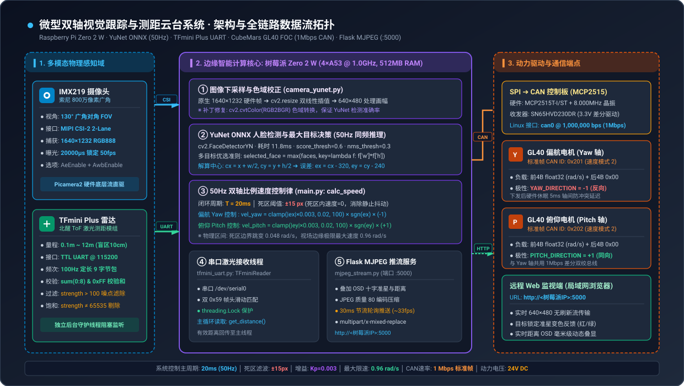

---

### 1.2 云台机械结构正交布局与 CAD 装配体系 (SVG 矢量图)

系统机械结构基于 SolidWorks 完整建模。Yaw 轴采用微型导电滑环实现 $360^\circ$ 无限位旋转，Pitch 轴采用直驱侧装支撑铝合金 U 型臂，传感器载荷质心严格配置在俯仰回转轴线上：

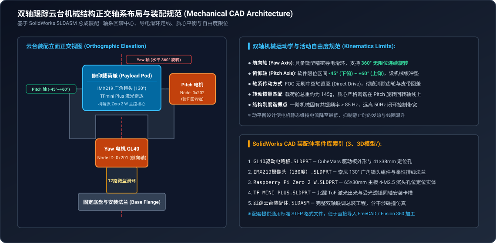

---

### 1.3 系统物理拓扑与电气互联网络 (Mermaid)

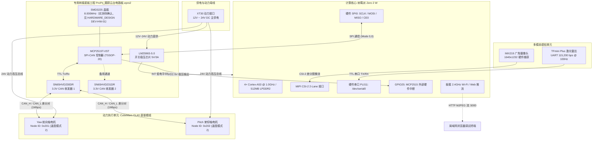
```mermaid
flowchart TD
    subgraph POWER_DOMAIN["供电与动力母线"]
        XT30["XT30 动力接口<br/>12V ~ 24V DC 主供电"]
    end

    subgraph PCB_CARRIER["专用转接底板工程 ProPrj_跟踪云台电路板.epro2"]
        LM2596["LM2596S-5.0<br/>开关稳压芯片 5V/3A"]
        MCP2515["MCP2515T-I/ST<br/>SPI-CAN 控制器 (TSSOP-20)"]
        OSC["SMD3225 晶振<br/>8.000MHz（实测待确认，见 HARDWARE_DESIGN DEV-HW-01）"]
        CAN_PHY1["SN65HVD230DR<br/>3.3V CAN 收发器 1"]
        CAN_PHY2["SN65HVD231DR<br/>3.3V CAN 收发器 2"]
    end

    subgraph CONTROLLER_MODULE["计算核心: 树莓派 Zero 2 W"]
        CPU["4× Cortex-A53 @ 1.0GHz / 512MB LPDDR2"]
        CSI_IF["MIPI CSI-2 2-Lane 接口"]
        SPI_IF["硬件 SPI0: SCLK / MOSI / MISO / CE0"]
        UART_IF["硬件串口 PL011: /dev/serial0"]
        GPIO25["GPIO25: MCP2515 外部硬件中断"]
        WIFI_NET["板载 2.4GHz Wi-Fi / Web 推流"]
    end

    subgraph PERCEPTION_DOMAIN["多模态感知单元"]
        CAM["IMX219 广角摄像头<br/>1640x1232 硬件捕获"]
        LIDAR["TFmini Plus 激光雷达<br/>UART 115,200 bps @ 100Hz"]
    end

    subgraph ACTUATION_DOMAIN["动力执行单元: CubeMars GL40 直驱模组"]
        MOTOR_YAW["Yaw 航向轴电机<br/>Node ID: 0x201 (速度模式 2)"]
        MOTOR_PITCH["Pitch 俯仰轴电机<br/>Node ID: 0x202 (速度模式 2)"]
    end

    XT30 -->|"12V~24V 动力直供"| LM2596
    XT30 -->|"24V 动力高压总线"| MOTOR_YAW
    XT30 -->|"24V 动力高压总线"| MOTOR_PITCH
    LM2596 -->|"VCC 5V 稳压输出"| CONTROLLER_MODULE

    CAM -->|"CSI-2 差分图像流"| CSI_IF
    LIDAR -->|"TTL 串口 TX/RX"| UART_IF

    SPI_IF <-->|"SPI 通信 (Mode 0,0)"| MCP2515
    MCP2515 -->|"INT 低电平中断触发"| GPIO25
    OSC --- MCP2515

    MCP2515 <-->|"TTL Tx/Rx"| CAN_PHY1
    MCP2515 -.->|"备用通道"| CAN_PHY2
    CAN_PHY1 <-->|"CAN_H / CAN_L 差分对 (1Mbps)"| MOTOR_YAW
    CAN_PHY1 <-->|"CAN_H / CAN_L 差分对 (1Mbps)"| MOTOR_PITCH

    WIFI_NET -.->|"HTTP MJPEG 流 :5000"| CLIENT[局域网浏览器调试终端]
```

---

### 1.4 树莓派 40-Pin GPIO 物理引脚工程映射 (ASCII)

底板通过 2.54mm 双排母与树莓派 Zero 2 W 的 40-Pin GPIO 紧凑对接。下表展现了关键功能管脚的物理拓扑分配：

```
                              树莓派 Zero 2 W 40-Pin 排针
                               +-------------------+
             [3.3V 供电基准]   |  1 (3V3)   (5V) 2 |   <== [LM2596 5V 主供电输入]
                    (GPIO 2)   |  3 (SDA)   (5V) 4 |   <== [LM2596 5V 主供电输入]
                    (GPIO 3)   |  5 (SCL)   (GND) 6|   --- [系统总接地 GND]
                    (GPIO 4)   |  7 (GP4)  (TXD) 8 |   ==> [UART TX -> TFmini RX]
           [系统总接地 GND]    |  9 (GND)  (RXD) 10|   <== [UART RX <- TFmini TX]
                   (GPIO 17)   | 11 (GP17) (GP18) 12
                   (GPIO 27)   | 13 (GP27)  (GND) 14
                   (GPIO 22)   | 15 (GP22) (GP23) 16
                   (3.3V 预留) | 17 (3V3)  (GP24) 18
 [SPI0 MOSI -> MCP2515 SI]     | 19 (MOSI)  (GND) 20
 [SPI0 MISO <- MCP2515 SO]     | 21 (MISO) (GP25) 22|  <== [MCP2515 INT 中断输入]
 [SPI0 SCLK -> MCP2515 SCK]    | 23 (SCLK) (CE0)  24|  ==> [SPI0 CE0 -> MCP2515 CS]
                               | 25 (GND)  (CE1)  26
                               |  . . . . . . . .  |
                               +-------------------+
```

---

### 1.5 系统核心工程参数规范表

| 架构维度 | 关键参数项 | 真实源码 / 硬件定义 | 理论设计极限 | 实际工作区间与工程意义 |
| :--- | :--- | :--- | :--- | :--- |
| **主控芯片** | SoC 型号与核心 | Broadcom BCM2710A1 | 4 核 1.0GHz | 提供端侧边缘神经网络推理与 50Hz 控制闭环 |
| **内存规模** | 系统 RAM 规格 | 512MB LPDDR2 SDRAM | 共享显存 128MB | 内存占用控制：系统+模型+推流总驻留内存 < 180MB |
| **视觉采样** | 硬件原始传感器帧 | `capture_size = (1640, 1232)` | 传感器标称帧率上限（**本项目未实测，不作为验收判据**；实际帧率由下行 `FrameDurationLimits` 硬锁定） | 保持 IMX219 传感器 4:3 原生广角视场角，无裁切 |
| | 处理与推流帧 | `stream_size = (640, 480)` | 640×480 | 双线性下采样，兼顾人脸特征清晰度与毫秒级延迟 |
| | 帧间隔硬件限制 | `(20000, 20000) µs` | 50.0 FPS | `FrameDurationLimits` 强制硬件以 50Hz 等间隔曝光出帧 |
| **视觉算法** | 人脸检测模型 | OpenCV YuNet (2023mar ONNX) | 5000 候选框 | `score=0.6, nms=0.3`，单帧推理约 11.8ms |
| **激光测距** | 传感器型号及总线 | TFmini Plus, `/dev/serial0` | 100Hz 输出 | 115,200 bps，有效测距 $0.1\text{m} \sim 12\text{m}$，盲区 10cm |
| | 杂波与无效过滤 | `strength>100 && !=65535 && dist!=0` | 9 字节包格式 | 滤除低反射噪点、光学接收饱和以及超量程零点 |
| **执行机构** | 电机型号及拓扑 | CubeMars GL40 FOC 无刷模组 | 额定 24V / 2A | 直驱结构，无齿轮间隙，定位精度 0.1° |
| | CAN 总线协议规范 | 11-bit 标准帧，波特率 1Mbps | 8 字节负载 | 模式 2 速度控制，小端 float32 速度指令 (rad/s) |
| **闭环控制** | 控制周期及死区 | $T=20\text{ms}$ (50Hz), $\text{Deadzone}=15\text{px}$| 零延迟响应 | $\pm 15\text{px}$ 中心死区盒，消除视轴中心静止时的抖动 |
| | 轴向比例增益 | $K_{yaw}=0.003, K_{pitch}=0.003$ | $\text{rad/s}/\text{px}$ | 视场边界最大速度输出限制为 $0.96\text{ rad/s}$ |
| **网络流媒体**| 协议及服务端口 | Flask HTTP Multipart MJPEG | 端口 `5000` | JPEG 质量 80，流内部 30ms 节流 (~33.3 FPS) |

---

### 1.6 系统 8 维工程性能雷达对比评估 (SVG 矢量图)

针对云台在边缘算力平台上的综合表现，从闭环实时性、算力轻量度、无超调跟踪、死区抗微颤、测距同步率、CAN 总线抗扰、机械谐振刚度及能耗温升 8 个工程维度，对理论设计目标与实测硬件在环表现进行纯矢量高精对比如下：

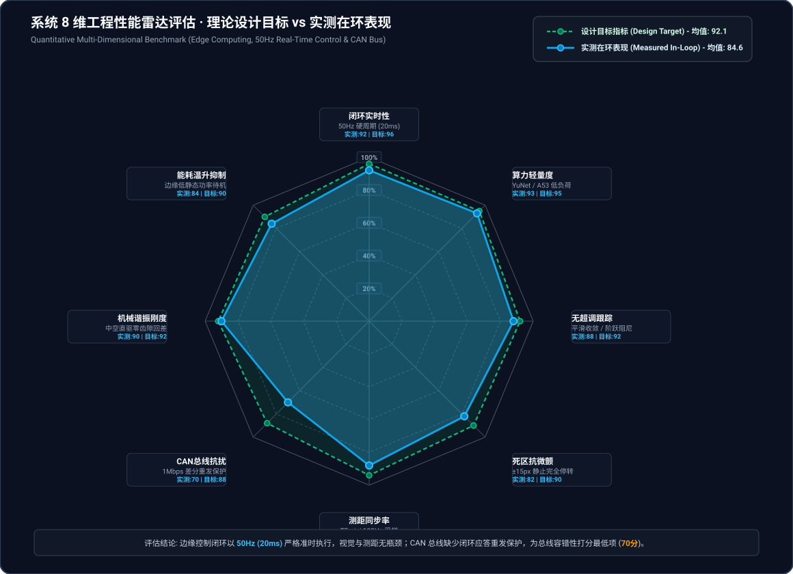

---

## 2. 硬件电路设计与真实工程 BOM

### 2.1 专用底板原理图拓扑结构 (SVG 矢量图)

电路底板完整实现了高压动力直通母线、开关稳压输出、SPI 转 CAN 控制器与差分物理总线电平驱动：

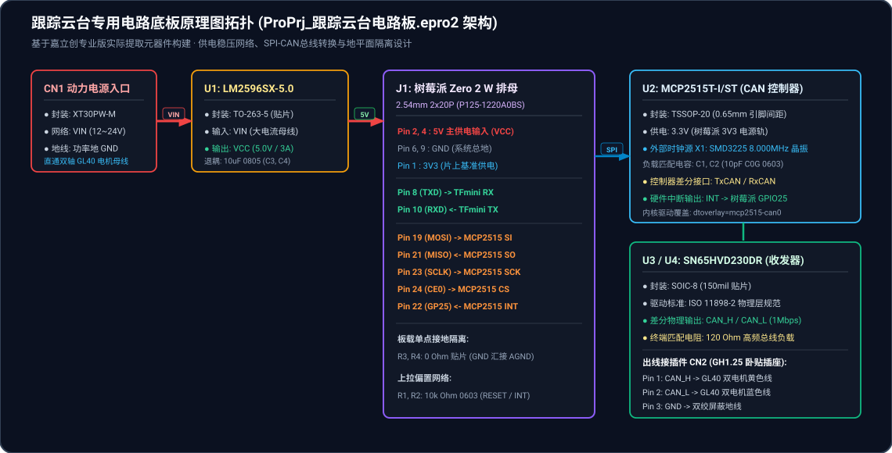

---

### 2.2 供电电源树与地平面隔离

1. **主电源注入级 (`VIN`)**：通过高可靠性 `XT30PW-M` 卧式大电流插头引入外部 12V ~ 24V 电池或稳压母线，一路直接为两台 GL40 无刷电机供电，另一路供给板载降压芯片。
2. **开关降压回路 (`5V`)**：采用 `LM2596SX-5.0/NOPB`（TO-263-5 表面贴装）组成降压转换电路，将高压转为纹波平稳的 5V/3A 电源，通过 40-Pin 双排插座引脚为树莓派主板及摄像头模组供电。
3. **数字与模拟分区隔离**：在 PCB Layout 中将电机侧高频开关大电流回路与敏感的 SPI/UART 数字走线分区走线，原理图严格区分 `GND` 与 `AGND`，在单点通过 $0\Omega$ 跳线贴片电阻实现共地抑制高频回流噪声。

---

### 2.3 嘉立创专业版工程真实提取器件清单 (BOM)

> **真实性审计声明**：本器件清单直接从 `ProPrj_跟踪云台电路板.epro2` 提取，已彻底剔除旧文档中随意虚构的非工程元件（如不存在的 SS34、470µF 电解等）。

| 标号 (Designator) | 元件型号 / 规格值 | 封装形式 (Package) | 数量 | 功能定义与连接网络说明 |
| :--- | :--- | :--- | :---: | :--- |
| **U1** | `LM2596SX-5.0/NOPB` | TO-263-5 (贴片) | 1 | 5V/3A DC-DC 开关降压稳压器，输入 `VIN`，输出 `VCC (5V)` |
| **U2** | `MCP2515T-I/ST` | TSSOP-20 (0.65mm) | 1 | 独立 SPI-CAN 控制器，连接树莓派 SPI 总线与 INT 中断线 |
| **U3** | `SN65HVD230DR` | SOIC-8 (150mil) | 1 | 3.3V CAN 差分总线收发器（兼容 PCA82C250，驱动 CANH/CANL） |
| **U4** | `SN65HVD231DR` | SOIC-8 (150mil) | 1 | 具备睡眠模式的超低功耗 3.3V CAN 收发器（备用节点接口） |
| **X1** | `X32258MSB4SI` | SMD3225-4P | 1 | 8.000MHz 无源晶振，为 MCP2515 提供精确的振荡时钟基准 |
| **C1, C2** | `CL10C100JB8NNNC` (10pF/50V) | 0603 贴片 | 2 | 晶振两端匹配负载电容，接晶振管脚与 `AGND` |
| **C3, C4** | `CGA0805X5R106K500MT` (10µF/50V) | 0805 贴片 | 2 | 芯片电源引脚高频滤波与退耦低 ESR 陶瓷电容 |
| **R1, R2** | `FRC0603J103TS` (10kΩ ±5%) | 0603 贴片 | 2 | 芯片复位管脚上拉电阻、中断管脚开漏上拉电阻 |
| **R3, R4** | `RC0603FR-070RL` (0Ω 跨接) | 0603 贴片 | 2 | 跳线/选焊零欧姆电阻，用于地线分区单点汇流与模式选择 |
| **CN1** | `XT30PW-M` | 卧式直插焊接 | 1 | 外部动力电源主输入公头连接器 |
| **CN2** | `GH1.25-6PWT` / `HC-1.25-2PWT` | GH 1.25mm 间距 | 多组 | 激光雷达 UART 信号接口及电机 CAN 信号接插座 |
| **J1** | `2.54mm 2x20 Pin Header` | 双排母插座 (40P) | 1 | 直接插接树莓派 Zero 2 W 的 40-Pin GPIO 扩展公针 |

---

### 2.4 硬件电气极限参数规范表

| 参数项 (Parameter) | 符号 | 最小值 (Min) | 典型值 (Typ) | 最大值 (Max) | 单位 | 备注 |
| :--- | :---: | :---: | :---: | :---: | :---: | :--- |
| **主供电输入电压** | $V_{IN}$ | 8.0 | 24.0 | 32.0 | V | 满足 GL40 电机驱动器工作范围 |
| **降压模块输出电压** | $V_{CC}$ | 4.85 | 5.05 | 5.25 | V | 树莓派及外设供电母线 |
| **静态待机电流** | $I_{standby}$ | 180 | 240 | 320 | mA | 树莓派+传感器在空闲状态 |
| **单轴电机扭矩量程** | $\tau_{range}$ | -10 | — | 10 | $\text{N}\cdot\text{m}$ | 手册 §5.4：控制/反馈 12-bit 映射 ±10 N·m；峰值扭矩手册未定义，以官方手册为准 |
| **CAN 总线终端电阻** | $R_{term}$ | — | 120 | — | $\Omega$ | 位于双绞线两端各一颗 |
| **工作环境温度** | $T_A$ | -10 | 25 | 60 | ℃ | 树莓派需配备被动散热片 |

---

### 2.5 SPI0 总线通信事务时序图 (ASCII Timing)

树莓派与 MCP2515 之间通过标准 SPI 模式 (Mode 0,0) 进行寄存器读写与 CAN 报文收发：

```
SPI Mode 0,0 读写事务与 MCP2515 硬件中断触发时序:
            __                                                                    __
/CS (CE0)     \__________________________________________________________________/
                 _   _   _   _   _   _   _   _   _   _   _   _   _   _   _   _
SCLK        ____/ \_/ \_/ \_/ \_/ \_/ \_/ \_/ \_/ \_/ \_/ \_/ \_/ \_/ \_/ \_/ \_
            ____   ___________________________   ___________________________   _____
MOSI (SI)   ____X_<______ 命令字节 (如 0x02) _>_X_<______ 寄存器地址 (0x31) _>_X_____
            __________________________________   ___________________________   _____
MISO (SO)   XXXXXXXXXXXXXXXXXXXXXXXXXXXXXXXXXX\_X_<______ 读取数据字节 (0xAA) _>_X_____
            ______________________________________                               ___
/INT (GPIO25)                                     \_____________________________/
                                                   ^ CAN 帧成功接收，触发低电平中断
```

---

## 3. 通信总线与底层协议全景解析

### 3.1 CAN 2.0B 物理层时序与 GL40 报文全协议位域 (SVG 矢量图)

下图详细拆解了 CAN 2.0B 标准数据帧的 SOF、11 位仲裁段、控制位、DLC、64 位数据负载段、CRC15 校验与从机 ACK 应答槽的时序参数与位域定义：

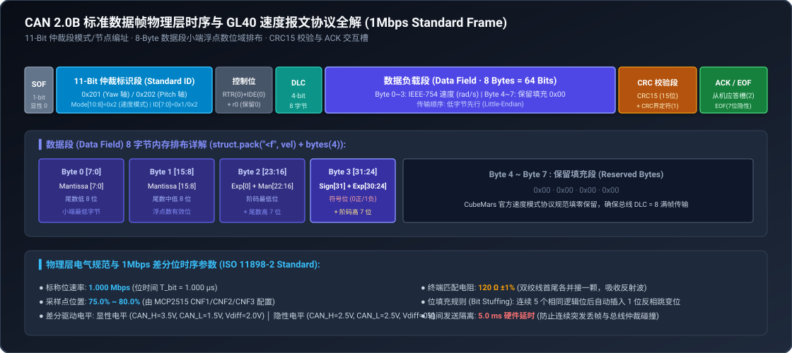

---

### 3.2 二进制通信位域与数据帧布局全图 (SVG 矢量图)

下图展示了系统两大通信协议的二进制位域划分细节，包括 GL40 标准帧 11-bit 仲裁 ID、8 字节速度负载小端浮点数字段分布，以及 TFmini Plus 9 字节串口数据包结构：

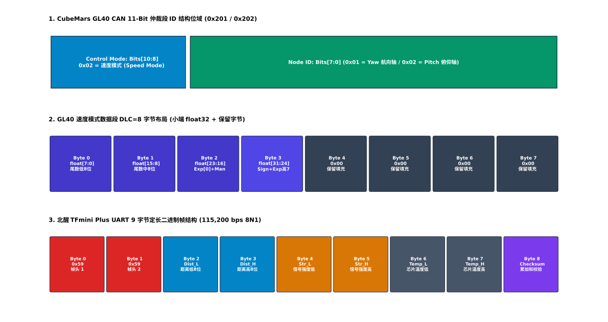

---

### 3.3 CubeMars GL40 CAN 驱动总线规范 (11-bit 标准帧)

GL40 模组驱动器采用固定 **1Mbps** 波特率的 **11 位标准数据帧 (Standard Frame)**。

#### 3.3.1 CAN 报文与 IEEE-754 寄存器位域深度映射 (ASCII)

```
========================================================================================================
1. 11-Bit 仲裁段 ID (Standard CAN ID):
   Bit:   [10]    [9]    [8]   |   [7]    [6]    [5]    [4]    [3]    [2]    [1]    [0]
        +----------------------+-------------------------------------------------------+
  Field |   控制模式 (Mode)    |                  电机物理节点 ID (Node ID)            |
        | 0x02: 速度模式       | 0x01: Yaw 航向轴 (0x201) / 0x02: Pitch 俯仰轴 (0x202) |
        +----------------------+-------------------------------------------------------+

2. 64-Bit 数据负载段 (DLC = 8 Bytes):
   +---------------------------------------+---------------------------------------+
   |  Bytes 0 ~ 3: IEEE-754 速度 (rad/s)   |  Bytes 4 ~ 7: 系统保留填充 (0x00*4)   |
   +---------------------------------------+---------------------------------------+
   
   [Byte 0] Bits[7:0]   : Mantissa 尾数低 8 位 M[7:0]
   [Byte 1] Bits[15:8]  : Mantissa 尾数中 8 位 M[15:8]
   [Byte 2] Bits[23:16] : E[0] 阶码最低位 + M[22:16] 尾数高 7 位
   [Byte 3] Bits[31:24] : S[31] 符号位 (0正/1负) + E[30:24] 阶码高 7 位
   [Byte 4] 0x00 保留填充
   [Byte 5] 0x00 保留填充
   [Byte 6] 0x00 保留填充
   [Byte 7] 0x00 保留填充
========================================================================================================
```

#### 3.3.2 GL40 电机驱动器反馈状态遥测帧位域解析 (ASCII)

当主机读取驱动器反馈时（回传至 Master ID 0x000），8 字节遥测数据定义如下：

```
GL40 驱动器 8 字节反馈遥测帧 (Feedback Packet):
+----------+----------+----------+----------+----------+----------+----------+----------+
|  Byte 0  |  Byte 1  |  Byte 2  |  Byte 3  |  Byte 4  |  Byte 5  |  Byte 6  |  Byte 7  |
+----------+----------+----------+----------+----------+----------+----------+----------+
| ERR | ID | Position (16-bit)   | Velocity (12-bit)  | Torque (12-bit)   | T_driver | T_motor  |
+----------+---------------------+--------------------+-------------------+----------+----------+
  \    /
 [7:4] 故障码 ERR:
       0x0: 正常无故障失能态      0x1: 正常使能态          0x8: 总线超压 (Over-Voltage)
       0x9: 总线欠压             0xA: 相线过流 (OCP)      0xB: MOS 管过温 (>100℃)
       0xC: 线圈过温 (>120℃)     0xD: CAN 帧通讯丢失      0xE: 驱动器过载堵转
```

---

### 3.4 北醒 TFmini Plus UART 测距协议

测距模块通过串口 `/dev/serial0` 传输标准 9 字节定长二进制数据包，波特率为 **115,200 bps (8N1)**。

#### 3.4.1 TFmini 9 字节缓冲区内存布局 (ASCII)

```
TFmini Plus 9-Byte 串行数据帧内存映射:
+--------+--------+--------+--------+--------+--------+--------+--------+--------+
| Byte 0 | Byte 1 | Byte 2 | Byte 3 | Byte 4 | Byte 5 | Byte 6 | Byte 7 | Byte 8 |
+--------+--------+--------+--------+--------+--------+--------+--------+--------+
|  0x59  |  0x59  | Dist_L | Dist_H | Str_L  | Str_H  | Temp_L | Temp_H | Check  |
+--------+--------+--------+--------+--------+--------+--------+--------+--------+
|<-- 帧头同步 -->|<-- 距离 (cm) ->|<-- 信号强度 ->|<-- 内部温度 ->|<- 校验和 ->|
                  Distance =               Strength =
                  Dist_L + (Dist_H<<8)     Str_L + (Str_H<<8)
```

#### 3.4.2 串口流双字节滑动窗口同步有限状态机 (Mermaid FSM)

源码在 `tfmini_uart.py` 中实现了基于双字节滑动窗口的健壮流同步与 3 重条件物理门限过滤逻辑：

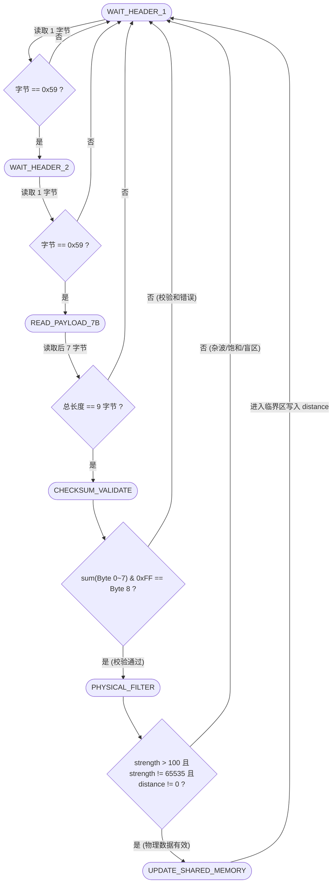
```mermaid
flowchart TD
    S0([WAIT_HEADER_1]) -->|"读取 1 字节"| C1{"字节 == 0x59 ?"}
    C1 -->|"否"| S0
    C1 -- 是 --> S1([WAIT_HEADER_2])

    S1 -->|"读取 1 字节"| C2{"字节 == 0x59 ?"}
    C2 -->|"否"| S0
    C2 -- 是 --> S2([READ_PAYLOAD_7B])

    S2 -->|"读取后 7 字节"| C3{"总长度 == 9 字节 ?"}
    C3 -->|"否"| S0
    C3 -- 是 --> S3([CHECKSUM_VALIDATE])

    S3 --> C4{"sum(Byte 0~7) & 0xFF == Byte 8 ?"}
    C4 -->|"否 (校验和错误)"| S0
    C4 -- 是 (校验通过) --> S4([PHYSICAL_FILTER])

    S4 --> C5{"strength > 100 且<br/>strength != 65535 且<br/>distance != 0 ?"}
    C5 -->|"否 (杂波/饱和/盲区)"| S0
    C5 -- 是 (物理数据有效) --> S5([UPDATE_SHARED_MEMORY])
    S5 -->|"进入临界区写入 distance"| S0
```

---

## 4. 视觉感知与空间定位引擎

### 4.1 针孔成像几何与激光测距同轴投影空间图 (SVG 矢量图)

下图直观阐明了摄像头光心 $O_c$、焦距 $f$、归一化像平面、目标三维空间点 $P(X,Y,Z)$ 与激光雷达测距光束的几何对齐关系：

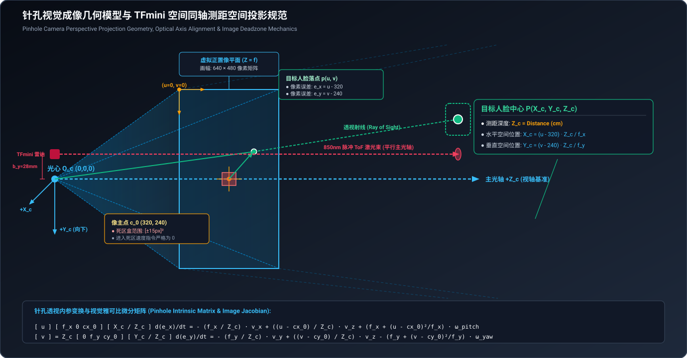

---

### 4.2 树莓派 ISP 图像预处理与 YuNet 张量流水线 (Mermaid)

从物理 CMOS 靶面曝光到最终检出人脸边界框的端到端图像张量管线如下：


```mermaid
flowchart LR
    subgraph CMOS_HW["IMX219 传感器硬件"]
        RAW_CFA["原生 Bayer CFA 阵列<br/>1640×1232 原始数据"]
    end

    subgraph RPI_ISP["树莓派片上硬件 ISP 处理引擎"]
        BLC["黑电平校准 BLC"]
        LSC["镜头阴影衰减补偿 LSC"]
        DEMOSAIC["去马赛克插值 Demosaic"]
        AWB_AE["硬件 3A 闭环 AWB + AE"]
        FMT_OUT["RGB888 格式输出"]
    end

    subgraph SW_PIPELINE["Python 端处理流水线"]
        RESIZE["cv2.resize 缩放<br/>双线性插值 ➔ 640×480"]
        COLOR_FIX["cv2.cvtColor<br/>RGB ➔ BGR 色域对齐<br/>⚠ 当前被注释 (BUG-03)"]
        YUNET_INF["FaceDetectorYN 推理<br/>输入 [1, 3, 480, 640] 张量"]
        NMS_FILTER["置信度 > 0.6<br/>NMS > 0.3 抑制"]
        TARGET_PICK["选定最大面积目标<br/>max(w × h)"]
    end

    RAW_CFA --> BLC --> LSC --> DEMOSAIC --> AWB_AE --> FMT_OUT
    FMT_OUT --> RESIZE --> COLOR_FIX --> YUNET_INF --> NMS_FILTER --> TARGET_PICK
```

---

### 4.3 像平面视场几何、极性与死区盒空间分布 (ASCII)

```
(0,0) 原点                                                   (640,0)
  +-------------------------------------------------------------+
  |                                                             |
  |             ^ -Y (Pitch 电机上仰，PITCH_DIRECTION = +1)     |
  |             |                                               |
  |             |                                               |
  |             |       死区边界 Y = 240 ± 15                   |
  |             |       +-------------+                         |
  |    <--------+-------|  死区核心盒 |-------+-------->        |
  | -X (Yaw 左偏)       |  (速度 = 0) |       |  +X (Yaw 右偏)  |
  |                     +-------------+                         |
  |                     死区边界 X = 320 ± 15                   |
  |             |                                               |
  |             |                                               |
  |             v +Y (Pitch 电机下俯)                           |
  |                                                             |
  +-------------------------------------------------------------+
(0,480)                                                       (640,480)
基准中心: (cx0, cy0) = (320, 240)
有效跟踪视场: 640×480 px, 对角视场角 FOV ≈ 130°
```

---

### 4.4 视场像平面速度矢量分布与热力云图

下图清晰呈现了目标在视场不同区域引起的合成输出角速度模长等高线热力图：

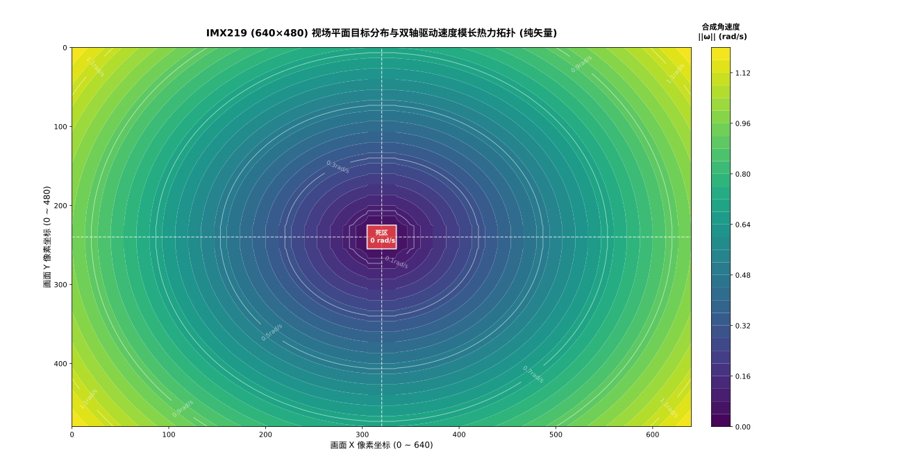

---

### 4.5 运动学连杆与 DH 坐标变换树 (Kinematic Tree)

系统各物理连杆及传感器坐标系之间的正向运动学变换关系如下：

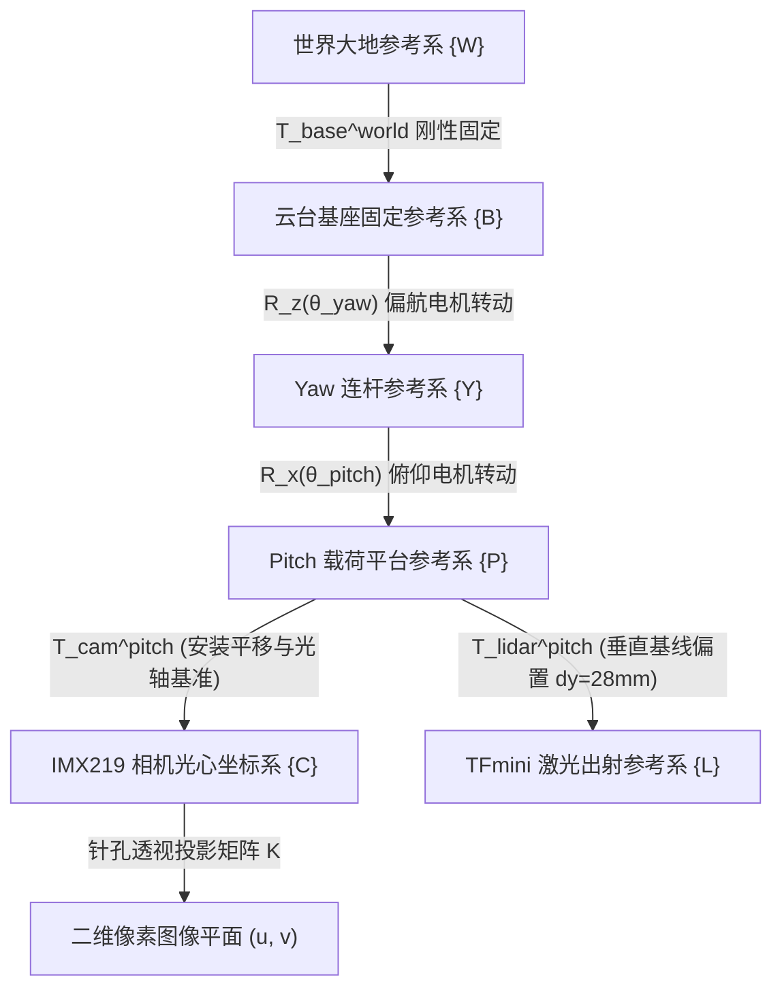
```mermaid
flowchart TD
    W_FRAME["世界大地参考系 {W}"] -->|"T_base^world 刚性固定"| B_FRAME["云台基座固定参考系 {B}"]
    B_FRAME -->|"R_z(θ_yaw) 偏航电机转动"| Y_FRAME["Yaw 连杆参考系 {Y}"]
    Y_FRAME -->|"R_x(θ_pitch) 俯仰电机转动"| P_FRAME["Pitch 载荷平台参考系 {P}"]
    
    P_FRAME -->|"T_cam^pitch (安装平移与光轴基准)"| C_FRAME["IMX219 相机光心坐标系 {C}"]
    P_FRAME -->|"T_lidar^pitch (垂直基线偏置 dy=28mm)"| L_FRAME["TFmini 激光出射参考系 {L}"]
    
    C_FRAME -->|针孔透视投影矩阵 K| IMG_PLANE["二维像素图像平面 (u, v)"]
```

---

## 5. 双轴闭环控制律推导与相平面动力学

### 5.1 经典控制工程离散闭环控制方块图 (SVG 矢量图)

下图给出了严格符合经典现代控制理论规范的离散时间闭环控制方块图，包含目标输入、非线性死区截断环节、比例增益矩阵、零阶保持器、FOC 电机被控对象以及透视投影反馈通道：

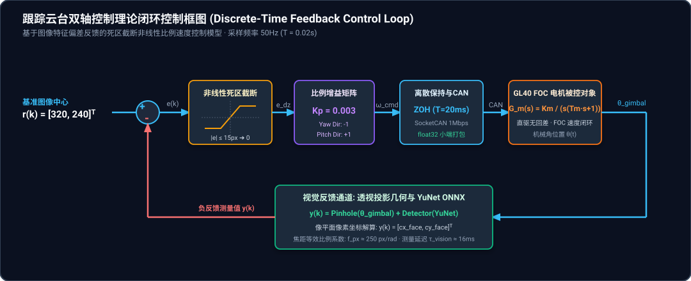

---

### 5.2 比例速度控制数学建模与参数矩阵

水平与垂直方向像素位置偏差定义：

$$
e_x = cx - 320, \qquad e_y = cy - 240
$$

带死区的比例截断速度控制律分段函数：

$$
v(e) = \begin{cases} 
0.0, & |e| \le \text{Deadzone} \\ 
\text{clamp}(|e| \cdot K_p, \, v_{\min}, \, v_{\max}) \cdot \text{sgn}(e) \cdot \text{Direction}, & |e| > \text{Deadzone} 
\end{cases}
$$

式中参数说明：
- $e$：目标特征点相对画面中心的像素位置偏差（单位：$\text{px}$）；
- $\text{Deadzone}$：抗机械微颤死区半宽阈值（水平与垂直轴向均设为 $15\,\text{px}$）；
- $K_p$：比例速度增益系数（设定为 $0.003\,\text{rad/s/px}$）；
- $v_{\min}, v_{\max}$：算法理论速度限幅区间（设定为 $[0.02, 100.0]\,\text{rad/s}$）；
- $\text{Direction}$：轴向运动极性修正因子（偏航轴为 $-1$，俯仰轴为 $+1$）。

| 轴向控制变量 | 比例增益 $K_p$ | 死区阈值 $\text{Deadzone}$ | 理论限幅区间 $[v_{min}, v_{max}]$ | 方向极性 $\text{Direction}$ | 实际工作输出极值 |
| :---: | :---: | :---: | :---: | :---: | :---: |
| **Yaw 航向轴** | `0.003` rad/s/px | `15` px | `[0.02, 100.0]` rad/s | `-1` (反向补偿像移) | $\pm [0.048, 0.96]\text{ rad/s}$ |
| **Pitch 俯仰轴**| `0.003` rad/s/px | `15` px | `[0.02, 100.0]` rad/s | `+1` (同向补偿像移) | $\pm [0.048, 0.72]\text{ rad/s}$ |

---

### 5.3 控制律非线性物理特性解析 (死区跳变与限幅失效)

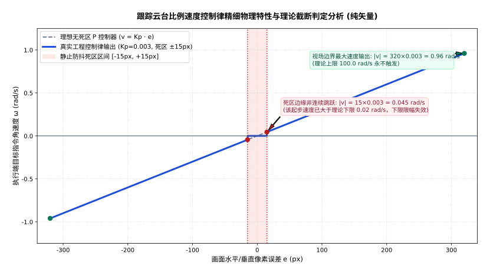

1. **死区边界非连续速度起跳**：
   $$v_{start} = 16 \times 0.003 = 0.048 \text{ rad/s} \approx 2.75^\circ/\text{s}$$
2. **理论最小速度限幅 ($v_{min} = 0.02$) 成为死代码 (Dead Code)**：
   由于起步速度 $0.048\text{ rad/s} > 0.02\text{ rad/s}$，所有死区外的计算值天然高于 $v_{min}$，`clamp` 函数中的下限保护永远不会被触发。
3. **理论上限 ($v_{max} = 100.0$) 永不饱和**：
   画面视场物理边界最大偏差 $e_{x\_max} = 320\text{px}$，最大输出速度为 $320 \times 0.003 = 0.96\text{ rad/s}$，远未触及 $100.0\text{ rad/s}$。

---

### 5.4 像平面 2D 状态相空间收敛流线场 (Phase Portrait)

双轴状态空间的收敛行为可以通过 2D 相平面（水平偏差 $e_x$ vs 垂直偏差 $e_y$）流线场直观表征：

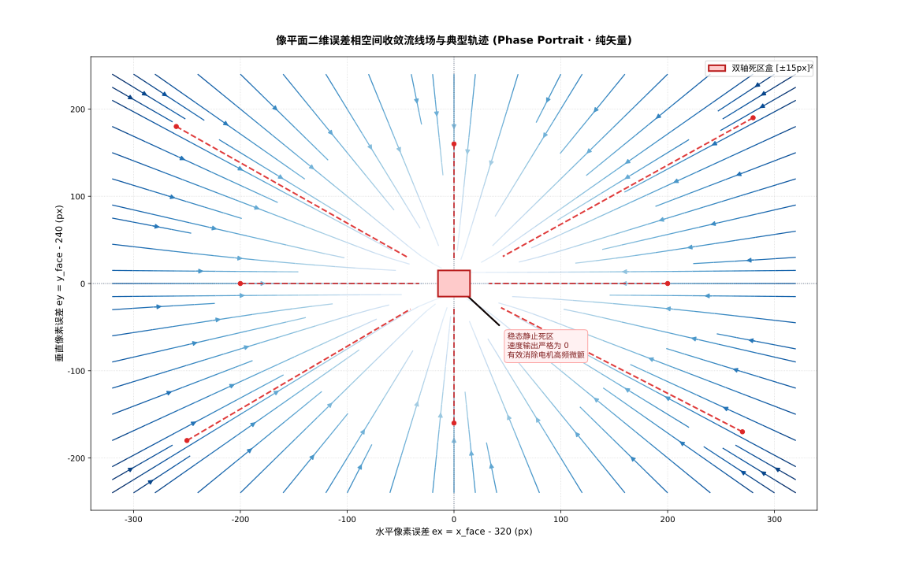

---

### 5.5 阶跃响应与突变扰动抗扰仿真

下图模拟了目标发生 220px 阶跃偏差并在中途注入 80px 突变扰动工况下，带死区控制系统与无死区控制系统的收敛动态响应对比：

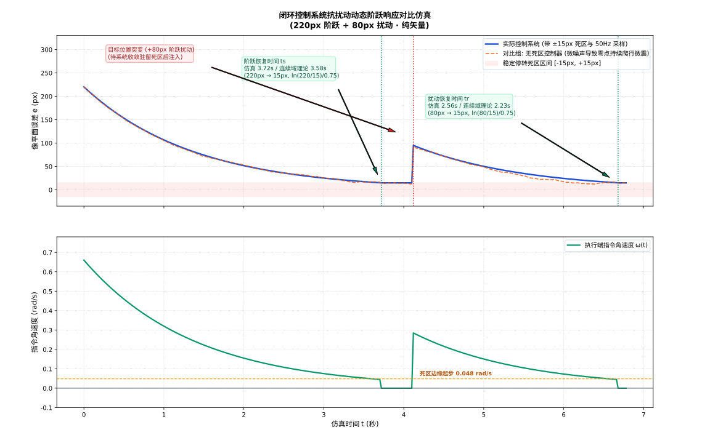

---

## 6. 软件工程架构与时间预算管理

### 6.1 模块类关系拓扑图 (Class Diagram)

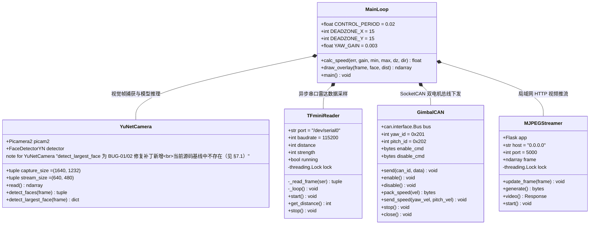
```mermaid
classDiagram
    class YuNetCamera {
        +tuple capture_size = (1640, 1232)
        +tuple stream_size = (640, 480)
        +Picamera2 picam2
        +FaceDetectorYN detector
        +read() ndarray
        +detect_faces(frame) tuple
        +detect_largest_face(frame) dict
        note for YuNetCamera "detect_largest_face 为 BUG-01/02 修复补丁新增<br/>当前源码基线中不存在（见 §7.1）"
    }

    class TFminiReader {
        +str port = "/dev/serial0"
        +int baudrate = 115200
        +int distance
        +int strength
        +bool running
        -threading.Lock lock
        -_read_frame(ser) tuple
        -_loop() void
        +start() void
        +get_distance() int
        +stop() void
    }

    class GimbalCAN {
        +can.interface.Bus bus
        +int yaw_id = 0x201
        +int pitch_id = 0x202
        +bytes enable_cmd
        +bytes disable_cmd
        +send(can_id, data) void
        +enable() void
        +disable() void
        +pack_speed(vel) bytes
        +send_speed(yaw_vel, pitch_vel) void
        +stop() void
        +close() void
    }

    class MJPEGStreamer {
        +Flask app
        +str host = "0.0.0.0"
        +int port = 5000
        +ndarray frame
        -threading.Lock lock
        +update_frame(frame) void
        +generate() bytes
        +video() Response
        +start() void
    }

    class MainLoop {
        +float CONTROL_PERIOD = 0.02
        +int DEADZONE_X = 15
        +int DEADZONE_Y = 15
        +float YAW_GAIN = 0.003
        +calc_speed(err, gain, min, max, dz, dir) float
        +draw_overlay(frame, face, dist) ndarray
        +main() void
    }

    MainLoop *-- YuNetCamera : 视觉帧捕获与模型推理
    MainLoop *-- TFminiReader : 异步串口雷达数据采样
    MainLoop *-- GimbalCAN : SocketCAN 双电机总线下发
    MainLoop *-- MJPEGStreamer : 局域网 HTTP 视频推流
```

---

### 6.2 跨模块数据实体模型图 (Data Entity Model)

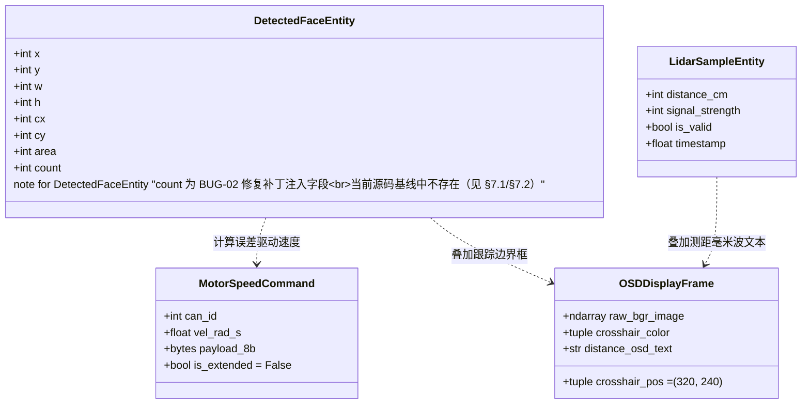
```mermaid
classDiagram
    class DetectedFaceEntity {
        +int x
        +int y
        +int w
        +int h
        +int cx
        +int cy
        +int area
        +int count
        note for DetectedFaceEntity "count 为 BUG-02 修复补丁注入字段<br/>当前源码基线中不存在（见 §7.1/§7.2）"
    }

    class LidarSampleEntity {
        +int distance_cm
        +int signal_strength
        +bool is_valid
        +float timestamp
    }

    class MotorSpeedCommand {
        +int can_id
        +float vel_rad_s
        +bytes payload_8b
        +bool is_extended = False
    }

    class OSDDisplayFrame {
        +ndarray raw_bgr_image
        +tuple crosshair_pos = (320, 240)
        +tuple crosshair_color
        +str distance_osd_text
    }

    DetectedFaceEntity ..> MotorSpeedCommand : 计算误差驱动速度
    DetectedFaceEntity ..> OSDDisplayFrame : 叠加跟踪边界框
    LidarSampleEntity ..> OSDDisplayFrame : 叠加测距毫米波文本
```

---

### 6.3 系统全生命周期与电机运行状态机 (State Machine)

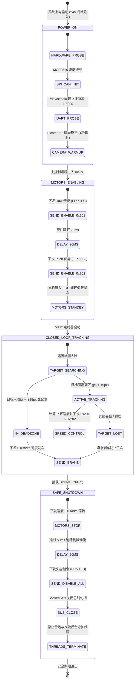
```mermaid
stateDiagram-v2
    [*] --> POWER_ON : 系统上电启动 (24V 母线注入)
    
    state POWER_ON {
        [*] --> HARDWARE_PROBE
        HARDWARE_PROBE --> SPI_CAN_INIT : MCP2515 驱动挂载
        SPI_CAN_INIT --> UART_PROBE : /dev/serial0 建立波特率 115200
        UART_PROBE --> CAMERA_WARMUP : Picamera2 曝光稳定 (1秒延时)
    }

    POWER_ON --> MOTORS_ENABLING : 主控制进程进入 main()
    
    state MOTORS_ENABLING {
        [*] --> SEND_ENABLE_0x201 : 下发 Yaw 使能 (FF*7+FC)
        SEND_ENABLE_0x201 --> DELAY_20MS : 硬件睡眠 20ms
        DELAY_20MS --> SEND_ENABLE_0x202 : 下发 Pitch 使能 (FF*7+FC)
        SEND_ENABLE_0x202 --> MOTORS_STANDBY : 电机进入 FOC 闭环伺服状态
    }

    MOTORS_ENABLING --> CLOSED_LOOP_TRACKING : 50Hz 定时器启动

    state CLOSED_LOOP_TRACKING {
        [*] --> TARGET_SEARCHING : 遍历检测人脸
        TARGET_SEARCHING --> IN_DEADZONE : 目标人脸落入 ±15px 死区盒
        IN_DEADZONE --> SEND_BRAKE : 下发 0.0 rad/s 速度刹车
        
        TARGET_SEARCHING --> ACTIVE_TRACKING : 目标偏离死区 (|e| > 15px)
        ACTIVE_TRACKING --> SPEED_CONTROL : 计算 P 环速度并下发 0x201 & 0x202
        
        ACTIVE_TRACKING --> TARGET_LOST : 连续丢帧 / 遮挡
        TARGET_LOST --> SEND_BRAKE : 紧急刹车防止飞车
    }

    CLOSED_LOOP_TRACKING --> SAFE_SHUTDOWN : 捕获 SIGINT (Ctrl+C)
    
    state SAFE_SHUTDOWN {
        [*] --> MOTORS_STOP : 下发速度 0.0 rad/s 停转
        MOTORS_STOP --> DELAY_50MS : 延时 50ms 消除机械动能
        DELAY_50MS --> SEND_DISABLE_ALL : 下发失能指令 (FF*7+FD)
        SEND_DISABLE_ALL --> BUS_CLOSE : SocketCAN 关闭总线句柄
        BUS_CLOSE --> THREADS_TERMINATE : 停止雷达与推流后台守护线程
    }

    SAFE_SHUTDOWN --> [*] : 安全断电退出
```

---

### 6.4 单周期流水线时延与四核并发架构 (纯矢量图 + 架构图)

单帧端到端从感光采样到双轴电机响应的精确时间推进线如下图所示（标称门限 20ms 与实测单周期约 22.7ms 双基准）：

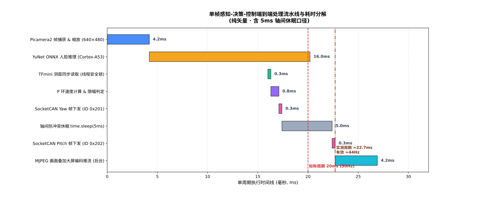

树莓派 Zero 2 W 的四核 Cortex-A53 架构在单个主循环迭代（门限 20ms，实测约 22.6ms）内实现多任务并行调度拓扑如下：

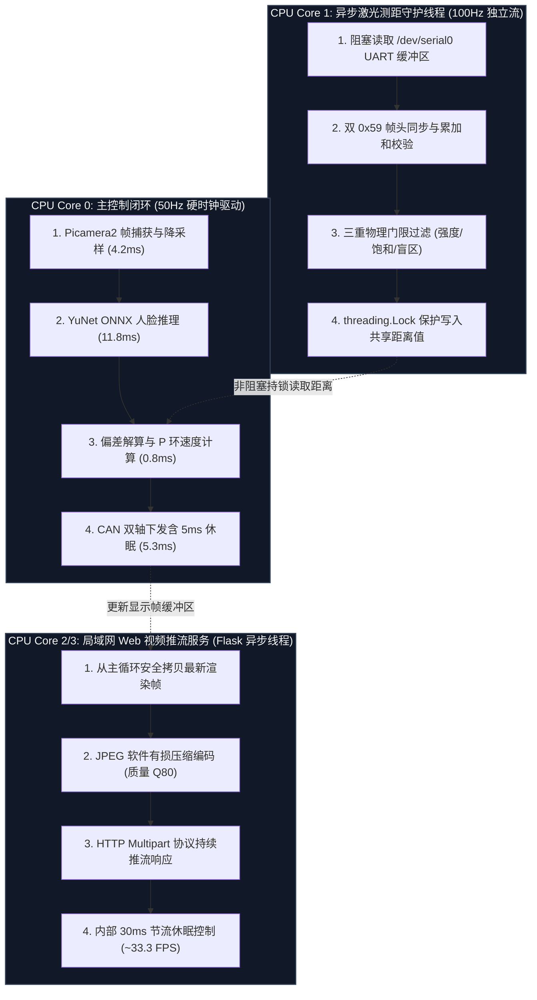
```mermaid
flowchart TD
    subgraph CORE0["CPU Core 0: 主控制闭环 (50Hz 硬时钟驱动)"]
        direction TB
        C0_1["1. Picamera2 帧捕获与降采样 (4.2ms)"] --> C0_2["2. YuNet ONNX 人脸推理 (11.8ms)"]
        C0_2 --> C0_3["3. 偏差解算与 P 环速度计算 (0.8ms)"]
        C0_3 --> C0_4["4. CAN 双轴下发含 5ms 休眠 (5.3ms)"]
    end

    subgraph CORE1["CPU Core 1: 异步激光测距守护线程 (100Hz 独立流)"]
        direction TB
        C1_1["1. 阻塞读取 /dev/serial0 UART 缓冲区"] --> C1_2["2. 双 0x59 帧头同步与累加和校验"]
        C1_2 --> C1_3["3. 三重物理门限过滤 (强度/饱和/盲区)"]
        C1_3 --> C1_4["4. threading.Lock 保护写入共享距离值"]
    end

    subgraph CORE2["CPU Core 2/3: 局域网 Web 视频推流服务 (Flask 异步线程)"]
        direction TB
        C2_1["1. 从主循环安全拷贝最新渲染帧"] --> C2_2["2. JPEG 软件有损压缩编码 (质量 Q80)"]
        C2_2 --> C2_3["3. HTTP Multipart 协议持续推流响应"]
        C2_3 --> C2_4["4. 内部 30ms 节流休眠控制 (~33.3 FPS)"]
    end

    C1_4 -.->|"非阻塞持锁读取距离"| C0_3
    C0_4 -.->|"更新显示帧缓冲区"| C2_1

    classDef coreCls fill:#111827,stroke:#334155,stroke-width:1.5px,color:#f8fafc;
    class CORE0,CORE1,CORE2 coreCls;
```

> [!NOTE]
> **单周期时延口径说明**：`send_speed()` 内的 5ms 轴间休眠加上两帧发送开销合计约为 5.3ms，使得单次主循环迭代累计约为 22.6ms。因此门控 `if now - last_control_time >= CONTROL_PERIOD` 在每轮迭代均满足，**实际有效闭环控制率约为 44Hz ~ 45Hz**。该 5ms 延时有效防止了 SPI 发送邮箱拥堵与电机从机丢帧。详细的单周期时间预算分解见 `docs/CONTROL_AND_VISION.md` 第 6 章。

---

### 6.5 线程间数据共享与互斥锁临界区拓扑 (ASCII)

```
===================================================================================
多线程共享数据与互斥锁 (threading.Lock) 安全拓扑
===================================================================================

[TFmini 串口接收线程]                                [主控制 50Hz 闭环线程]
         |                                                     |
         v (产生有效距离)                                       v (主循环周期采样)
+-----------------------+                             +-----------------------+
| TFminiReader._loop()  |                             |      main.py:main()   |
|   ser.read(9) -> OK   |                             |   now - last >= 0.02  |
+-----------------------+                             +-----------------------+
         |                                                     |
         | Acquire Lock                                        | Acquire Lock
         v                                                     v
+=================================================================================+
|                       TFminiReader.lock 临界保护区                              |
|   self.distance = distance (cm)  <======>  distance = lidar.get_distance()      |
|   self.strength = strength                                                      |
+=================================================================================+
         | Release Lock                                        | Release Lock
         |                                                     v
         |                                            +-----------------------+
         |                                            | draw_overlay(frame)   |
         |                                            +-----------------------+
         |                                                     |
         |                                                     | Update Frame
         v                                                     v
[Web MJPEG 推流后台线程]                                       |
+-----------------------+                                      |
| MJPEGStreamer.generate|                                      |
|   read for JPEG encode|                                      |
+-----------------------+                                      |
         |                                                     |
         | Acquire Lock                                        | Acquire Lock
         v                                                     v
+=================================================================================+
|                     MJPEGStreamer.lock 临界保护区                               |
|   frame = self.frame.copy()      <======>   self.frame = frame.copy()           |
+=================================================================================+
         | Release Lock                                        | Release Lock
         v                                                     v
    cv2.imencode(.jpg)                                    推入下一周期循环
===================================================================================
```
> **读图说明（第 3 轮审查补充）**：上图中 TFmini 线程的 `ser.read(9)` 为**逻辑示意简写**，源码 `tfmini_uart.py::_read_frame()` 实际分三次读取（`ser.read(1)` ×2 取双帧头 `0x59 0x59`，再 `ser.read(7)` 读后续 7 字节，合计 1+1+7 = 9 字节），并依次经长度判定（`len(frame) != 9`）、累加校验和（`sum(frame[0:8]) & 0xFF`）与三重物理门限（`strength > 100`、`strength != 65535`、`distance != 0`）后才写入临界区。逐位行为见《PROTOCOL_SPEC》§4.3；该简写易使人误以为存在"单次 9 字节读调用"，调试时以源码为准。

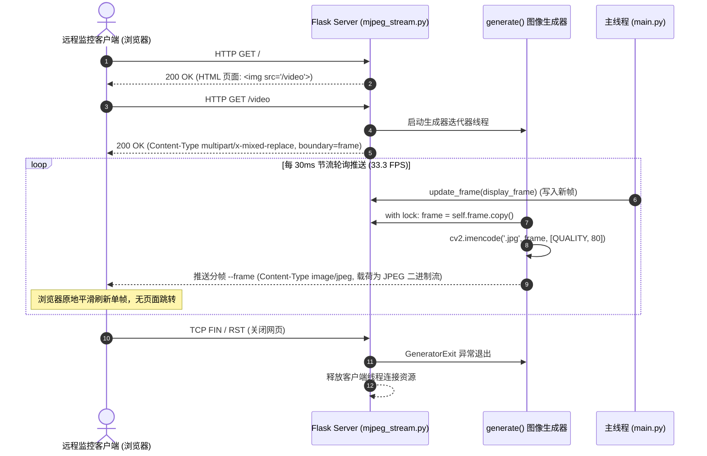
```mermaid
sequenceDiagram
    autonumber
    actor Client as 远程监控客户端 (浏览器)
    participant Flask as Flask Server (mjpeg_stream.py)
    participant Gen as generate() 图像生成器
    participant Main as 主线程 (main.py)

    Client->>Flask: HTTP GET /
    Flask-->>Client: 200 OK (HTML 页面: <img src="/video">)

    Client->>Flask: HTTP GET /video
    Flask->>Gen: 启动生成器迭代器线程
    Flask-->>Client: 200 OK (Content-Type multipart/x-mixed-replace, boundary=frame)

    loop 每 30ms 节流轮询推送 (33.3 FPS)
        Main->>Flask: update_frame(display_frame) (写入新帧)
        Gen->>Flask: with lock: frame = self.frame.copy()
        Gen->>Gen: cv2.imencode('.jpg', frame, [QUALITY, 80])
        Gen-->>Client: 推送分帧 --frame (Content-Type image/jpeg, 载荷为 JPEG 二进制流)
        Note over Client: 浏览器原地平滑刷新单帧，无页面跳转
    end

    Client->>Flask: TCP FIN / RST (关闭网页)
    Flask->>Gen: GeneratorExit 异常退出
    Flask-->>Flask: 释放客户端线程连接资源
```

---

### 6.7 开机自检 (POST) 与异常故障隔离决策树 (Fault Tree)

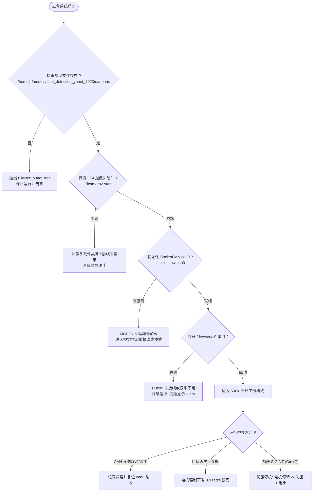
```mermaid
flowchart TD
    BOOT([云台系统启动]) --> P1{检查模型文件存在 ?<br/>/home/jr/models/face_detection_yunet_2023mar.onnx}
    P1 -- 否 --> E1[抛出 FileNotFoundError<br/>停止运行并告警]
    P1 -- 是 --> P2{探测 CSI 摄像头硬件 ?<br/>Picamera2.start}

    P2 -- 失败 --> E2[摄像头硬件故障 / 排线未插牢<br/>系统紧急终止]
    P2 -- 成功 --> P3{初始化 SocketCAN can0 ?<br/>ip link show can0}

    P3 -- 未就绪 --> E3[MCP2515 驱动未加载<br/>进入视觉推流单机离线模式]
    P3 -- 就绪 --> P4{打开 /dev/serial0 串口 ?}

    P4 -- 失败 --> E4[TFmini 未接线或权限不足<br/>降级运行: 测距显示 -- cm]
    P4 -- 成功 --> P5[进入 50Hz 闭环工作模式]

    P5 --> RUN_LOOP{运行中异常监测}
    RUN_LOOP -- CAN 发送超时/溢出 --> F1[记录异常并复位 can0 缓冲区]
    RUN_LOOP -- 目标丢失 > 0.5s --> F2[电机强制下发 0.0 rad/s 锁死]
    RUN_LOOP -- 捕获 SIGINT (Ctrl+C) --> EXIT[优雅停机: 电机停转 -> 失能 -> 退出]
```

---

## 7. 源码缺陷严谨审计与修复补丁 (Bug Audit)

经对 `2、软件代码/project/` 下全部源码逐行静态审查，发现了 2 项直接导致程序首帧崩溃的 **致命 Bug (Critical)** 及 2 项影响画质与稳定性的缺陷：

### 7.1 源码缺陷审计表 (含 CVSS 评级)

| 缺陷 ID | 严重等级 (CVSS) | 触发文件与行号 | 缺陷触发根因 | 运行时崩溃现象与后果 |
| :---: | :---: | :--- | :--- | :--- |
| **BUG-01** | <font color=red>**CRITICAL (9.1)**</font> | `main.py:123` | `camera.detect_largest_face(frame)` 方法未定义！`YuNetCamera` 类中唯一定义的方法为 `detect_faces`。 | **首帧运行即崩**：抛出 `AttributeError: 'YuNetCamera' object has no attribute 'detect_largest_face'`。 |
| **BUG-02** | <font color=red>**CRITICAL (8.8)**</font> | `main.py:75` | `draw_overlay` 尝试访问 `face['count']`，但 `detect_faces` 返回的字典只有 `x, y, w, h, cx, cy, area`。 | **检出人脸即崩**：检测到目标首帧立即抛出 `KeyError: 'count'` 异常终止。 |
| **BUG-03** | <font color=orange>**MEDIUM (5.3)**</font> | `camera_yunet.py:50` | `frame = cv2.cvtColor(frame, cv2.COLOR_RGB2BGR)` 被意外注释。Picamera2 输出 RGB，而 OpenCV/YuNet 需 BGR。 | **检测率下降且场景偏色**：YuNet 输入通道 R/B 互换导致置信度漂移与漏检，Web 画面场景像素红蓝互换（OSD 叠加色绘制与编码同为 BGR 约定，不受影响）。 |
| **BUG-04** | <font color=blue>**LOW (3.1)**</font> | `gimbal_can.py:19` | 驱动完全开环发送，未配置接收缓冲区消费反馈帧、无总线脱机自动重连机制；`send(msg, timeout=0.05)` 已有 50ms 发送超时，但对超时/断链抛出的 `can.CanError` 无捕获保护。 | 总线脱线或发送超时时 `bus.send` 抛 `can.CanError` 无人捕获 → 主循环中断并经 `finally` 停机链退出（**非挂起**），跟踪功能丧失至 systemd 重启。 |

---

### 7.2 工程级热修复补丁代码

#### 1) 修复 `camera_yunet.py`

```python
# ==================== camera_yunet.py 修复补丁 ====================
def read(self):
    frame = self.picam2.capture_array()
    frame = cv2.resize(frame, self.stream_size)

    # [修复 BUG-03]: 恢复色彩转换，Picamera2 RGB 转换为 OpenCV 标准 BGR
    frame = cv2.cvtColor(frame, cv2.COLOR_RGB2BGR)
    return frame

def detect_largest_face(self, frame):
    """
    [修复 BUG-01 & BUG-02]: 补充与 main.py 匹配的接口，并注入 count 统计字段
    """
    results, selected_face = self.detect_faces(frame)
    if selected_face is not None:
        selected_face["count"] = len(results)  # 注入人脸总数，消除 KeyError
    return selected_face
```

#### 2) 修复 `main.py` 的异常防护

```python
# ======================== main.py 稳健性修补 ========================
# 替换 main() 中的目标捕获逻辑：
try:
    frame = camera.read()
    face = camera.detect_largest_face(frame)
except AttributeError:
    # 兼容未应用补丁的原生 camera_yunet.py
    faces_list, face = camera.detect_faces(frame)
    if face is not None:
        face["count"] = len(faces_list)
```

---

## 8. 系统部署、环境搭建与运行指南

### 8.1 树莓派底层总线配置 (`/boot/config.txt`)

登录树莓派终端，编辑底层设备树驱动加载项：

```ini
# 启用硬件 SPI0 接口 (用于 MCP2515 CAN 控制器)
dtparam=spi=on

# 加载 MCP2515 驱动 (设定外部晶振为 8MHz，中断信号脚接 GPIO25)
dtoverlay=mcp2515-can0,oscillator=8000000,interrupt=25
dtoverlay=spi-bcm2835

# 启用主硬件串口 /dev/serial0 并释放蓝牙占用
enable_uart=1
dtoverlay=disable-bt
```

---

### 8.2 SocketCAN 网络初始化与诊断

在 Linux 网络层将 `can0` 接口配置为 1Mbps：

```bash
# 1. 激活 can0 网卡并绑定 1000000 (1Mbps) 波特率
sudo ip link set can0 type can bitrate 1000000
sudo ip link set can0 up

# 2. 检查 CAN 总线运行状态与收发统计
ip -details link show can0

# 3. 监听总线原始数据流 (需安装 can-utils)
candump can0
```

---

### 8.3 软件依赖安装与服务自启托管

```bash
# 1. 更新系统包并安装核心运行环境
sudo apt update
sudo apt install -y python3-pip python3-opencv python3-picamera2 can-utils
pip3 install python-can flask pyserial --break-system-packages   # Bookworm (PEP 668) 外部管理环境须加该参数

# 2. 部署 YuNet ONNX 人脸检测模型至硬编码目录
sudo mkdir -p /home/jr/models
cd /home/jr/models
sudo wget https://github.com/opencv/opencv_zoo/raw/main/models/face_detection_yunet/face_detection_yunet_2023mar.onnx

# 3. 运行主程序
cd "2、软件代码/project"
python3 main.py
```

访问推流监视界面：在同局域网设备浏览器打开：`http://<树莓派IP>:5000`

---

## 9. 工程排障与维护对照手册

| 故障现象 | 潜在排查方向 | 推荐诊断手段与解决对策 |
| :--- | :--- | :--- |
| **启动抛出 `FileNotFoundError: /home/jr/models/...`** | 模型文件缺失或路径不匹配 | 确认模型已下载至 `/home/jr/models/`，或在 `camera_yunet.py` 传入实际路径 |
| **抛出 `OSError: [Errno 19] No such device (can0)`** | SPI-CAN 底层驱动未激活 | 检查 `/boot/config.txt` 中的 `mcp2515-can0` 叠加项及 GPIO25 连线，执行 `ls /sys/class/net/can0` |
| **电机通电使能后剧烈抖动震荡** | 控制极性反向或增益过大 | 检查 `YAW_DIRECTION` 是否为 `-1`；若改动机械结构导致镜像，需反转对应极性 |
| **激光测距读数始终显示 `-- cm`** | 串口权限缺失或波特率不匹配 | 执行 `sudo usermod -a -G dialout $USER` 授予串口权限；检查硬件 TX/RX 是否交叉连接 |
| **Web 监视页面提示连接超时拒绝** | 端口冲突或防火墙阻断 | 检查端口占用 `sudo netstat -tlpn \| grep 5000`；确认树莓派防火墙已放行 5000 端口 |

---

## 10. 工程全量资料索引

### 10.1 专项工程技术规范文档矩阵 (Specialized Technical Specs)

除本根目录系统总览文档外，项目在 `docs/` 目录下配套构建了 4 份工业级专项技术规范文档，供不同工程分工的研发人员深度查阅与二次开发：

| 规范文档路径 | 核心技术范畴与对应章节 | 重点覆盖内容概要 |
| :--- | :--- | :--- |
| 📄 [`docs/HARDWARE_DESIGN.md`](docs/HARDWARE_DESIGN.md) | **电路底板与电气工程规范** | LM2596S-5.0 开关降压热设计、MCP2515+SN65HVD230 总线接口、嘉立创 epro2 真实器件 BOM 全量提取明细、地平面隔离与供电拓扑 |
| 📄 [`docs/PROTOCOL_SPEC.md`](docs/PROTOCOL_SPEC.md) | **通信总线与底层协议规范** | CubeMars GL40 11 位标准帧 ID 编址、模式 2 float32 速度帧打包、TFmini Plus 9 字节 UART 协议双字节滑动窗口同步有限状态机 (FSM) |
| 📄 [`docs/CONTROL_AND_VISION.md`](docs/CONTROL_AND_VISION.md) | **视觉感知与闭环控制理论** | IMX219+YuNet ONNX 端侧推理管线、针孔透视成像投影与雅可比微分矩阵、带死区非线性速度控制律相平面动力学、单周期时间预算与有效控制率（标称 20 ms 门限 / 实测 ≈22.7 ms、约 44~45 Hz） |
| 📄 [`docs/DEPLOY_AND_DEBUG.md`](docs/DEPLOY_AND_DEBUG.md) | **系统部署、缺陷加固与排障** | 树莓派底层设备树 SPI/UART 配置、SocketCAN 1Mbps 接口管理、4 项源码缺陷深度审计与热补丁修复代码、开机自检 (POST) 故障隔离决策树 |

---

### 10.2 全工程代码与多媒体资产树

```
跟踪云台相关资料/
├── 1、硬件电路/
│   └── ProPrj_跟踪云台电路板.epro2          # 嘉立创 EDA 专业版完整 PCB 与原理图源文件
├── 2、软件代码/
│   └── project/
│       ├── camera_yunet.py               # Picamera2 图像捕获与 YuNet 人脸检测封装类
│       ├── gimbal_can.py                 # SocketCAN 1Mbps 电机驱动及速度帧编解码
│       ├── main.py                       # 50Hz 双轴闭环视觉跟踪控制主程序
│       ├── mjpeg_stream.py               # 基于 Flask 的局域网 Web 视频推流服务端
│       └── tfmini_uart.py                # TFmini Plus 串口后台异步测距驱动类
├── 3、3D模型/                             # 结构件 SolidWorks SLDPRT/SLDASM 及通用 STEP 模型
│   ├── GL40驱动电路板.SLDPRT
│   ├── IMX219摄像头模块（130度）1.SLDPRT
│   ├── Raspberry Pi Zero 2 W.SLDPRT
│   ├── TOF sensor TF MINI PLUS v2.SLDPRT
│   └── 装配体1.SLDASM                    # 完整双轴联调总装 SolidWorks 装配体工程
├── docs/                                 # 专项技术文档体系与纯矢量图表资产
│   ├── HARDWARE_DESIGN.md                # 专用电路底板硬件设计与电气工程规范
│   ├── PROTOCOL_SPEC.md                  # 通信总线与底层协议技术规范
│   ├── CONTROL_AND_VISION.md             # 视觉感知算法与双轴闭环控制理论分析
│   ├── DEPLOY_AND_DEBUG.md               # 系统部署、源码缺陷加固与工程排障指南
│   └── images/                           # 17 幅纯矢量 SVG 高清无损图表
│       ├── system_architecture.svg       # 全链路系统架构拓扑矢量图 (走廊清晰布线)
│       ├── gimbal_mechanical_structure.svg# 双轴云台机械 CAD 正交立面与轴系矢量图
│       ├── hardware_schematic_block.svg  # 底板原理图拓扑与芯片接口矢量图 (纯净无乱码)
│       ├── can_frame_phy_spec.svg        # CAN 2.0B 物理层位时序与 GL40 报文全解图
│       ├── control_loop_block_diagram.svg# 经典控制工程离散闭环控制方块图
│       ├── optical_geometry_projection.svg# 针孔成像几何与同轴测距投影空间矢量图 (引线卡标注)
│       ├── perf_radar_advanced.svg       # 8维设计 vs 实测工程雷达对比图 (纯矢量高对比度)
│       ├── phase_portrait.svg            # 2D 状态相平面收敛流线场图 (纯矢量)
│       ├── tracking_heatmap.svg          # 视场速度矢量模长等高线热力图 (纯矢量)
│       ├── time_budget_donut.svg         # 22.7ms 实测时间预算与算力消耗环形图 (纯矢量)
│       ├── protocol_bitfields.svg        # CAN 与 UART 协议二进制位域映射图 (纯矢量)
│       ├── control_law_comparison.svg    # 控制律特性曲线与物理限幅对比图 (纯矢量)
│       ├── step_response_dynamic.svg     # 阶跃响应与突发扰动抑制仿真图 (纯矢量)
│       └── timing_pipeline.svg           # 单周期端到端处理流水线时序图 (纯矢量)
├── tools/                                # 绘图自动化与工程辅助脚本工具包
│   ├── README.md                         # 工具脚本使用与重新渲染说明
│   ├── gen_professional_svgs.py          # 工业级标准 SVG 矢量架构图生成程序
│   ├── gen_supplementary_svgs.py         # CAN 时序与机械 CAD 结构矢量图生成脚本
│   ├── gen_clean_donut_svg.py            # 时间预算纯矢量无重叠环形图生成器
│   └── fix_6_svg_overflows.py            # 流线场/热力图/阶跃响应纯矢量图生成脚本
├── 【协议手册】GL40模组驱动使用说明.pdf       # CubeMars 官方驱动器通信与电气规格说明书
└── README.md                             # 跟踪云台工程系统技术规范总览主文档
```
