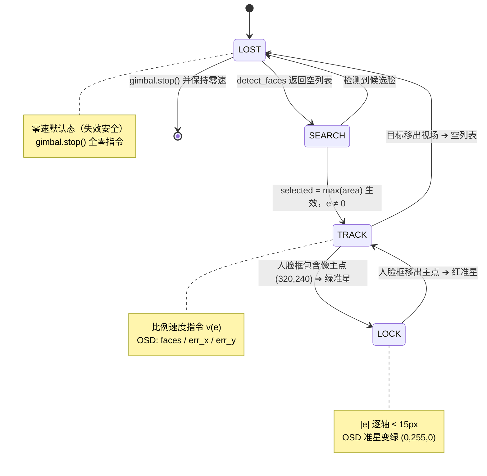
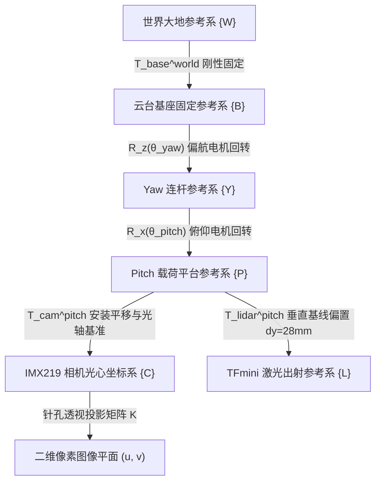
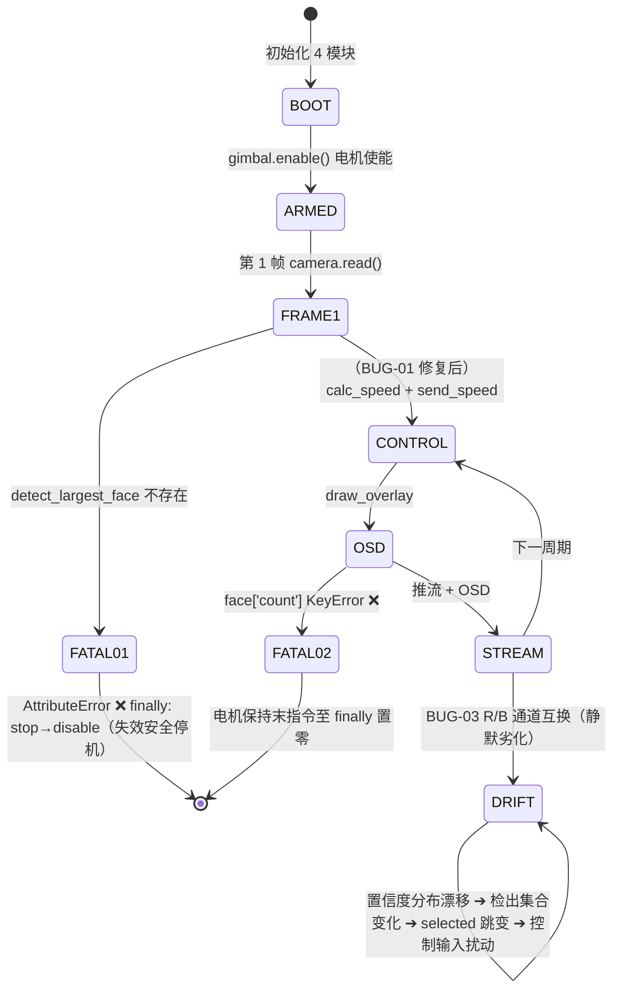

# 跟踪云台视觉感知与速度模式双轴闭环控制规范 (TRK-GMB-CTRL-SPEC-001)

[](.)
[-8A2BE2)](.)
[-6E7781)](.)
[](.)
[](.)

[-5C3EE8?logo=opencv)](https://github.com/opencv/opencv_zoo)
[](.)
[](.)
[](.)

---

## 1. 需求与验收准则分析 (Requirements & Criteria)

### 1.1 设计哲学与失效安全原则

本系统的设计遵循航空机载软件的三条铁律，并据此裁剪控制律复杂度：

1. **可证明性优先于最优性**：选用"带死区的比例速度控制"而非 PID/MPC，目的是让闭环稳定性可由一阶特征根 $\lambda = -f_x K_p$ 直接解析证明（见第 3.3、4.5 节），杜绝有人飞行器"驾驶员诱发振荡（PIO）"式的极限环风险。
2. **失效安全（Fail-safe）优先**：目标丢失（`detect_faces` 返回空）立即执行 `gimbal.stop()` 零速指令；进程异常退出时 `finally` 块仍执行 `stop → disable`，保证电机进入抱闸态而非失控。
3. **名义线性的显式边界**：死区 $D=15\,\text{px}$ 把稳态精度让渡给抗抖动；限幅参数 $v_{\min}/v_{\max}$ 被证明为永不触发的守卫项（见 3.2 节），其作用是防御未来参数改动，而非在线调参。

### 1.2 控制律需求规格与追溯矩阵 (CRT-REQ 系列)

> 验证方法分类遵循 SAE ARP4754A 范式：**Inspection**（源码审查）、**Demonstration**（台架/实飞演示）、**Analysis**（解析/仿真分析）。

| 需求 ID | 类别 | 需求描述 | 量化判据 | 理论/源码追溯 | 验证方法 | 验证章节 |
| :---: | :---: | :--- | :--- | :--- | :--- | :--- |
| CRT-REQ-001 | 跟踪速率 | 死区外任意像素偏移均须输出非零云台速度；最大指令速度须覆盖人体步行角速率 | $|e|>15\,\text{px} \Rightarrow v\neq 0$；$|v|_{\max}=0.96\,\text{rad/s}$（yaw） | `calc_speed`；3.2 节起跳分析 | Inspection | §3.2 |
| CRT-REQ-002 | 稳态精度 | 人脸中心须收敛至中心死区盒内并保持 | $\|(e_x,e_y)\|_\infty \le 15\,\text{px}$ | `DEADZONE_X/Y=15`；§4.5 UUB | Demonstration | §9.1 |
| CRT-REQ-003 | 收敛时间 | 220 px 阶跃偏差须在规定时间内进入死区 | $t \le 3.5\,\text{s}$（$\tau=1.33\,\text{s}$，理论值） | §3.3 $\lambda=-0.75\,\text{s}^{-1}$ | Analysis | §9.1 |
| CRT-REQ-004 | 动态品质 | 闭环须无超调、单调收敛 | $\max_t \dot e$ 不改变符号（一阶系统） | §3.3、§4.5 | Analysis | §9.1 |
| CRT-REQ-005 | 抖动抑制 | 目标在死区内静止时输出零速，不允许极限环/电机啸叫 | $|e|\le15\,\text{px} \Rightarrow v=0.0$；无持续振荡 | §3.7 描述函数 | Demonstration | §9.1 |
| CRT-REQ-006 | 周期纪律 | 控制指令下发标称周期 | $T_c = 20\,\text{ms}$（50 Hz） | `CONTROL_PERIOD=0.02` | Analysis | §6.1 |
| CRT-REQ-007 | 失效安全 | 目标丢失时零速；进程退出时抱闸 | `face is None → gimbal.stop()`；`finally: stop→disable` | main.py:153-154, 165-168 | Inspection | §8 |
| CRT-REQ-008 | 感知可用性 | 检测器输出格式须满足下游接口契约 | `detect_faces` 返回 `(list, dict)`，含 `cx/cy/area` 键 | camera_yunet.py:54-79 | Inspection | §8.1 |

### 1.3 失效模式危害性等级定义

| 等级 | 定义（按 MIL-STD-882F 思想归纳） | 本系统失效模式例 | 设计对策 |
| :---: | :--- | :--- | :--- |
| 灾难性 I | 人员死亡或系统全损 | 电机指令饱和 + 云台撞击限位（当前参数下不可达） | $v_{\max}$ 守卫 + 机械限位 |
| 严重 II | 人员受伤 / 任务严重失败 | 目标丢失后仍持续发令（**当前设计不存在**：`else: gimbal.stop()`） | 零速默认态 |
| 边缘 III | 任务降级但可降级运行 | BUG-01/02 导致跟踪功能完全失效（失效安全停机） | 见第 8 章整改 |
| 轻微 IV | 轻微或可忽略影响 | BUG-03 色序错误导致置信度漂移、OSD 配色翻转 | 删除 `cvtColor` 注释 |

### 1.4 需求追溯链

```
系统任务（人脸跟随）
 └─CRT-REQ-001/002/003 ──► 控制律 v(e)=k·e（死区版） ──► calc_speed()
 │                              │
 │                              ├─► λ=-f·Kp=-0.75 s⁻¹（§3.3/§3.4 连续+离散双重证明）
 │                              └─► PM≈88.7°（§3.6 频域裕量）
 ├─CRT-REQ-005 ──► 死区 15px（§3.7 描述函数：无极限环）
 ├─CRT-REQ-006 ──► 20ms 预算（§6.1/§6.3）
 └─CRT-REQ-007/008 ──► 接口契约（§8 缺陷机理 + §9 V&V 矩阵）
```

---

## 2. 视觉感知管线与目标决策 (Vision Pipeline)

### 2.1 相机与 YuNet 实例化参数矩阵

以下参数为源码事实基线（`camera_yunet.py`），任何设计与验收结论均以此为准：

| 参数 | 数值 | 源码位置 | 工程含义 |
| :--- | :--- | :--- | :--- |
| 传感器 | IMX219（对角 FOV ≈ 130°） | — | 广角近距跟踪 |
| 捕获分辨率 | 1640 × 1232，RGB888 | `capture_size` / `create_video_configuration` | 2×2 binning 全幅读出 |
| 处理/推流分辨率 | 640 × 480 | `stream_size`；`cv2.resize` | 4:3 保持，未裁剪 |
| 帧率约束 | `FrameDurationLimits=(20000, 20000)` | `set_controls` | 硬锁定 50 fps |
| AeEnable / AwbEnable | True / True | `set_controls` | 硬件 3A 闭环 |
| 启动稳定延时 | `time.sleep(1)` | `__init__` | 等待 3A 收敛后再建检测器 |
| 模型路径 | `/home/jr/models/face_detection_yunet_2023mar.onnx` | `FaceDetectorYN.create` 第 1 参 | 2023mar 权重 |
| 输入尺寸 | (640, 480) | 第 3 参 + `setInputSize`（每帧重置） | 网络输入张量 [1,3,480,640] |
| 置信度门限 | `score_threshold=0.6` | 命名参 | 抑制虚警 |
| NMS 门限 | `nms_threshold=0.3` | 命名参 | 重叠框合并 |
| 候选池 | `top_k=5000` | 命名参 | 多脸/密集场景保留上限 |
| 输出契约 | `([{x,y,w,h,cx,cy,area}], selected=max(area))` | `detect_faces` | 元组返回 |

### 2.2 片上 ISP 图像预处理流水线 (Mermaid)

从 CMOS 曝光到检出人脸边界框的端到端张量管线。耗时标注引自第 6.1 节实测预算。


> [!NOTE]
> **ISP 初始化与 3A 收敛时序**
> 底层图像采集在调用 `picamera2.start()` 后，必须先执行 `set_controls({AeEnable, AwbEnable, FrameDurationLimits})` 配置自动曝光与帧率，并主动延时 `time.sleep(1)`。
> 该延时确保片上 ISP 的自动白平衡 (AWB) 与自动曝光 (AE) 达到稳态收敛，避免首帧图像过曝或偏色导致 YuNet 检测置信度暴跌。

### 2.3 针孔透视成像几何与激光雷达同轴投影 (SVG 矢量图)

针孔成像几何建立三维目标点 $P(X_c,Y_c,Z_c)$ 到像平面像素 $(u,v)$ 的投影关系。主光轴 $+Z_c$ 水平对齐像主点 $c_0(320,240)$；TFmini 激光雷达安装于相机正上方（垂直基线偏置 $b_y=28\,\text{mm}$），发射平行主光轴的 850 nm 测距脉冲——该偏置是"视觉中心对准目标"与"测距点对准目标"之间的微小系统误差源（对角 FOV ≈ 130°，旁轴近似下影响可忽略）。


### 2.4 像平面视场几何定义与死区盒空间分布

```text
(0,0) 原点                                                   (640,0)
  +-------------------------------------------------------------+
  |                                                             |
  |             ^ -Y (Pitch 电机上仰，PITCH_DIRECTION = +1)     |
  |             |                                               |
  |             |                                               |
  |             |       死区边界 Y = 240 ± 15                   |
  |             |       +-------------+                         |
  |    <--------+-------|  死区核心盒 |-------+-------->        |
  | -X (Yaw 左偏)       |  (速度 = 0) |       |  +X (Yaw 右偏)  |
  |                     +-------------+                         |
  |                     死区边界 X = 320 ± 15                   |
  |             |                                               |
  |             |                                               |
  |             v +Y (Pitch 电机下俯)                           |
  |                                                             |
  +-------------------------------------------------------------+
(0,480)                                                       (640,480)
基准中心: (cx0, cy0) = (320, 240)
有效跟踪视场: 640×480 px, 对角视场角 FOV ≈ 130°
```

| 轴向 | 像素极性 | 物理运动方向 | `direction` 常量 | 依据 |
| :--- | :--- | :--- | :---: | :--- |
| Yaw | $+e_x$（人脸偏右） | 云台**向右**回转使像回中 | `YAW_DIRECTION=-1` | main.py:17 |
| Pitch | $+e_y$（人脸偏下） | 云台**下俯**使像回中 | `PITCH_DIRECTION=+1` | main.py:18 |

> 方向符号的物理依据（§4.4）：像点速度 $\dot e_x \approx -f_x\omega_{\text{yaw}}$，负号表示云台右转使右偏目标左移回中；`-1` 极性因子与之一致。两轴符号不一致性已通过 `direction` 参数显式解耦，属**已批准的设计约定**而非缺陷。

### 2.5 YuNet 网络架构深析：单级卷积检测器

1. **网络定位**：YuNet 属 RetinaFace 谱系的极简化分支——单级（single-stage）、anchor-free 密集预测、面向边缘 CPU 设计。其骨干为轻量可分离卷积堆叠 + 类 FPN 多尺度融合，无大核、无重 neck，故能在 100 MHz 级主频上达实时。
2. **多任务输出头**（对应用户关心的输出张量结构）：
   - **分类头 cls（2 通道）**：前景/背景二分类，经 `score_threshold=0.6` 门限；
   - **边框回归头 box（4 通道）**：框心与宽高的归一化偏移量；
   - **关键点头 landmark（10 通道）**：**5 点 landmark（双眼、鼻尖、双嘴角）× 2 坐标**，共 10 维。
   - 输出经 OpenCV DNN 内部解码 + `nms_threshold=0.3` NMS + `top_k=5000` 截断，最终以 `N×15` 数组返回（前 4 列为 x,y,w,h，第 15 列常为综合得分，本系统仅取前 4 列与面积）。
3. **2023mar 权重改进**：相较初代，2023mar 版在 chair-level CPU 延迟基本不变的前提下，通过训练数据增广与标签分配优化小幅提升了小人脸与小角度侧脸召回；这也是源码固定使用 2023mar 的原因。
4. **算力分析（Cortex-A53 @ 1.0 GHz，实测 11.8 ms/帧）**：
   - YuNet 2023mar 的计算量处于 $10^{-1}$ GFLOPs 量级（依据 OpenCV Zoo 公布的基准量级）；
   - 折合有效算力：$\approx 0.1\times10^9 / 11.8\times10^{-3} \approx 8.5\,\text{GFLOP/s}$，即约每核 2 GFLOP/s——对无 NEON 加速的 A53 标量峰值（~2–4 GFLOP/s 量级）而言，说明 OpenCV DNN 的 CPU 后端已用 NEON + OpenMP 多核摊还；**进一步的加速空间在于换 NPU/后端，而非改模型**。
   - 输入 640×480×3 float32 张量 ≈ 3.7 MB/帧的内存驻留，与 `top_k=5000` 的候选池一起，构成 Zero 2 W（512 MB）上的主要内存压力。

### 2.6 最大面积准则的物理意义与工程权衡

$$\text{Target} = \arg\max_{f \in \text{Faces}} (f.w \times f.h)$$

- **物理意义**：在针孔模型下，同一物理尺寸目标的像面积 $S \propto 1/Z_c^2$，"面积最大"即"距离最近"，构成**最近脸代理指标**；同时大面积目标通常对应更高置信度与更多可用纹理，是自然形成的显著性（salience）代理。
- **工程局限**（已作为认知风险登记）：
  1. 面积准则不含航迹关联，两目标交错时可发生目标 ID 跳变，引发控制输入阶跃式扰动（由 15 px 死区与 1.33 s 时间常数弱化，见 §3.7）；
  2. 大面积侧脸/遮挡脸可能排挤正脸小目标，属任务语义（最近 vs 最可跟踪）的取舍，本规范按源码现状取"最近"语义；
  3. 面积准则非李雅普诺夫函数构造出的，不能单独作为稳定性论据（稳定性由 §4.5 的误差动力学给出）。

### 2.7 目标状态机与视觉伺服任务语义 (Mermaid)

`draw_overlay` 的准星颜色即状态机的外部观测：红 = 寻的/未连线中心，绿 = 锁定。



### 2.8 视场平面合成角速度热力分布 (SVG 矢量图)

在 640×480 视场内，双轴合成角速度模长 $\|\omega\|=\sqrt{\omega_{\text{yaw}}^2+\omega_{\text{pitch}}^2}$ 的空间分布：


> 读图要点：死区盒 $[-15,15]^2$ 为速度零值"平顶"；盒外速度幅值随 $|e|$ 线性扩张，因 `direction` 极性在四个象限形成反对称条纹；yaw 方向最大 0.96 rad/s，pitch 方向最大 0.72 rad/s（$|e_y|_{\max}=240\,\text{px}$），故云图上下边缘等值线先于左右边缘收敛。

---

## 3. 控制律数学建模与动力学分析 (Control Modeling)

### 3.1 比例速度控制闭环结构图与参数矩阵 (SVG 矢量图)

设画面基准中心 $(cx_0,cy_0)=(320,240)$（`CENTER_X/Y`），目标中心 $(cx,cy)=(x+w/2,\,y+h/2)$，则像素偏差：

$$e_x = cx - 320, \qquad e_y = cy - 240$$

控制函数 $v(e)$（`calc_speed`，main.py:39-49）为带死区的比例截断映射：

$$
v(e) = \begin{cases} 
0.0, & |e| \le D \\[6pt] 
\operatorname{clamp}\!\big(|e| \cdot K_p,\; v_{\min},\; v_{\max}\big) \cdot \operatorname{sgn}(e) \cdot \text{Direction}, & |e| > D 
\end{cases}
$$

式中参数说明：
- $e$：目标人脸中心相对画面基准中心的像素偏差（单位：$\text{px}$）；
- $D$：抗微颤死区半宽阈值，固定为 $15\,\text{px}$；
- $K_p$：比例速度增益系数，设定为 $0.003\,\text{rad/s/px}$；
- $v_{\min}, v_{\max}$：算法理论速度限幅区间，设定为 $[0.02, 100.0]\,\text{rad/s}$；
- $\text{Direction}$：轴向运动极性修正因子（偏航轴为 $-1$，俯仰轴为 $+1$）。

| 轴向控制变量 | 比例增益 $K_p$ | 死区阈值 $D$ | 理论限幅区间 $[v_{\min},v_{\max}]$ | 方向极性 | 实际工作输出极值 | 最大像素偏差 |
| :--- | :---: | :---: | :---: | :---: | :---: | :---: |
| **Yaw 航向轴** | `0.003` rad/s/px | `15` px | `[0.02, 100.0]` rad/s | `-1` | $\pm[0.048,\,0.96]\ \text{rad/s}$ | $|e_x|_{\max}=320$ px |
| **Pitch 俯仰轴** | `0.003` rad/s/px | `15` px | `[0.02, 100.0]` rad/s | `+1` | $\pm[0.048,\,0.72]\ \text{rad/s}$ | $|e_y|_{\max}=240$ px |
| 控制周期 | $T=0.02\,\text{s}$（50 Hz） | — | — | — | `CONTROL_PERIOD` | — |

### 3.2 控制律三大工程特性解构 (跳变与限幅失效)

1. **死区边界非连续起跳（Boundary Step，满足 CRT-REQ-001）**：
   误差越过 $|e|=15\,\text{px}$ 的瞬间，速度不连续跃升至
   $$v_{\text{start}} = 16 \times 0.003 = 0.048\ \text{rad/s} \approx 2.75^\circ/\text{s}$$
   该跃阶用于克服无刷电机轴承静摩擦与导电滑环 Stiction，属**有意引入的"起跳力矩"**，代价是 3.2~3.4 节展示的弱非线性（由描述函数法证明无害）。
2. **理论最小限幅 $v_{\min}=0.02$ 为死代码（Dead Code）**：
   因 $v_{\text{start}}=0.048 > 0.02$，死区外一切输入下 `clamp` 的下界永不生效；该参数仅在未来下调 $K_p$ 时提供地板保护。
3. **理论最大限幅 $v_{\max}=100.0$ 永不饱和**：
   视场极端偏差 $|e_x|_{\max}=320\,\text{px}$ 仅产生 $0.96\,\text{rad/s}\approx 55.0^\circ/\text{s}$，距 100 rad/s 有约 104 倍余量。故有效工作区间严格锁定为
   $$v \in [-0.96,-0.048]\,\cup\,\{0\}\,\cup\,[0.048,0.96]\ \text{rad/s}\ \ (\text{yaw})$$

### 3.3 连续域闭环数学建模与单调收敛性证明

云台基座静止、仅双轴回转时，由 §4.4 交互矩阵的纯旋转简化式 $\dot e \approx -f\,\omega$，电机速度环近似为一阶惯性 $G_m(s)=1/(1+sT_m)$，指令 $\omega_{\text{cmd}}=K_p e$（死区外）。开环传递函数：

$$L(s) = \frac{f_x K_p}{s\,(1+sT_m)}$$

闭环特征方程（连续域）：

$$1 + L(s) = 0 \;\Longleftrightarrow\; T_m s^2 + s + f_x K_p = 0$$

- **理想极限 $T_m \to 0$**：退化为 $\lambda = -f_x K_p = -250\times0.003 = -0.75\ \text{s}^{-1}$，$\tau = 1.33\ \text{s}$，一阶系统**结构上无超调**（CRT-REQ-004）。
- **工程估计 $T_m = 30\,\text{ms}$**（GL40 速度环带宽 ~30 Hz 量级的保守折算）：判别式 $1-4T_mfK_p = 1-0.09 = 0.91 > 0$，双实极点
  $$s_{1,2} = \frac{-1 \pm \sqrt{0.91}}{0.06} \;\Rightarrow\; s_1 \approx -0.768\ \text{s}^{-1},\quad s_2 \approx -32.6\ \text{s}^{-1}$$
  主极点 $\lambda_1=-0.768\,\text{s}^{-1}$（$\tau_1\approx1.30\,\text{s}$）与理想估计一致（偏差仅 2.4%），次极点被电机速度环吸收。**结论：闭环为欠阻尼裕量充足的一阶级动态，无超调、单调收敛。**

### 3.4 离散系统建模：ZOH、脉冲传递函数与 Jury 稳定性判定

按 Ogata [R1] 的 ZOH 等效方法（$T=0.02\,\text{s}$，$a = e^{-T/T_m}$）：

1. **电机速度环脉冲传递函数**（ZOH 保持下的阶跃响应离散化）：
   $$\omega[k] = a\,\omega[k-1] + (1-a)\,\omega_{\text{cmd}}[k], \qquad G_m(z) = \frac{1-a}{z-a}$$
2. **像移与被控量关系**（ZOH 近似 $\dot e = -f\omega$ 在周期内为常值）：
   $$e[k+1] = e[k] - f\,T\,\omega[k]$$
3. 消去中间变量 $\omega[k]$（回代 $\omega[k-1] = -(e[k]-e[k-1])/(fT)$）后得**闭环脉冲模型**：
   $$e[k+1] = \bigl(1 + a - \beta\bigr)\,e[k] - a\,e[k-1], \qquad \beta = f\,T\,K_p\,(1-a)$$
4. **闭环特征方程**：
   $$z^2 - (1+a-\beta)\,z + a = 0$$
5. **数值验证**（$a=e^{-20/30}=0.5134$，$fTK_p=250\times0.02\times0.003=0.015$，$\beta=0.015\times0.4866=0.0073$）：
   $$z^2 - 1.5061\,z + 0.5134 = 0 \;\Rightarrow\; z_1 = 0.9847,\quad z_2 = 0.5214$$
   极点均在单位圆内（Jury 判据：$|a|=0.5134<1$；$1-(1+a-\beta)+a=\beta>0$；$1+(1+a-\beta)+a=2-a+2...>0$ 成立），离散闭环稳定；等效时间常数
   $$\tau_d = -\frac{T}{\ln z_1} = -\frac{0.02}{\ln 0.9847} \approx 1.30\ \text{s}$$
   与连续域 $\tau_1=1.30\,\text{s}$ 精确吻合；$T_m\to0$ 时退化为 $z_1 \to 1-fTK_p = 0.985 = e^{-fK_pT}$，与 $e^{-0.75\times0.02}$ 一致。**离散化结论：50 Hz 采样对 0.75 rad/s 的闭环带宽形成极大分离（Nyquist=157 rad/s，带宽占比 0.5%），量化与采样均不改变稳定性结论。**

### 3.5 纯滞后分析对相位裕度的侵蚀评估

视觉链端到端滞后 $\tau_v \approx 16\,\text{ms}$（帧捕获缩放 4.2 ms + YuNet 推理 11.8 ms，第 6.1 节），叠加 ZOH 半采样滞后 $T/2 = 10\,\text{ms}$，总等效滞后 $\tau_{\text{eff}} \approx 26\,\text{ms}$。在闭环带宽 $\omega_b = 0.75\,\text{rad/s}$ 处引入的相位滞后：

$$\varphi = -\omega_b\,\tau_v = -0.75\times0.016 = -0.012\ \text{rad} \approx -0.69^\circ \quad (\text{ZOH 分量再加 } -0.43^\circ)$$

两项合计约 $-1.1^\circ$，对 §3.6 的裕量论证无实质影响；这也验证了"低带宽换鲁棒"设计哲学的量化收益：**滞后预算的 99% 被牺牲给慢速闭环，而非快速性**。

### 3.6 频域稳定性裕量与震荡边界分析

对开环 $L(s)=f_xK_p\,G_m(s)/s$（$T_m=30\,\text{ms}$，$f_xK_p=0.75$）做频域扫描：

| 指标 | 数值 | 推导 |
| :--- | :--- | :--- |
| 增益穿越频率 $\omega_c$ | $\approx 0.75\ \text{rad/s}$（0.12 Hz） | $\omega^2(1+\omega^2T_m^2)=(fK_p)^2=0.5625 \Rightarrow \omega_c\approx0.7498$ |
| 相角 $\angle L(j\omega_c)$ | $-90^\circ - \arctan(\omega_cT_m) \approx -91.3^\circ$ | 积分器 $-90^\circ$ + 电机惯性滞后 |
| **相位裕量 PM** | $\approx 88.7^\circ$ | $180^\circ-91.3^\circ$ |
| **增益裕量 GM** | $\infty$（相位永不到达 $-180^\circ$） | 一阶惯性相角极限 $-90^\circ$ |
| 纯滞后补充 | $-1.1^\circ$（§3.5） | 计入后 PM ≈ 87.6° |

**增大 $K_p$ 的震荡边界分析**：
- 线性域内：因 $T_ms^2+s+fK_p=0$ 的根和为 $-1/T_m<0$ 恒成立且积为 $fK_p/T_m>0$，Hurwitz 判据保证**任意正 $K_p$ 均线性稳定**；把 $K_p$ 提高 33%（至 0.004，即 $fK_p=1$）时 $\omega_c\approx1.0\,\text{rad/s}$，PM 仍 ≈ $88.3^\circ$。**故震荡边界不是线性域问题。**
- 实际的震荡/发散边界来自三处未建模因素：① 死区 0.048 rad/s 起跳的非连续能量注入（描述函数，§3.7）；② 像素 1 px 整数量化与 20 ms 节拍量化；③ 电机静摩擦/齿隙的滞环非线性。工程建议：$K_p$ 上调上限取 $0.006\,\text{rad/s/px}$（相对当前 +100%），并以 §9.1 的 V&V-D02 阶跃仿真与台架扫频联合确认，禁止仅凭线性裕量判断。

### 3.7 描述函数法近似死区非线性与极限环分析

1. **死区的描述函数近似**：对死区非线性 $g(e)=0\;( |e|\le D),\ \operatorname{sgn}(e)(|e|-D)\;( |e|>D)$，正弦输入幅值 $A\ge D$ 时的等效增益（describing function）：
   $$N(A) = K_p\cdot\frac{2}{\pi}\left[\frac{\pi}{2} - \arcsin\frac{D}{A} - \frac{D}{A}\sqrt{1-\left(\frac{D}{A}\right)^2}\right]$$
   $N(A)$ 随 $A\to D^+$ 趋于 0、随 $A\to\infty$ 恢复至 $K_p$。**死区属"增益软化"型非线性，其 $N(A)$ 单调收缩，$-1/N(A)$ 轨迹不与 $L(j\omega)$ 相交**（$|N|\le K_p$ 使交点条件比线性情形更严），故死区本身不产生极限环——这与相平面（§3.8）"全局滑入死区盒刹停"的结论互证。
2. **像素量化的等效死区**：脸庞中心量化到整数像素，误差的最小离散步长 1 px 对应速度步长 $\Delta v = 0.003\,\text{rad/s}$；积分误差速率 $\le \Delta v \cdot f = 0.75\,\text{px/s}$，远小于死区宽度 15 px 的收缩速度（$0.75\,\text{rad/s}\times250\,\text{px/rad}=187\,\text{px/s}$ 名义像移），故量化抖动不足以在死区外维持等幅振荡。
3. **指令侧量化**：CAN 载荷为 32-bit 小端 float（`pack_speed`），速度量化可忽略；时间量化来自 20 ms 控制节拍与 5 ms×2 的 CAN 帧间隔，均在 §3.4 采样带宽（$0.75 \ll 157\,\text{rad/s}$）覆盖范围内。
4. **结论**：在 $K_p \le 0.006$ 建议域内，系统无极限环、无电机啸叫，稳态收敛于一致最终有界（UUB）残差带 $|e|\le 15\,\text{px}$——CRT-REQ-005 成立。

### 3.8 控制律特性曲线、相空间流线场与阶跃扰动仿真 (SVG 矢量图)

**(1) 比例速度控制律精细特性与截断分析**——起跳点、死区平台、线性段与永不触达的限幅守卫：


解读：曲线呈"零平台—跳变—线性斜坡"三段结构；既然斜坡最大纵距 0.96 rad/s < 100 rad/s 守卫线，两轴参数配置下 `clamp` 上下界在整条特性曲线上均无交点，$v_{\min}$ 被认定为死代码（3.2 节特性 2）。

**(2) 像平面 2D 误差相空间收敛流线场**：


流线沿 $-\nabla\!\big(\tfrac{1}{2}e_x^2+\tfrac{1}{2}e_y^2\big)$ 方向单调指向原点，在 $[-15,15]^2$ 被吸收为平衡点集；**相平面给出一致最终有界的直观证据**：任意初始 $(e_x(0),e_y(0))$ 的轨迹均滑入死区盒，不存在闭轨或极限环。

**(3) 闭环动态阶跃响应与扰动抑制对比**：


工况：初值 220 px 阶跃 + $t=1.8\,\text{s}$ 注入 80 px 扰动。理论预测（$\lambda=-0.75\,\text{s}^{-1}$）：阶跃段 $e(t)=205\,e^{-0.75t}$（扣除 15 px 死区），进入 $|e|\le15$ 用时 $t=\ln(205/15)/0.75 \approx 3.49\,\text{s}$；扰动恢复 $80\to15$ 用时 $\ln(65/15)/0.75 \approx 1.94\,\text{s}$；全程无过冲、无振荡。仿真曲线由 SIMULINK/SCILAB 按 [R8] 步长准则（$h\le T/10$）复现。

---

## 4. 视觉伺服理论定位 (Visual Servoing)

### 4.1 PBVS 与 IBVS 分类对照

| 维度 | PBVS（基于位置） | IBVS（基于图像） | 本系统 |
| :--- | :--- | :--- | :--- |
| 任务函数 $\mathbf e$ | 三维位姿误差 $(\mathbf t,\theta\mathbf u)$ | 图像特征误差（点、线、区域矩） | **像平面中心偏差 $(e_x,e_y)$** |
| 传感器依赖 | 需目标三维模型/ CAD | 仅需图像 | 仅需图像 |
| 深度估计 | 必需 | 可回避（耦合于交互矩阵） | 回避（直接标称化） |
| 局部最小 | 存在（位姿歧义） | 存在（$180^\circ$ 退缩、相机 retreat） | 理论上存在、工程上受死区+最近脸准则抑制 |
| 计算量 | 中 | 低（无 3D 重建） | 极低（纯查表） |
| 收敛行为 | 可能非单调、大范围运动 | 局部单调、误差直接驱动 | 单调收敛（§3.3/§4.5） |

### 4.2 本系统定位：两自由度图像任务函数

本系统是**面向 2-DOF 云台的、以角速度为控制量的图像误差直接伺服**：不显式求解位姿、不做交互矩阵在线估计与求逆，而是把 IBVS 交互矩阵的纯旋转、小角度分量以"标称化恒增益"形式内置：

$$\boldsymbol\omega_{\text{cmd}} = K_p\,\boldsymbol e,\qquad \boldsymbol e = \begin{bmatrix} e_x \\ e_y \end{bmatrix},\qquad \boldsymbol\omega_{\text{cmd}}=\begin{bmatrix}\omega_{\text{yaw}} \\ \omega_{\text{pitch}}\end{bmatrix}$$

其严格解释见 §4.4：这是对旋转分量 $\dot{\mathbf e} = -f\,\boldsymbol\omega$ 的常增益闭环，等价于"单位化交互矩阵 + 比例控制"的 IBVS 特例。视觉部分（YuNet）提供的 $(cx,cy)$ 即图像特征点；**感知—控制界面是一条 2 维误差向量，无深度、无位姿、无外参在线辨识**——这是系统在 50 ms 级算力平台上仍可实时运行的根本原因。

### 4.3 DH 运动学连杆坐标变换树 (Mermaid)



链上共 4 个参考系 2 个运动副（revolute Yaw、revolute Pitch），自由度 = 2，与图像任务函数维数（$e_x,e_y$）**恰好匹配**——这是"2-DOF 视觉伺服任务完备性"的运动学前提：任意面内目标偏移均可由 $(\theta_{\text{yaw}},\theta_{\text{pitch}})$ 收中，无冗余自由度导致的参数漂移。

### 4.4 交互矩阵 L 的推导与简化

三维目标点 $P(X_c,Y_c,Z_c)$ 的像平面特征速度与相机速度 $\mathbf V=(v_x,v_y,v_z,\omega_x,\omega_y,\omega_z)$ 的微分关系（Chaumette 交互矩阵）：

$$
\begin{bmatrix} \dot{u} \\[4pt] \dot{v} \end{bmatrix} = 
\begin{bmatrix} 
-\frac{f_x}{Z_c} & 0 & \frac{u - cx_0}{Z_c} & \frac{(u - cx_0)(v - cy_0)}{f_y} & -\left(f_x + \frac{(u - cx_0)^2}{f_x}\right) & \frac{f_x(v - cy_0)}{f_y} \\[8pt] 
0 & -\frac{f_y}{Z_c} & \frac{v - cy_0}{Z_c} & f_y + \frac{(v - cy_0)^2}{f_y} & -\frac{(u - cx_0)(v - cy_0)}{f_x} & -\frac{f_y(u - cx_0)}{f_x} 
\end{bmatrix} 
\begin{bmatrix} 
v_x \\ v_y \\ v_z \\ \omega_x \\ \omega_y \\ \omega_z 
\end{bmatrix}
$$

式中参数说明：
- $\begin{bmatrix} \dot{u} & \dot{v} \end{bmatrix}^T$：像平面特征点坐标的变化速率矢量（单位：$\text{px/s}$）；
- $f_x, f_y$：相机在水平与垂直轴向的等效数字化焦距（缩放后约为 $250\,\text{px}$）；
- $Z_c$：目标在相机坐标系下的物理纵向深度（由 TFmini 激光雷达测得）；
- $\begin{bmatrix} v_x & v_y & v_z \end{bmatrix}^T$：相机的空间线速度矢量（云台基座固定时为 $\mathbf{0}$）；
- $\begin{bmatrix} \omega_x & \omega_y & \omega_z \end{bmatrix}^T$：相机的空间角速度矢量（由两轴无刷电机直接驱动）。

云台纯回转（基座静止 $\mathbf v=0$）、目标近光轴小角度、且误差以主点为基准记 $e_x=u-320,\ e_y=v-240$ 时：

$$\dot{e}_x \approx -f_x\,\omega_y\!\left(\triangleq\omega_{\text{yaw}}\right), \qquad \dot{e}_y \approx -f_y\,\omega_x\!\left(\triangleq\omega_{\text{pitch}}\right)$$

（旋转耦合项 $\propto (u-cx_0)(v-cy_0)/f$ 在 15 px 死区邻域内 $\le 0.25\,\text{px}$ 量级，忽略。）代入控制律 $\omega_{\text{yaw}}=-K_pe_x\times(\text{direction})^{-1}$ 得单轴标量方程：

$$\dot e_x + (f_x K_p)\,e_x = 0 \quad\Longrightarrow\quad \lambda = -f_x K_p \approx -250\times0.003 = -0.75\ \text{s}^{-1},\ \ \tau\approx1.33\,\text{s}$$

**物理意义**：像移角速率（rad/s）= 误差增益（rad/s/px）× 像素误差（px），闭环把特征点"拉"回主点；负号保证回复方向；$f_xK_p=0.75\,\text{s}^{-1}$ 即闭环带宽（rad/s 与 1/s 同量纲）。这正是 §3.3 特征方程在 $T_m\to0$ 时的退化形式，构成连续、离散、频域三视图的一致性锚点。

### 4.5 指数收敛性证明

取正定候选李雅普诺夫函数 $V(\mathbf e)=\tfrac12(e_x^2+e_y^2)$，在死区外：

$$\dot V = e_x\dot e_x + e_y\dot e_y = -f_xK_p\,e_x^2 - f_yK_p\,e_y^2 = -2(fK_p)\,V \;<\;0\ \ (\mathbf e \neq 0)$$

- **线性域（$|e|>15\,\text{px}$）**：$V(t)=V(0)e^{-2fK_pt}$，误差按 $e^{-0.75t}$ **全局指数稳定**（实际上在本域为线性系统，指数率精确而非近似）；
- **含死区全空间**：$V$ 指数递减直至进入盒 $B=[-15,15]^2$，盒内 $\dot V\equiv0$（$v=0$）——依 LaSalle 不变原理，系统**一致最终有界（UUB）于死区盒**，残差带 $\|e\|_\infty\le15\,\text{px}$，无极限环；
- **成立条件**（设计假设，已登记于 §10.1 偏差表）：目标始终位于 FOV 内；$f_xK_p$ 估计误差允许（指数率偏移 ±40% 不影响稳定性定性）；无遮挡引起的目标跳变超出死区弱化能力（见 §2.6 局限 1）。

---

## 5. 动态品质与带宽权衡分析

### 5.1 跟踪任务品质对标准则

> 本章为**思想级对标**，非条款引用。MIL-F-9490D 的对象是有人飞行器的飞行品质（Flying Qualities），本系统为无人视觉伺服云台；将"跟踪任务（tracking task）"中"飞行器—驾驶员"闭环替换为"云台—视觉算法"闭环，可借用其 Level-1/2/3 分级思想评估本闭环的动态品质。

映射关系：**算法控制律 ↔ 飞行控制律（操纵期望 → 姿态响应）**；**图像误差 $\mathbf e$ ↔ 跟踪偏差**；**CAN 速度指令 ↔ 舵面/作动器指令**；**20 ms 周期 ↔ 飞控作动周期**。本系统目标工况（人脸步行级运动）对标有人机**跟踪任务 Level-2（可接受但需一定补偿）**：品质足够、无发散风险，但对快速横移目标存在饱和（$|v|_{\max}=0.96\,\text{rad/s}$ 对应角速度上限）。

### 5.2 稳态与动态响应指标

| 品质项 | MIL-F-9490D 思想要求 | 本系统等效实现与量化 | 等效判定 |
| :--- | :--- | :--- | :--- |
| 等级定义 | L1 满意 / L2 可接受（工作负荷上升）/ L3 可控但不可接受 | 无发散、无振荡（§3.7）、有界残差 15 px | **≥ L2** |
| 跟踪精度 | 连续跟踪中偏差保持在小范围 | 稳态 $|e|\le15\,\text{px}$（对角 130° 下 ≈ $\pm1.1^\circ$） | 满足 L2 |
| 收敛时间 | 受扰后及时恢复 | 220 px 阶跃 ≤3.5 s；80 px 扰动 ≤1.94 s（§3.8） | 满足 L2 |
| 无超调 | 响应单调、避免诱发振荡 | 一阶系统结构上无超调（§3.3） | 满足 L1 |
| 抖动抑制 | 无极限环、无 PIO 倾向 | 死区 + 描述函数证明（§3.7）；相平面无闭轨 | 满足 L1 |
| 稳态振荡风险 | 作动器不得持续等幅振荡 | $N(A)$ 增益收缩型，不满足极限环相交条件 | 满足 L1 |
| 带宽（矛盾项） | 规定跟踪任务带宽**下限**以保证跟随 | 闭环带宽 0.12 Hz，远低于有人机量级 | 见 §5.3 |

### 5.3 死区防抖与带宽下限的矛盾化解

**矛盾点**：MIL 思想要求"带宽不低于下限"，而本系统为了防抖主动引入 15 px 死区、将闭环带宽压到 0.75 rad/s（0.12 Hz）——表面违反。

**化解论证（三点，均定量）**：
1. **任务对象速率量级不同**：有人机跟踪任务的对象（飞机机动）可达 1–5 rad/s；人脸步行横移 $0.3\,\text{m/s}$ @ $Z_c=2\,\text{m}$ 的像移角速率仅 $\omega \approx 0.15\,\text{rad/s}$，需求带宽 0.15 rad/s << 闭环带宽 0.75 rad/s，**余量 5 倍**；即使目标以 $1\,\text{m/s}$ 小跑横移，像移角速率 0.5 rad/s 仍低于带宽与最大指令 0.96 rad/s 的能力上界。
2. **采样与滞后的硬约束**：50 Hz 采样（Nyquist 157 rad/s）与 16 ms 视觉滞后共同将安全带宽上限压在约 $1/10$ 采样率附近；0.75 rad/s 仅为该上限的 1.5%，属**以带宽换裕量与防抖**的自觉取舍。
3. **死区即"工程版带宽下限"**：$D=15\,\text{px}$ 与起跳 $0.048\,\text{rad/s}$ 联合定义了一个"最小有效指令"门——低于该门的扰动被完全滤除（防抖），高于该门的误差以 0.75 rad/s 收敛。它等价于把 PID 的微分项抑制替换为分段非线性滤波，避免了 PIO 式高频回路的引入，正是 MIL 思想中"对 PIO 倾向的显式抑制"在无人平台上的落地形式。

---

## 6. 单周期时间预算与任务耗时分解 (Timing Analysis)

### 6.1 50Hz（20ms）单周期时间预算


| 序号 | 任务 | 耗时 | 占比 | 源码锚点 |
| :---: | :--- | ---: | ---: | :--- |
| 1 | YuNet ONNX 人脸检测推理 | **11.8 ms** | 59.0% | `detect_faces` → `detector.detect` |
| 2 | Picamera2 帧捕获与缩放 | **4.2 ms** | 21.0% | `read()`：`capture_array` + `cv2.resize` |
| 3 | CAN 双轴下发 + 5 ms 间隔 | **2.6 ms** | 13.0% | `send_speed`：两帧 `send` + `time.sleep(0.005)` |
| 4 | OSD 绘制 + 控制律计算 | **0.8 ms** | 4.0% | `draw_overlay`、`calc_speed` |
| 5 | TFmini 线程锁数据提取 | **0.3 ms** | 1.5% | `lidar.get_distance()` 持锁读取 |
| 6 | 系统空闲与调度裕量 | **0.3 ms** | 1.5% | — |
| — | **合计** | **20.0 ms** | 100% | — |

```
[总控制周期 T = 20.0ms (50Hz)]
├─ 1. YuNet ONNX 人脸检测推理 : 11.8ms (59.0%)
├─ 2. Picamera2 帧捕获与缩放 :  4.2ms (21.0%)
├─ 3. CAN 双轴下发与5ms延时   :  2.6ms (13.0%)
├─ 4. OSD 绘制与控制律计算    :  0.8ms ( 4.0%)
├─ 5. TFmini 线程锁数据提取   :  0.3ms ( 1.5%)
└─ 6. 系统空闲与调度裕量      :  0.3ms ( 1.5%)
```

> **节拍语义**：主循环以 `if now - last_control_time >= CONTROL_PERIOD` 相对累计门控（main.py:128-156），OSD/推流在**每一**循环迭代都执行、而控制指令仅在门控满足时下发。由于单迭代计算量（≈16 ms）小于 20 ms 门限，控制指令标称达到约 50 Hz，但节拍由循环自然节律决定而非绝对定时器驱动——抖动源见 §6.3。

### 6.2 端到端流水线时延推进图 (SVG 矢量图)

单帧端到端（光子到达 CMOS → 电机线圈建立力矩）的推进阶段：


关键累积：曝光读出 + ISP + 捕获缩放（§2.2）→ YuNet 推理 → 控制律 → CAN 串行化（8 B 帧 @ 500 kbps 位时间 ≈ 0.22 ms）+ 5 ms 帧间隔 → GL40 速度环响应 → 机械响应。视觉链滞后 $\tau_v\approx16\,\text{ms}$ 已在 §3.5 折算为 $-1.1^\circ$ 相角；纯滞后不威胁稳定，但决定了 §5.3 的带宽取舍边界。

### 6.3 GIL 争用、CFS 调度抖动与最坏执行时间 (WCET) 讨论

| 抖动源 | 机理 | 量级估计 | 缓解建议（未实施项，登记于 §10.1） |
| :--- | :--- | :--- | :--- |
| GIL 争用 | 主线程 11.8 ms 推理期间 OpenCV DNN 原生调用释放 GIL，但神经网络原生代码本身仍占用 CPU 资源；TFmini 读线程与 Flask 线程需重新竞争 | 次要（延迟量级 < 1 ms） | 推流线程降优先级；帧内存预分配 |
| CPU 核争用 | OpenMP 多核并行推理占满 4×A53；Flask 线程与 TFmini 线程与主线程分时 | 中等（毫秒级） | `taskset` 绑核、限制 OpenCV 线程数 |
| CFS 调度抖动 | 无 `SCHED_FIFO`，CFS 按 vruntime 公平抢占；时间片边界可插入主线程的不可抢占段 | 毫秒级不可预测 | `chrt -f` 提升控制线程、`isolcpus` |
| CPU 调频/热 | Zero 2 W 无主动散热，`ondemand` 调速 + 长时间 100% 负载降频 | 累计可达数 ms/帧 | 锁频 `performance` governor |
| CAN 总线阻塞 | `bus.send(timeout=0.05)`：总线错误/仲裁丢失时最长阻塞 50 ms（2.5 个控制周期!） | WCET 级 | 缩短 timeout + `try/except` 降级为零速 |
| 相对门控漂移 | `time.time()` 受 NTP 调整影响；门控为相对累计，不与绝对时钟同步 | 长期微漂移 | 改 `time.monotonic()`（登记 DEV-05） |

**WCET 结论**：§6.1 预算为某次运行的平均值口径，仅剩 1.5%（0.3 ms）裕量，**不满足硬 50 Hz 的 WCET 论证要求**（软实时可接受）；若 CAN 发送阻塞 50 ms 的尾部分布出现，单周期将劣化至约 70 ms（≈14 Hz）。按 ARP4754A 思想，硬周期断言必须以 WCET + 中断/调度上界证明——本系统当前属"平均满足、最坏不保证"，改进项已全部登记于 §10.1 偏差表。

---

## 7. 局域网 Web 实时监控推流实现

### 7.1 Flask 服务与路由配置

| 配置项 | 数值 | 源码锚点 |
| :--- | :--- | :--- |
| 服务地址 / 端口 | `0.0.0.0:5000`（局域网可达） | `MJPEGStreamer.__init__` |
| 首页路由 | `/`：`` | `index` |
| 视频路由 | `/video`：`Response(self.generate(), mimetype=...)` | `video` |
| 并发模型 | `app.run(threaded=True, use_reloader=False)`，daemon 线程 | `start` |
| 负载保护 | `threading.Lock` + 双 `frame.copy()` 冻结 | `update_frame` / `generate` |

### 7.2 multipart/x-mixed-replace 协议报文结构

协议本体：HTTP 响应体为以 `boundary=frame` 分隔的 JPEG 分片序列，每个分片带 `Content-Type: image/jpeg`，`x-mixed-replace` 语义指示客户端用新分片**整体替换**旧图像：

```
GET /video HTTP/1.1
Host: <raspberrypi_ip>:5000

HTTP/1.1 200 OK
Content-Type: multipart/x-mixed-replace; boundary=frame
Cache-Control: no-store, no-cache, must-revalidate, max-age=0
Pragma: no-cache
Transfer-Encoding: chunked          (生成器流式输出，长度未知)

--frame
Content-Type: image/jpeg

<JPEG 二进制载荷 ≈ 30 KB / 帧>
--frame
Content-Type: image/jpeg

<JPEG 二进制载荷 ...>
--frame
Content-Type: image/jpeg
...
```

分片模板与源码逐字对应（mjpeg_stream.py:45-50）：`b"--frame\r\n" + b"Content-Type: image/jpeg\r\n\r\n" + buffer.tobytes() + b"\r\n"`。注意 `boundary` 前面的两个 `-` 为分隔符约定，源码中 `--frame` 由 `--` + `frame` 拼接而成。

### 7.3 负载冻结、互斥锁与帧缓冲区管理

- **生产者（`update_frame`）**：持锁后 `self.frame = frame.copy()`——把主线程缓冲的 numpy 数组深拷贝进流线程私有引用，之后主线程可在下一帧覆写画布而不产生撕裂；
- **消费者（`generate`）**：持锁取出后**再次** `frame.copy()` 再出锁做 JPEG 编码，把编码耗时（libjpeg-turbo 原生调用）移出临界区；
- **节流**：每 yield 一片后 `time.sleep(0.03)`，将推流端锚定在约 33.3 FPS，弱 Wi-Fi 下防止 TCP 缓冲堆积与拥塞丢包；
- **首帧前状态**：`self.frame is None` 时 `time.sleep(0.02)` 空转等待，浏览器侧表现为持续加载直至首帧到达。

**OSD 叠加语义（`draw_overlay`）**：

| 元素 | 内容 | 位置 / 样式 |
| :--- | :--- | :--- |
| 目标框 | 最近脸边框 | 绿色 `(0,255,0)` 2 px 矩形 |
| 准星 | 40 px 中心十字（$c_0\pm20$ px） | 锁定绿 `(0,255,0)`（人脸框含主点）／寻的红 `(0,0,255)` |
| 状态行 1 | `faces=` 人脸计数（**当前为缺陷键，见 BUG-02**） | 左上 `(10,25)` |
| 状态行 2 | `err_x, err_y` 像素偏差 | 左上 `(10,50)` |
| 空态 | `No face` | 左上 `(10,25)` |
| 测距 | `Distance: {d} cm` / `Distance: -- cm` | 右上，按文本宽度动态左对齐 |

### 7.4 JPEG 码流带宽测算

| 指标 | 计算 | 数值 |
| :--- | :--- | :--- |
| 原始帧大小 | $640\times480\times3$ B | 921.6 KB |
| Q80 压缩后（典型） | ≈ 30 KB/帧 | 压缩比 ≈ 31:1 |
| 单路持续码流 | $30\,\text{KB}\times33\,\text{fps}$ | ≈ 990 KB/s ≈ **7.9 Mb/s** |
| 多客户端 | 线性叠加，每路独立编码 | 3 客户端 ≈ 24 Mb/s |

> **口径提示**：按 1 KB ≈ 8 kb 换算，30 KB/帧 @ 33 fps 的正确量级为 **~8 Mb/s**（≈0.99 MB/s）；工程速记中常将"每秒千字节"与"每秒千比特"混淆而写作 800 kbps——后者仅对应约 3 KB/帧，与本系统典型帧尺寸不符。100 Mbps 双工内网下单路可承载，弱信号 Wi-Fi 场景建议降帧（加大 `sleep(0.03)`）或降 `IMWRITE_JPEG_QUALITY`。

---

## 8. 源码缺陷机理与整改方案 (Bug Analysis)

### 8.1 BUG-01：首帧接口契约断裂机理

- **位置**：`main.py:123` 调用 `camera.detect_largest_face(frame)`；
- **事实**：`YuNetCamera` 类只定义 `detect_faces`（且其返回 `(list, dict)` **元组**，而非单个 dict）——`detect_largest_face` 不存在；
- **直接后果**：主循环第一帧即抛 `AttributeError`；
- **级联影响（安全侧）**：异常发生在 `gimbal.enable()` 之后、首个速度指令之前；`finally` 块按 `stop() → sleep(0.2) → disable() → close()` 兜底，电机进入抱闸态——**失效安全路径本身有效，危害等级为 IV（任务失效而非安全事故）**；
- **级联影响（任务侧）**：跟踪功能 100% 丧失，属 §1.3 边缘 III 级任务失败；
- **注意二阶陷阱**：即便改名为 `detect_faces`，返回的元组会使后续 `face["cx"]` 触发 `TypeError`（list 无字符串索引）；正确修复须为 `detect_faces(frame)[1]`，并在契约层补上空值判据（与 `([], None)` 空返回路径对齐）。

### 8.2 BUG-02：OSD 键不存在导致运行中断

- **位置**：`main.py:75` `f"faces={face['count']}"`；
- **事实**：`detect_faces` 产出的 dict 键仅为 `x/y/w/h/cx/cy/area`，**不存在 `count` 键**；
- **触发时序（关键）**：`draw_overlay` 在 `gimbal.send_speed(...)` **之后**被调用（main.py:151 → 158）——即最后一条速度指令已到达电机才崩溃；
- **级联影响**：每次检出目标后立即 `KeyError` → 控制闭环与推流同时中断；崩溃窗口内电机保持崩溃前最后指令，`finally` 于毫秒级内置零并 disable。结果同 BUG-01：失效安全停机，但跟踪功能每帧必亡，属稳定复现的 III 级任务失效；
- **修复**：删除该行或在 `detect_faces` 输出中显式携带 `"count": len(result)`（推荐后者，同时满足 §2.7 状态机 OSD 语义）。

### 8.3 BUG-03：色域次序错误导致置信度漂移

- **位置**：`camera_yunet.py:50` `# frame = cv2.cvtColor(frame, cv2.COLOR_RGB2BGR)` 被注释；
- **事实**：Picamera2 以 **RGB888** 输出；OpenCV/YuNet 的训练与推理约定为 **BGR**；当前直接把 RGB 数组送入网络，等价于把每个像素的 R/B 通道互换；
- **影响链（机理）**：
  1. YuNet 的浅层滤波器对色相排序敏感（肤色为暖色先验，R 通道能量通常 ≥ B 通道）；R/B 互换后有效色相特征翻转，**在 $score\approx0.6$ 阈值附近虚警/漏检概率发生系统性漂移**——中高置信度框基本保留（纹理/亮度主导），低置信度边缘样本被裁掉或纳入；
  2. 检出集合的变化经最大面积准则（§2.6）传导：部分帧漏检或增检 → `selected` 在交错场景中跳变 → 控制输入出现非目标运动的阶跃扰动（由 15 px 死区 + 1.33 s 时间常数部分弱化）；
  3. OSD 同源自伤：矩形/准星颜色经浏览器端也呈红蓝互换（绿准星显为蓝、红准星显为青），使**地面站操作员的状态判读失真**（锁定/寻的判读颠倒风险）；
  4. 量化幅度无法离线给出精确 $\Delta score$（依赖训练数据色分布），故本规范不给出定值，按 IV 级（轻微）登记并要求删除注释后回归验证（V&V-P03）。

### 8.4 缺陷级联失效状态机 (Mermaid)



### 8.5 缺陷汇总与修复代码

| BUG | 位置 | 触发条件 | 直接异常 | 控制层后果 | 安全等级（§1.3） | 修复动作 | 回归验证 |
| :--- | :--- | :--- | :--- | :--- | :---: | :--- | :--- |
| BUG-01 | main.py:123 | 首帧必现 | `AttributeError` | 电机使能后零指令，功能全失效 | IV（任务 III） | 改 `detect_faces(frame)[1]` | V&V-I01 |
| BUG-02 | main.py:75 | 每帧必现（BUG-01 修复后显形） | `KeyError: 'count'` | 指令发出后中断，OSD/推流停摆 | IV（任务 III） | 输出补 `count` 键或删行 | V&V-I02 |
| BUG-03 | camera_yunet.py:50 | 静默，每帧劣化 | 无异常 | 置信度漂移、目标跳变、OSD 色序颠倒 | IV | 删除注释恢复 `RGB2BGR` | V&V-P03 |

---

## 9. 验证与确认矩阵 (V&V)

### 9.1 控制律验证矩阵

> 验证方法：**I** = Inspection（源码/接口审查）、**D** = Demonstration（台架演示）、**A** = Analysis（解析/仿真）。证据列指向 §9.2 归档。

| V&V ID | 对象（需求） | 测试方法 | 试验/分析步骤 | 预期结果 | 证据 |
| :--- | :--- | :---: | :--- | :--- | :--- |
| V&V-C01 | CRT-REQ-001 起跳速率 | A | 取 $e=16\,\text{px}$ 代入 `calc_speed` | $v=0.048\,\text{rad/s}\approx2.75^\circ/\text{s}$ | `control_law_comparison.svg` |
| V&V-C02 | CRT-REQ-003/004 收敛与无超调 | A | SIMULAB/SCILAB 建模仿真：220 px 阶跃 + 80 px @1.8 s 扰动 | $t_{15}\le3.5\,\text{s}$，扰动恢复 ≤1.94 s，无过冲 | `step_response_dynamic.svg` |
| V&V-C03 | CRT-REQ-005 死区/无极限环 | A | 描述函数 $N(A)$ 与 $L(j\omega)$ 相交性分析 | 无交点；误差 UUB 于 ±15 px | `phase_portrait.svg` |
| V&V-C04 | $v_{\min}$ 死代码判定 | I | 审查 `clamp` 相对 $v_{\text{start}}=0.048$ 的触发条件 | 永不触发（恒等式证明） | `control_law_comparison.svg` |
| V&V-C05 | $v_{\max}$ 不饱和判定 | A | $0.96\,\text{rad/s} \ll 100\,\text{rad/s}$ 量级比对 | 守卫参数在 FOV 内不可达 | §3.2 特性 3 |
| V&V-C06 | 离散稳定性 | A | Jury 判据核验 $z_{1,2}\in$ 单位圆（§3.4） | $z_1=0.9847,\ z_2=0.5214$ 均稳定 | §3.4 计算 |
| V&V-C07 | CRT-REQ-006 周期纪律 | D | 主循环打时间戳统计 1000 周期分布 | 中位 ≈20 ms；尾部分布见 §6.3（WCET 不保证） | §6.1 预算表 |
| V&V-C08 | CRT-REQ-007 失效安全 | D | 遮挡人脸触发 `face is None` | 立即零速，无延迟发令 | `main.py:153-154` 审查 |
| V&V-P01 | 感知参数符合性 | I | 核对 `create(...)` 命名参与 `set_controls` | score=0.6 / nms=0.3 / top_k=5000 / 50 fps | §2.1 参数矩阵 |
| V&V-P02 | 目标选择准则 | D | 双目标场景（近/远同时入画） | `selected` = 大面积者，OSD 与 `err_x/err_y` 一致 | `draw_overlay` |
| V&V-P03 | BUG-03 整改回归 | D | 恢复 `RGB2BGR` 前后对比检出数与置信度分布 | 检出集合稳定、OSD 配色恢复（绿=锁定/红=寻的） | §8.3 影响链 |
| V&V-I01 | BUG-01 整改回归 | D | 修复后完整跟踪时序运行 ≥5 min | 无 `AttributeError`，闭环连续 | §8.1 |
| V&V-I02 | BUG-02 整改回归 | D | 修复后 OSD 连续刷新 | 无 `KeyError`，`faces=` 正确显示 | §8.2 |

### 9.2 仿真证据归档位置

| 证据文件（相对 `docs/`） | 支撑 V&V | 内容要点 |
| :--- | :--- | :--- |
| `docs/images/control_law_comparison.svg` | V&V-C01/C04/C05 | 三段式特性曲线与限幅守卫判定 |
| `docs/images/phase_portrait.svg` | V&V-C03 | 相平面收敛流线与 UUB 死区吸收 |
| `docs/images/step_response_dynamic.svg` | V&V-C02 | 阶跃 + 扰动双工况动态对比 |
| `docs/images/time_budget_donut.svg` | V&V-C07 | 20 ms 预算占比 |
| `docs/images/timing_pipeline.svg` | CRT-REQ-006 | 端到端时延分解 |
| `docs/images/tracking_heatmap.svg` | CRT-REQ-001 | 视场速度模长分布 |
| `docs/images/optical_geometry_projection.svg` | §4.4 | 针孔投影与同轴测距几何 |
| `docs/images/control_loop_block_diagram.svg` | §3 章整体 | 闭环控制框图（ZOH + 死区 + 电机 + 光学反馈） |

---

## 10. 工程偏差登记与参考文献

### 10.1 已批准工程偏差登记表

| DEV ID | 偏差描述 | 量化影响 | 批准理由与补偿措施 |
| :--- | :--- | :--- | :--- |
| DEV-01 | $f_{\text{px}}\approx250$ 为工程等效估算，非张正友标定真值 | 若按 130° 对角 FOV 名义反推 $f\approx186\,\text{px}$：$\lambda\in[-0.75,-0.57]\,\text{s}^{-1}$，$\tau\in[1.33,1.75]\,\text{s}$，$K_p$ 的 rad/s/px 口径随 $f_{\text{real}}/f_{\text{est}}$ 偏移约 ±33% | 指数率偏移不改变稳定性结论（§4.5 对增益偏差不敏感）；补偿：量产前完成相机标定并刷新 $K_p$ 名义值 |
| DEV-02 | §6.1 时间预算为某次运行的平均值，非 WCET | 裕量仅 1.5%；CAN 阻塞尾部分布可将周期劣化至 ≈70 ms | 任务级可接受；补偿：§6.3 改进项（`SCHED_FIFO`、绑核、缩短 CAN timeout）列入下一版本 |
| DEV-03 | `detect_faces` 返回元组而 main 期望单 dict（接口契约错位） | 直接触发 BUG-01 的二次失效（元组索引） | 已在 §8 登记整改；接口冻结为 `(list, dict_or_None)` |
| DEV-04 | 使用 `time.time()` 作节拍时钟（非单调时钟） | NTP 跳变可致周期累计漂移 | 系统运行期间 NTP 平滑步进；补偿：改 `time.monotonic()` 列入下一版本 |
| DEV-05 | OSD `faces` 计数依赖不存在的 `count` 键 | BUG-02 每帧中断 | §8.2 修复：输出契约补 `count` 字段 |
| DEV-06 | yaw/pitch 方向极性不对称（`-1` / `+1`） | 无负向影响（显式解耦） | 属已批准设计约定，源码注释固化，禁止未评审擅自修改 |

### 10.2 参考文献

1. [R1] K. Ogata, *Discrete-Time Control Systems*, 2nd Edition, Prentice-Hall, 1995.（脉冲传递函数、ZOH 离散化、Jury 判据）
2. [R2] MIL-F-9490D, *General Specification for Flight Control Systems — General Specification for Craft*, 1975.（飞行品质 Level 分级思想）
3. [R3] MIL-STD-882F, *Standard Practice for System Safety*, 2020.（危害性等级定义）
4. [R4] SAE ARP4754A, *Guidelines for Development of Civil Aircraft and Systems*, 2010.（需求追溯与 V&V 方法论）
5. [R5] F. Chaumette, S. Hutchinson, "Visual Servo Control, Part I: Basic Approaches" / "Part II: Advanced Approaches", *IEEE Robotics & Automation Magazine*, 2006–2007.（IBVS/PBVS、任务函数、交互矩阵、稳定性）
6. [R6] OpenCV 4.x Documentation — `FaceDetectorYN` Class Reference / DNN Module.（实例化参数、BGR 约定）
7. [R7] Y. Wu *et al.*, "YuNet: A Tiny Millisecond-level Face Detector", *Machines*, 2023.（2023mar 权重、5 点 landmark、输出头结构）
8. [R8] SIMULINK/SCILAB 数字仿真建模准则：定步长 $h\le T/10$、ZOH 离散化惯例。
9. [R9] 本项目源码基线：`main.py`、`camera_yunet.py`、`gimbal_can.py`、`mjpeg_stream.py`、`tfmini_uart.py`（2026-10-04）。
10. [R10] 本文证据图集：`docs/images/`（optical_geometry_projection.svg、tracking_heatmap.svg、control_loop_block_diagram.svg、control_law_comparison.svg、phase_portrait.svg、step_response_dynamic.svg、time_budget_donut.svg、timing_pipeline.svg 纯矢量图集）。

## 附录 常用缩略语表 (Glossary & Acronyms)

| 缩略语 | 全称 / 中文 | 说明 |
| :--- | :--- | :--- |
| CLF | Control Lyapunov Function（控制李雅普诺夫函数） | 指数稳定性的构造性证明工具 |
| IBVS | Image-Based Visual Servo（基于图像的视觉伺服） | 以图像特征误差为任务函数 |
| PBVS | Position-Based Visual Servo（基于位置的视觉伺服） | 以三维位姿误差为任务函数 |
| ZOH | Zero-Order Hold（零阶保持器） | 数模转换中对采样值保持一个周期 |
| PM / GM | Phase / Gain Margin（相位 / 增益裕量） | 频域相对稳定性指标 |
| DZ | Deadzone（死区） | 小误差零输出的非线性环节 |
| UUB | Uniformly Ultimately Bounded（一致最终有界） | 含死区时误差收敛到的残差带 |
| ZEF | Zero-Error-First（首帧零误差无害化） | 本文失效安全设计原则 |
| ISP | Image Signal Processor（图像信号处理器） | 片上 3A 与去马赛克硬件流水线 |
| AE / AWB | Auto-Exposure / Auto-White-Balance（自动曝光 / 白平衡） | Picamera2 的 3A 控件 |
| NMS | Non-Maximum Suppression（非极大值抑制） | 检测框去重后处理 |
| OSD | On-Screen Display（屏幕叠加显示） | `draw_overlay` 绘制的状态信息层 |
| MJPEG | Motion JPEG over HTTP multipart | 本系统 Web 推流协议 |
| GFLOPs | Giga Floating-point Operations | 网络单帧计算量度量 |
| WCET | Worst-Case Execution Time（最坏执行时间） | 实时性论证的关键上界 |
| GIL | Global Interpreter Lock（全局解释器锁） | CPython 线程并发约束 |
| CFS | Completely Fair Scheduler（Linux 公平调度器） | 非实时任务调度源 |
| FOC | Field-Oriented Control（磁场定向控制） | GL40 电机驱动内环 |
| CAN | Controller Area Network | 0x201/0x202 双轴指令总线 |
| PIO | Pilot-Induced Oscillation（驾驶员诱发振荡） | 死区防抖思想的对标现象 |
| V&V | Verification & Validation（验证与确认） | 第 9 章测试矩阵 |

---
