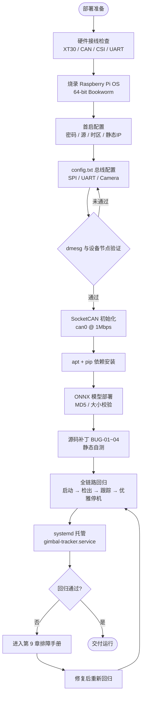
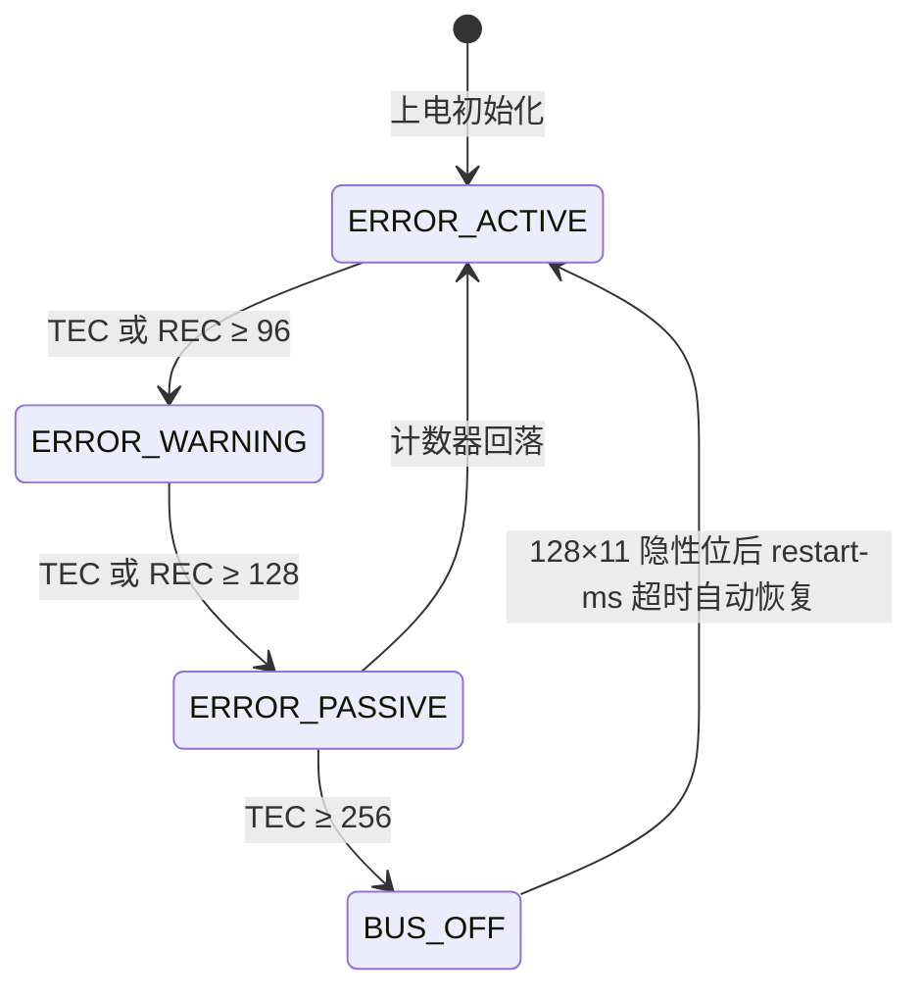
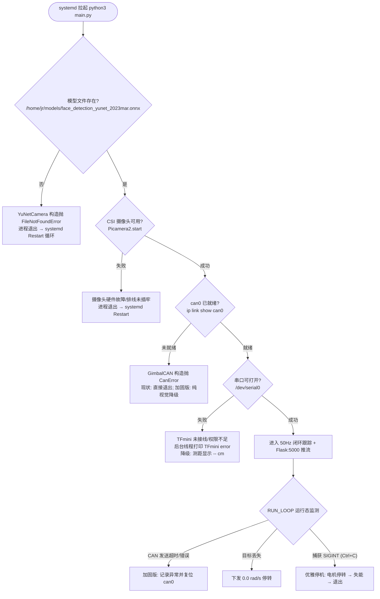

# 跟踪云台系统部署、源码缺陷加固与运维排障规范 (DEPLOY_AND_DEBUG)

[-A22846?logo=raspberry-pi)](https://www.raspberrypi.com/software/)
[](https://github.com/linux-can/can-utils)
[](https://opencv.org/)
[](https://www.freedesktop.org/software/systemd/man/latest/systemd.service.html)
[-10B981)]()
[]()

---

---

## 目录 (Table of Contents)

- [1. 部署架构与前置条件](#1-部署架构与前置条件)
  - [1.1 系统拓扑与运行模式](#11-系统拓扑与运行模式)
  - [1.2 硬件接线检查清单](#12-硬件接线检查清单)
  - [1.3 软件与固件版本兼容矩阵](#13-软件与固件版本兼容矩阵)
  - [1.4 部署流程总览 (Mermaid)](#14-部署流程总览-mermaid)
- [2. 系统镜像烧录与初始化 (SOP)](#2-系统镜像烧录与初始化-sop)
  - [2.1 Raspberry Pi Imager 烧录步骤](#21-raspberry-pi-imager-烧录步骤)
  - [2.2 Headless 免显环境配置](#22-headless-免显环境配置)
  - [2.3 首次启动网络与安全配置](#23-首次启动网络与安全配置)
  - [2.4 磁盘扩容与配置备份策略](#24-磁盘扩容与配置备份策略)
- [3. 底层总线驱动配置与验证](#3-底层总线驱动配置与验证)
  - [3.1 config.txt 设备树配置全量块](#31-configtxt-设备树配置全量块)
  - [3.2 设备树驱动加载验证 (dmesg 判据)](#32-设备树驱动加载验证-dmesg-判据)
  - [3.3 串口与蓝牙设备树冲突排查](#33-串口与蓝牙设备树冲突排查)
  - [3.4 SocketCAN 初始化与开机自启配置](#34-socketcan-初始化与开机自启配置)
  - [3.5 can0 链路状态参数逐字段解读](#35-can0-链路状态参数逐字段解读)
  - [3.6 CAN 总线故障状态机与错误计数器诊断](#36-can-总线故障状态机与错误计数器诊断)
- [4. 运行环境搭建与模型部署](#4-运行环境搭建与模型部署)
  - [4.1 系统底层依赖安装](#41-系统底层依赖安装)
  - [4.2 Python 虚拟环境与依赖管理](#42-python-虚拟环境与依赖管理)
  - [4.3 YuNet ONNX 模型下载与完整性校验](#43-yunet-onnx-模型下载与完整性校验)
  - [4.4 硬编码模型路径软链接兼容方案](#44-硬编码模型路径软链接兼容方案)
- [5. 源码缺陷审计与加固补丁 (Bug Audit)](#5-源码缺陷审计与加固补丁-bug-audit)
  - [5.1 缺陷全景审计表 (CVSS 评级)](#51-缺陷全景审计表-cvss-评级)
  - [5.2 补丁一：camera_yunet.py 修复补丁](#52-补丁一camera_yunetpy-修复补丁)
  - [5.3 补丁二：main.py 异常保护补丁](#53-补丁二mainpy-异常保护补丁)
  - [5.4 补丁静态验证单测步骤](#54-补丁静态验证单测步骤)
  - [5.5 全链路回归验证清单](#55-全链路回归验证清单)
- [6. 开机自检 (POST) 与运行时故障隔离](#6-开机自检-post-与运行时故障隔离)
  - [6.1 POST 决策树 (Mermaid)](#61-post-决策树-mermaid)
  - [6.2 运行时守护与分级降级策略](#62-运行时守护与分级降级策略)
- [7. systemd 生产级服务托管与保活](#7-systemd-生产级服务托管与保活)
  - [7.1 基线 unit 单元配置文件](#71-基线-unit-单元配置文件)
  - [7.2 生产加固配置 (资源限制与策略)](#72-生产加固配置-资源限制与策略)
  - [7.3 sdnotify 看门狗心跳实现代码](#73-sdnotify-看门狗心跳实现代码)
  - [7.4 journald 日志持久化与检索命令](#74-journald-日志持久化与检索命令)
  - [7.5 服务启停与状态诊断常用命令套件](#75-服务启停与状态诊断常用命令套件)
- [8. FMECA 运维失效分析与应急预案](#8-fmeca-运维失效分析与应急预案)
- [9. 现场排障手册 (P-01 ~ P-11 实操指南)](#9-现场排障手册-p-01--p-11-实操指南)
- [10. 安全加固、备份恢复与配置清单](#10-安全加固备份恢复与配置清单)
  - [10.1 SSH 密钥登录加固与密码禁用](#101-ssh-密钥登录加固与密码禁用)
  - [10.2 防火墙端口放行与串口用户组权限](#102-防火墙端口放行与串口用户组权限)
  - [10.3 关键配置文件备份与一键恢复脚本](#103-关键配置文件备份与一键恢复脚本)
  - [10.4 运维配置项 (OP-CI) 跟踪清单](#104-运维配置项-op-ci-跟踪清单)
- [附录 常用缩略语表](#附录-常用缩略语表)

---

> **安全警示（部署前必读）**
> 1. 本设备含 **24V 动力母线（XT30）**与高速伺服电机，作业前必须切断 24V 母线供电；仅保留树莓派 5V USB 供电方可进行软件调试。
> 2. 电机未安装机械限位与动平衡前，禁止直接 `python3 main.py` 全环路跟踪，防止飞车造成机械损伤与人员伤害。
> 3. 24V 侧 GND 必须与树莓派侧 GND 共参考地，否则 CAN 收发器共模电压超限，将导致总线通讯紊乱甚至器件损坏。
> 4. TFmini 为 850nm 红外测距模组，避免正对人眼长时间照射。

---

---

## 1. 部署架构与前置条件

### 1.1 系统拓扑与运行模式

系统由 5 个 Python 模块构成：`main.py`（主控/50Hz 闭环）、`camera_yunet.py`（YuNet 人脸检测）、`tfmini_uart.py`（激光测距后台线程）、`gimbal_can.py`（GL40 电机 SocketCAN 驱动）、`mjpeg_stream.py`（Flask MJPEG 推流）。**全部运行模式均为硬编码，无命令行参数**，标准运行方式即 `python3 main.py`：

| 子系统 | 硬件 | 运行模式（源码锚点） |
| :--- | :--- | :--- |
| 视觉采集 | IMX219（CSI） | Picamera2 视频配置，采集 1640×1232 RGB888，`FrameDurationLimits=(20000,20000)`（50fps），推流/推理缩放至 640×480 |
| 人脸检测 | YuNet ONNX 2023mar | `cv2.FaceDetectorYN`，`score_threshold=0.6`，`nms_threshold=0.3`，`top_k=5000` |
| 激光测距 | 北醒 TFmini Plus | UART `/dev/serial0` @ 115200，daemon 后台线程，9 字节帧 `0x59 0x59`，强度门限 `strength>100` |
| 电机驱动 | CubeMars GL40 ×2 | SocketCAN `can0` @ 1Mbps，速度模式，Yaw=`0x201` / Pitch=`0x202`，float32 小端 + 4 字节补零 |
| 控制闭环 | main.py | 50Hz（`CONTROL_PERIOD=0.02`），P 型速度控制，`YAW_GAIN=PITCH_GAIN=0.003`，死区 ±15px |
| Web 交互 | Flask | `0.0.0.0:5000`，`/` 索引页 + `/video` multipart MJPEG，JPEG 质量 80，约 33fps 节流 |
| 停机 | main.py `finally` | SIGINT 触发优雅停机链（见 [6.1](#61-post-决策树)） |

### 1.2 硬件接线检查清单

通电前逐项确认（☐ 为必检项）：

- [ ] **XT30 24V 动力母线**：GL40 母线接入 24V 动力电，XT30 插头锁紧，极性与底座标识一致。
- [ ] **CAN 总线**：GL40 侧黄色线接底板 `CAN_H`，蓝色线接底板 `CAN_L`，双绞可靠压接。
- [ ] **终端电阻**：总线两端各一只 **120Ω** 终端电阻（共 2 只），总线断开实测 55~65Ω。
- [ ] **共地检查**：24V 电源负极与树莓派 GND 等电位（万用表蜂鸣档确认）。
- [ ] **CSI 摄像头排线**：IMX219 通过 **15-Pin 转 22-Pin 专用柔性排线**接入 Zero 2 W 的 MIPI CSI-2 接口，排线金手指朝向主板、卡扣压紧。
- [ ] **TFmini UART 交叉连接**：TFmini **TX → Pin 10（RXD）**、**RX → Pin 8（TXD）**，5V 接 Pin 2/4、GND 接 Pin 6/9。
- [ ] **MCP2515 中断线**：底板中断线接 **GPIO25（Pin 22）**，与 `interrupt=25` 配置一致。
- [ ] **SPI0 走线**：MCP2515 模块 SPI 引脚插到底，CS 线接到 SPI0 的片选通道。
- [ ] **供电**：树莓派 5V USB 供电满足 Zero 2 W 要求（建议 ≥2.5A），CAN 板由 24V 母线独立供电。
- [ ] **散热与固定**：SoC 贴装散热片，机壳通风，所有线缆做防松固定。

### 1.3 软件与固件版本兼容矩阵

| 组件 | 基线版本要求 | 来源 | 兼容性说明 |
| :--- | :--- | :--- | :--- |
| Raspberry Pi OS | 64-bit（Bookworm，arm64） | Raspberry Pi Imager | `config.txt` 路径为 `/boot/firmware/config.txt` |
| 内核 | 6.1 / 6.6（随镜像更新） | 发行版仓库 | 需含 `mcp251x`、`can_raw` 驱动 |
| Python | 3.11.x | Debian Bookworm apt | systemd service 直接用 `/usr/bin/python3` |
| OpenCV (python3-opencv) | ≥ 4.6 | Debian Bookworm apt | 必须含 `FaceDetectorYN`（objdetect/dnn 模块） |
| python3-picamera2 | Bookworm 仓库版本 | Debian Bookworm apt | libcamera 新相机栈，配套命令为 `rpicam-hello` 等 |
| python3-numpy | ≥ 1.24 | Debian Bookworm apt | OpenCV 数组依赖 |
| python-can | ≥ 4.0 | pip | SocketCAN 接口 `can.interface.Bus(interface="socketcan")` |
| pyserial | ≥ 3.5 | pip | TFmini `/dev/serial0` @ 115200 |
| Flask | ≥ 2.2 | pip | 开发服务器，勿直接暴露公网 |
| can-utils | Debian 仓库版本 | Debian Bookworm apt | `cansend` / `candump` / `cangen` / `canbusload` |
| 模型 | `face_detection_yunet_2023mar.onnx` | OpenCV Zoo | YuNet 2023mar，实测大小约 232.6 KB |
| 内存 | Zero 2 W 板载 512MB | 硬件 | 进程内存上限 350MB（见 [7.2](#72-生产加固项)） |

### 1.4 部署流程总览 (Mermaid)



---

## 2. 系统镜像烧录与初始化（SOP）

### 2.1 Raspberry Pi Imager 烧录步骤

- **SOP-02-01**：PC 端安装 Raspberry Pi Imager（官方最新版），插入 microSD 卡（≥16GB，Class10/A1 以上，推荐工业卡）。
- **SOP-02-02**：Device 选择 **Raspberry Pi Zero 2 W**。
- **SOP-02-03**：OS 选择 **Raspberry Pi OS（64-bit）**（Bookworm 基底）；现场无人值守场景推荐 **Raspberry Pi OS Lite（64-bit）** 以压缩攻击面。
- **SOP-02-04**：Storage 选择目标 SD 卡，确认盘符无误后执行 **WRITE**（会全量擦除）。
- **SOP-02-05**：写入完成后安全弹出，插入 Zero 2 W，接好 USB 5V 与以太网，首次上电。
- **SOP-02-06**：新版镜像首启自动扩展根文件系统（见 [2.4](#24-磁盘扩容与镜像备份策略)）；通过路由器后台或 `arp -a` 查询设备 IP 后 SSH 登录。

### 2.2 Headless 免显环境配置

**方法 A：bootfs 空 `ssh` 文件（官方标准做法）**。将烧录后的 SD 卡插入 PC，在唯一可见的 FAT bootfs 分区（Bookworm 中挂载为 `/boot/firmware`）根目录放置一个**空文件** `ssh`（`touch ssh`），首启后即启用 SSH。

**方法 B：Imager 定制化预设（custom.toml）**。Imager 的 Customisation 面板可一次性写入主机名、用户名/密码、时区、Wi-Fi 与 SSH 开关；部分版本支持将该套定制保存为 `custom.toml` 预设文件，便于同一批次设备批量烧录复用（具体字段以所用 Imager 版本对话框为准）。

**方法 C：手工预置账户（无 Imager 场景）**。在 bootfs 根目录创建 `userconf.txt`（Bookworm 仍支持，密码哈希用 `openssl passwd -6` 生成）：`echo 'pi:$6$<哈希值>' > userconf.txt`。

> 注：Bookworm 起，bootfs 放置 `wpa_supplicant.conf` 配 Wi-Fi 的旧方式已不被支持，请改用 Imager 定制化面板或首启后 `raspi-config` 配置网络。

### 2.3 首次启动网络与安全配置

```bash
# 1) 修改默认密码（默认用户 pi，必须修改）
passwd

# 2) apt 换用国内镜像（中科大源，路径已实测可用）
sudo sed -i 's|http://raspbian.raspberrypi.org/raspbian/|https://mirrors.ustc.edu.cn/raspbian/raspbian/|g' /etc/apt/sources.list
sudo sed -i 's|http://archive.raspberrypi.org/debian/|https://mirrors.ustc.edu.cn/raspberrypi/debian/|g' /etc/apt/sources.list.d/raspi.list
sudo apt update && sudo apt upgrade -y

# 3) 时区与语言（中文路径依赖 UTF-8 locale）
sudo timedatectl set-timezone Asia/Shanghai
sudo raspi-config        # Localisation Options -> Locale -> en_US.UTF-8 或 zh_CN.UTF-8
timedatectl status       # 验收: Time zone: Asia/Shanghai (CST, +0800)

# 4) pip 国内源
pip3 config set global.index-url https://mirrors.ustc.edu.cn/pypi/simple
```

**静态 IP（Bookworm 默认 NetworkManager，nmcli 方式）**：

```bash
nmcli con show
sudo nmcli con mod "Wired connection 1" ipv4.method manual ipv4.addresses 192.168.1.100/24,192.168.1.1 ipv4.dns 223.5.5.5,119.29.29.29
sudo nmcli con up "Wired connection 1"
ip addr show eth0        # 验收: inet 192.168.1.100/24
```

**静态 IP（dhcpcd 传统方式，若网络仍由 dhcpcd 管理）**：

```bash
sudo apt install -y dhcpcd
sudo bash -c 'cat >> /etc/dhcpcd.conf <<EOF
interface eth0
static ip_address=192.168.1.100/24
static routers=192.168.1.1
static domain_name_servers=223.5.5.5
EOF'
sudo systemctl enable dhcpcd && sudo systemctl restart dhcpcd
```

### 2.4 磁盘扩容与配置备份策略

- **磁盘扩容**：新版镜像首启自动扩展。若未生效：`sudo raspi-config` → Advanced Options → Expand Filesystem，随后 `df -h /` 验收根分区应接近 SD 卡容量（如 32GB 卡 ≈ 29G）。
- **配置基线备份（推荐）**：关键配置随 SOP 打包归档，脚本见 [10.3](#103-备份与一键恢复)。
- **整卡镜像备份（SD Card Copier 思路）**：桌面版使用「附件 → SD Card Copier」整卡克隆；无桌面环境时离线 `sudo dd if=/dev/mmcblk0 of=gimbal-os-backup-$(date +%F).img bs=4M status=progress`。
- **写磨损控制**：journald 设持久化上限（见 [7.4](#74-journald-持久化与日志检索)），避免日志涨满 SD 卡（失效模式见 F-04）。

---

## 3. 底层总线驱动配置与验证

### 3.1 config.txt 设备树配置全量块

Bookworm 路径为 **`/boot/firmware/config.txt`**（早期镜像为 `/boot/config.txt`）。编辑：`sudo nano /boot/firmware/config.txt`，在文件末尾追加：

```ini
# =================================================================
# 跟踪云台底板硬件接口驱动配置
# =================================================================

# 1. 启用硬件 SPI 控制器
dtparam=spi=on

# 2. 加载 MCP2515 CAN 驱动叠加项:
# - oscillator=8000000: 板载 SMD3225 晶振实际频率为 8.000MHz
# - interrupt=25: 底板硬件中断线接入树莓派 GPIO25 (Pin 22)
# - spimaxfrequency=10000000: SPI 最大时钟频率设定为 10MHz
dtoverlay=mcp2515-can0,oscillator=8000000,interrupt=25,spimaxfrequency=10000000
dtoverlay=spi-bcm2835

# 3. 启用主硬件串口并禁用板载蓝牙占用
enable_uart=1
dtoverlay=disable-bt

# 4. 摄像头自动探测启用
camera_auto_detect=1
```

配置语义：`enable_uart=1` + `dtoverlay=disable-bt` 使 **PL011 硬件串口固定映射到 `/dev/serial0`**（不再受 mini-UART 波特率随 CPU 变频漂移影响），同时释放蓝牙占用的 `/dev/ttyAMA0`。保存后 `sudo reboot`。

### 3.2 设备树加载验证

- **验收判据 A（CAN 驱动）**：`dmesg | grep -i mcp2515` 应出现初始化成功信息（设备号以实际为准）：
  ```bash
  # 预期输出（示例）: [    4.126401] mcp251x spi0.0 can0: MCP2515 successfully initialized.
  ```
- **验收判据 B（串口映射）**：`ls -l /dev/serial0` 必须是指向 `ttyAMA0` 的软链接（PL011 在位）：
  ```bash
  # 预期输出（示例）: lrwxrwxrwx 1 root root 7 Oct  4 09:00 /dev/serial0 -> ttyAMA0
  ```
- **验收判据 C（摄像头探测）**：`vcgencmd get_camera` 预期 `supported=1 detected=1`；`rpicam-hello --list-cameras` 应列出 IMX219（Bookworm 提供；旧镜像为 `libcamera-hello`）。
- **验收判据 D（网络接口生成）**：`ls /sys/class/net/` 应包含 `can0`。随后禁用串口控制台登录并加入串口组（防止串口 debug 打印干扰 TFmini）：
  ```bash
  sudo systemctl stop serial-getty@ttyAMA0.service
  sudo systemctl disable serial-getty@ttyAMA0.service
  sudo usermod -a -G dialout $USER
  sudo reboot
  ```

### 3.3 串口与蓝牙设备树冲突排查

`dmesg` 无 MCP2515 初始化信息、或无 `can0` 接口时，按序排查：

1. **CS 片选冲突**：`grep -E "dtoverlay|dtparam" /boot/firmware/config.txt`，确认没有其它 overlay（如 SPI 从设备、`spi0-2cs` 等）占用 SPI0 CS0/GPIO8 或中断 GPIO25，有则删除冲突行后 reboot。
2. **GPIO25 复用**：`raspi-gpio get 25` 查看 GPIO25 功能分配，若被其它外设复用则调整底板跳线或 overlay 参数。
3. **SPI 主控未启用**：确认 `dtparam=spi=on` 存在；`ls /dev/spidev*` 应能看到 `spidev0.0`。
4. **晶振参数不匹配**：`oscillator=8000000` 必须与底板晶振实际频率一致；误配将导致位定时错误、总线错误计数飙升。
5. **中断线断链**：万用表测量 GPIO25（Pin 22）到底板 INT 的通断。

### 3.4 SocketCAN 初始化与开机自启配置

MCP2515 驱动加载后生成网络接口 `can0`。手动激活：

```bash
sudo ip link set can0 type can bitrate 1000000   # 波特率 1Mbps
sudo ip link set dev can0 txqueuelen 1000        # 发送队列长度（等价 sudo ifconfig can0 txqueuelen 1000）
sudo ip link set can0 up                         # 拉起接口
```

开机自启（ifupdown 方式；若未安装先 `sudo apt install -y ifupdown`）：编辑 `/etc/network/interfaces.d/can0`：

```ini
auto can0
iface can0 can static
    bitrate 1000000
    up /sbin/ip link set $IFACE txqueuelen 1000
```

双通道保险：systemd 单元中另设 `ExecStartPre=/sbin/ip link set can0 up`（见第 7 章），确保网络服务异常时服务启动前 can0 必被拉起。

### 3.5 can0 链路状态参数逐字段解读

```bash
ip -details -statistics link show can0
```

典型输出（数值以现场实际为准）：

```
3: can0: <NOARP,UP,LOWER_UP,ECHO> mtu 16 qdisc pfifo_fast state UNKNOWN mode DEFAULT group default qlen 1000
    link/can  promiscuity 0 minmtu 0 maxmtu 16
    can <TRIPLE-SAMPLING> state ERROR-ACTIVE restart-ms 100
          bitrate 1000000 sample-point 0.875
          tq 62.500 prop-seg 34 phase-seg1 35 phase-seg2 10 sjw 1
          mcp251x: tseg1 2..16 tseg2 2..8 sjw 1..4 brp 1..64
          clock 8000000
          re-stats bus-error arb-lost bus-off 0 0 0
          error-warning 0
          error-passive 0
          bus-off 0
    RX: bytes  packets  dropped overrun mcast
    1726      180      0       0       0
    TX: bytes  packets  errors  dropped carrier collsns
    584       75       0       0       0       0
```

| 字段 | 含义与现场判读 |
| :--- | :--- |
| `state UNKNOWN` + `UP,LOWER_UP` | 接口已使能并工作（CAN 无载波检测概念，显示 UNKNOWN 属正常） |
| `<TRIPLE-SAMPLING>` | MCP2515 三重采样，抗总线毛刺 |
| `state ERROR-ACTIVE` | 错误状态机当前态：正常（其它值见 [3.6](#36-can-总线故障诊断与错误状态机)） |
| `bitrate 1000000` | 位速率，**必须与 GL40 电机一致（1Mbps）** |
| `sample-point 0.875` / `tq` / `brp` | 位定时参数，由 `bitrate` + `clock` 推导 |
| `clock 8000000` | 驱动使用的晶振频率，验证 `oscillator=8000000` 是否生效 |
| `restart-ms 100` | BUS-OFF 后 100ms 自动尝试恢复 |
| `re-stats bus-error / arb-lost / bus-off` | 总线错误帧、仲裁丢失、总线关闭累计次数 |
| `error-warning / error-passive / bus-off` | 各错误阈值越限累计次数 |
| `RX/TX packets` | 收发报文计数（应随控制循环持续增长，约 50Hz×2 报文） |
| `RX/TX errors / dropped` | 收发错误/丢弃计数；`dropped` 增长表示队列或缓冲区拥塞 |
| `qlen 1000` | 发送队列长度，验证 txqueuelen 配置已生效 |

### 3.6 CAN 总线故障状态机与错误计数器诊断



- **TEC/REC 语义**：发送节点检测到错误帧时 TEC +8，接收节点 REC +1；TEC ≥ 128 进入 ERROR-PASSIVE（发送须等待间歇），REC ≥ 128 仅限制应答。
- **位速率不匹配的典型现象**：GL40 为 1Mbps 而 can0 配成其它速率时，双方采样点错位 → 错误帧风暴 → 无人 ACK（发送节点收不到应答位将持续重发）→ TEC 迅速累积至 256 → **BUS-OFF**。此时 `candump can0` 完全静默，`ip -details link show can0` 显示 `state BUS-OFF` 且 `bus-off` 计数持续增长。处置：核对两侧位速率后重配 `can0`。
- **总线物理断线**：BUS-OFF 与总线错误计数同步增长；逐段测量 CAN_H/CAN_L 通断与 120Ω×2 终端电阻。
- **总线负载观察**：`canbusload can0` 实时显示总线占用率；静默期异常 >0% 说明存在异常见错误帧。

---

## 4. 运行环境搭建与模型部署

### 4.1 系统底层依赖安装

```bash
# 1) 更新 apt 软件源并安装基础构建依赖
sudo apt update
sudo apt install -y python3-pip python3-opencv python3-picamera2 python3-numpy can-utils git

# 2) 安装 Python 总线通信与 Web 推流相关库
#    Bookworm 为 PEP 668 外部管理环境, 系统级安装必须加 --break-system-packages
pip3 install python-can pyserial flask --break-system-packages

# 3) 安装后立即验证关键能力
python3 -c "import cv2; print('OpenCV', cv2.__version__)"
python3 -c "from cv2 import FaceDetectorYN; print('YuNet detector OK')"
python3 -c "import can, serial, flask; print('can/serial/flask OK')"
```

### 4.2 Python 虚拟环境与依赖管理

PoC 阶段推荐系统级方案（便于 systemd 直接用 `/usr/bin/python3`）；需要多版本共存时使用 venv：

```bash
python3 -m venv --system-site-packages ~/gimbal-venv
source ~/gimbal-venv/bin/activate
pip install --upgrade pip
# venv 内无需 --break-system-packages
pip install python-can pyserial flask
python -c "import cv2, can, serial, flask; print('venv OK, OpenCV', cv2.__version__)"
deactivate    # 退出
```

### 4.3 YuNet ONNX 模型下载与完整性校验

源码 `camera_yunet.py` 将模型硬编码为 `/home/jr/models/face_detection_yunet_2023mar.onnx`（YuNet 2023mar，OpenCV Zoo 分发）。部署并记录校验和：

```bash
# 创建硬编码目录并下载
sudo mkdir -p /home/jr/models
cd /home/jr/models
sudo wget https://github.com/opencv/opencv_zoo/raw/main/models/face_detection_yunet/face_detection_yunet_2023mar.onnx
sudo chmod 644 face_detection_yunet_2023mar.onnx        # 赋予全用户可读权限

# 完整性校验: 记录 MD5 作为黄金指纹, 与分发方(opencv_zoo 仓库/官方 model card)公布值比对
md5sum face_detection_yunet_2023mar.onnx
ls -l face_detection_yunet_2023mar.onnx                 # 辅助校验: 实测约 232.6 KB (2026-10 实测 232589 字节)
```

> 完整性判定规则：① `md5sum` 输出与黄金指纹一致；② 文件大小在 230KB 量级；③ `python3 -c "from cv2 import FaceDetectorYN; FaceDetectorYN.create('/home/jr/models/face_detection_yunet_2023mar.onnx','',(640,480)); print('model load OK')"` 可正常加载。任一项不符即判定模型损坏，重新下载。

### 4.4 硬编码模型路径软链接兼容方案

若部署用户不是 `jr`（例如按第 7 章以 `pi` 用户运行），二选一：

- **方案 A（推荐）**：由 `pi` 目录软链进入硬编码路径：
  ```bash
  sudo mkdir -p /home/pi/models
  sudo wget -P /home/pi/models https://github.com/opencv/opencv_zoo/raw/main/models/face_detection_yunet/face_detection_yunet_2023mar.onnx
  sudo mkdir -p /home/jr && sudo ln -s /home/pi/models /home/jr/models
  ls -l /home/jr/models/face_detection_yunet_2023mar.onnx   # 验收: 链接可达
  ```
- **方案 B（直接落盘）**：`sudo mkdir -p /home/jr/models` 后下载并 `chmod 644`，保持源码不改；参数化多机部署时需同步维护该目录。

---

## 5. 源码缺陷审计与加固补丁 (Bug Audit)

在对全部 5 个 Python 源代码逐行静态审查中，排查出 **2 项首帧必崩的致命缺陷**与 **2 项稳定性缺陷**。所有补丁均以小侵入方式提供，打完补丁后必须执行 [5.4](#54-补丁验证步骤) 与 [5.5](#55-全链路回归验证清单)。

### 5.1 缺陷全景审计表 (CVSS 评级)

| 缺陷编号 | 严重度 (CVSS) | 触发位置 | 缺陷触发根因 | 崩溃现象与影响评估 |
| :---: | :---: | :--- | :--- | :--- |
| **BUG-01** | <font color=red>**CRITICAL (9.1)**</font> | `main.py:123` | `camera.detect_largest_face(frame)` 方法未定义！`YuNetCamera` 类唯一定义的方法为 `detect_faces`。 | **首帧抛出 `AttributeError` 崩溃退出**，云台完全无法启动闭环控制。 |
| **BUG-02** | <font color=red>**CRITICAL (8.8)**</font> | `main.py:75` | `draw_overlay` 试图访问 `face['count']`，但 `detect_faces` 返回的目标字典仅含 `x,y,w,h,cx,cy,area`。 | **首帧检出人脸立即抛出 `KeyError: 'count'` 崩溃**。 |
| **BUG-03** | <font color=orange>**MEDIUM (5.3)**</font> | `camera_yunet.py:50` | `frame = cv2.cvtColor(frame, cv2.COLOR_RGB2BGR)` 被意外注释。Picamera2 输出 RGB，而 OpenCV/YuNet 需 BGR。 | **检测置信度严重劣化并产生漏检**；Web 推流十字准星红蓝颜色互换。 |
| **BUG-04** | <font color=blue>**LOW (3.1)**</font> | `gimbal_can.py` | CAN 总线发送缺乏 `try...except can.CanError` 保护与总线脱机自动重连机制。 | 总线瞬态断连或从机脱机时主循环线程挂起阻断（`send(timeout=0.05)` 抛异常无人捕获）。 |

### 5.2 补丁一：camera_yunet.py 修复补丁

入口前先备份：`cp camera_yunet.py camera_yunet.py.bak`。打开 `2、软件代码/project/camera_yunet.py`，更新 `read()` 并追加 `detect_largest_face()` 方法：

```python
    def read(self):
        frame = self.picam2.capture_array()
        frame = cv2.resize(frame, self.stream_size)

        # [修复 BUG-03]: 恢复色彩空间转换，Picamera2 RGB 转换为 OpenCV 标准 BGR
        frame = cv2.cvtColor(frame, cv2.COLOR_RGB2BGR)

        return frame

    def detect_largest_face(self, frame):
        """
        [修复 BUG-01 & BUG-02]: 补充与 main.py 匹配的接口，并注入 count 统计字段
        """
        results, selected_face = self.detect_faces(frame)
        if selected_face is not None:
            # 注入人脸总数，消除 main.py draw_overlay 抛出的 KeyError: 'count'
            selected_face["count"] = len(results)
        return selected_face
```

### 5.3 补丁二：main.py 异常保护补丁

入口前先备份：`cp main.py main.py.bak`。在 `2、软件代码/project/main.py` 的主循环目标捕获段添加防御性解包逻辑：

```python
        while True:
            frame = camera.read()

            # 防御性调用：优先调用 detect_largest_face，若未打补丁则回退至 detect_faces
            try:
                face = camera.detect_largest_face(frame)
            except AttributeError:
                faces_list, face = camera.detect_faces(frame)
                if face is not None:
                    face["count"] = len(faces_list)

            distance = lidar.get_distance()
```

> **BUG-04 加固建议（可选）**：为 `gimbal_can.py` 的发送路径增加 CAN 异常保护，避免总线脱机时主循环中断：
> ```python
>     def send(self, can_id, data):
>         msg = can.Message(arbitration_id=can_id, data=data, is_extended_id=False)
>         try:
>             self.bus.send(msg, timeout=0.05)   # 总线脱机时抛 CanError 而非挂起
>         except can.CanError as e:
>             print(f"CAN send error: {e}")      # 生产环境建议改 journal 落盘
> ```

### 5.4 补丁静态验证单测步骤

以下静态自测**不触碰硬件**（模块构造均发生在 `main()` 内，导入安全），每条独立判定：

```bash
cd "/home/pi/gimbal/2、软件代码/project"

# V1: 模块可导入（main.py 有 __main__ 守卫，导入不会触发主流程）
python3 -c "import main; print('V1 OK: 模块导入无错误')"

# V2: BUG-01 —— detect_largest_face 接口存在
python3 -c "from camera_yunet import YuNetCamera; assert hasattr(YuNetCamera,'detect_largest_face'); print('V2 OK: BUG-01 接口已补齐')"

# V3: BUG-03 —— 色彩空间转换已恢复
python3 -c "import inspect; from camera_yunet import YuNetCamera; assert 'COLOR_RGB2BGR' in inspect.getsource(YuNetCamera.read); print('V3 OK: BUG-03 RGB2BGR 已恢复')"

# V4: BUG-02 —— count 字段注入逻辑存在
python3 -c "import inspect; from camera_yunet import YuNetCamera; assert 'count' in inspect.getsource(YuNetCamera.detect_largest_face); print('V4 OK: BUG-02 count 字段已注入')"

# V5: BUG-04 —— CAN 发送异常保护已就位（打可选补丁后必须通过）
python3 -c "import inspect; from gimbal_can import GimbalCAN; assert 'CanError' in inspect.getsource(GimbalCAN.send); print('V5 OK: BUG-04 CAN 异常保护已就位')"
```

V1~V4 全部输出 `OK` 方可进入回归；V5 视是否采用 BUG-04 可选补丁而定。

### 5.5 全链路回归验证清单

手动执行 `python3 main.py`，按序核对（任一项失败即回到第 9 章对应条目排障）：

| 步骤 | 操作 | 通过判据 |
| :---: | :--- | :--- |
| R-1 | `python3 main.py` | 终端打印 `Starting speed-mode face tracking...` 与 `http://<raspberrypi_ip>:5000`，无 Traceback |
| R-2 | 浏览器访问 `http://<IP>:5000` | 首页显示 `YuNet Face Tracking + TFmini`，`/video` 出图 |
| R-3 | 摄像头对准人脸 | 画面出现绿色人形框，左上角 `faces=N`（N≥1，多脸场景 N 正确） |
| R-4 | 移动人脸至画面中心 | 中心十字准星由红变绿（目标进入死区） |
| R-5 | 观察 `err_x/err_y` | 数值随目标实时收敛至 \|err\| ≤ 15px 死区内 |
| R-6 | 观察右下测距 | `Distance: N cm` 正常刷新（TFmini 有效距离内） |
| R-7 | 观察云台机械动作 | Yaw/Pitch 朝目标平滑转动，无飞车无异响 |
| R-8 | 遮挡目标 | 目标丢失后电机停转（`gimbal.stop()` 下发 0.0 rad/s），画面显示 `No face` |
| R-9 | `Ctrl+C` | 打印 `Stopping...`，按 `stop→sleep 0.2→disable→close→lidar.stop` 链执行后打印 `Exit.`，电机相线 PWM 释放 |

---

## 6. 开机自检 (POST) 与运行时故障隔离

### 6.1 POST 决策树 (Mermaid)



POST 关键结论（与源码行为严格对应）：

1. **模型缺失**：`camera_yunet.py:15` 的 `os.path.exists` 检查直接抛 `FileNotFoundError`，属**硬失败**（当前版本无降级路径）。
2. **摄像头不可用**：`Picamera2.start()` 失败属硬失败。
3. **can0 未就绪**：`GimbalCAN.__init__` 中 `can.interface.Bus(...)` 抛 `CanError` 且无人捕获，属硬失败——第 3 章 can0 初始化是 POST 前置必需项。
4. **TFmini 不可用**：串口异常在 `_loop()` 线程内被捕获打印，`self.distance` 保持 `None`，界面显示 `-- cm`，属**可接受降级**。
5. **优雅停机链**（`main.py` finally）：`gimbal.stop()` → `time.sleep(0.2)` → `gimbal.disable()` → `gimbal.close()` → `lidar.stop()`；任一步异常均打印 `Shutdown error: ...` 后继续走完剩余步骤。

### 6.2 运行时守护与分级降级策略

| 守护层 | 机制 | 触发与动作 |
| :--- | :--- | :--- |
| L1 进程守护 | systemd `Restart=always` + `RestartSec=3` | 进程退出/被杀后 3s 自动重启；配合 `StartLimitBurst` 防止风暴重启 |
| L2 心跳守护 | `WatchdogSec` + sdnotify 心跳（[7.3](#73-sdnotify-看门狗心跳实现)） | 主循环阻塞超 30s 未发 `WATCHDOG=1` → 判定僵死 → SIGKILL 后重启 |
| L3 运行时长 | `RuntimeMaxSec=86400` | 每日强制重建进程，规避长跑内存/句柄泄漏 |
| L4 降级运行 | 模块内 try/except | TFmini 断线 → 测距 `-- cm`；CAN 加固后 → 总线瞬断不中断视觉链路 |
| L5 可观测 | journald 持久化（[7.4](#74-journald-持久化与日志检索)） | `journalctl -u gimbal-tracker -p err` 值班巡检入口 |

---

## 7. systemd 生产级服务托管与保活

### 7.1 基线 unit 单元配置文件

为了让跟踪云台上电后无人值守自动拉起并在异常崩溃后自动重启，编写 systemd 单元 `sudo nano /etc/systemd/system/gimbal-tracker.service`：

```ini
[Unit]
Description=Two-Axis Vision & LiDAR Tracking Gimbal Service
After=network.target network-online.target
Wants=network-online.target

[Service]
Type=simple
User=pi
WorkingDirectory=/home/pi/gimbal/2、软件代码/project
ExecStartPre=/sbin/ip link set can0 up
ExecStart=/usr/bin/python3 main.py
Restart=always
RestartSec=3
KillMode=process
TimeoutStopSec=5

[Install]
WantedBy=multi-user.target
```

基线说明：`KillMode=process` 表示 `systemctl stop` 时只向主进程发信号（Flask/TFmini 均为进程内线程，随主进程一并退出）；`TimeoutStopSec=5` 给出优雅停机链 5s 预算，超时 SIGKILL 兜底；`Restart=always` 对任何退出（含 0 码退出）都重启，若希望仅异常退出重启可改为 `Restart=on-failure`（服务态无终端，推荐保留 `always`）。激活：

```bash
sudo systemctl daemon-reload
sudo systemctl enable gimbal-tracker.service
sudo systemctl start gimbal-tracker.service
```

### 7.2 生产加固配置 (资源限制与策略)

在基线之上追加以下加固指令（叠加为完整加固版单元）：

```ini
[Service]
Type=notify                    # 配合 sdnotify 就绪通知与看门狗 (需替换 Type=simple)
# —— 看门狗与运行时长 ——
WatchdogSec=30                 # 30s 未收到 WATCHDOG=1 判定僵死, SIGKILL 后按 Restart 拉起
RuntimeMaxSec=86400            # 单次运行最长 24h, 到点重建进程 (内存卫生)
# —— 资源限制 ——
MemoryMax=350M                 # 512MB 物理内存下为系统预留余量, 超限触发 OOM 策略
CPUQuota=80%                   # 限制 CPU 占用 80%, 防止满负荷抢占系统调度
OOMPolicy=stop                 # 达到 MemoryMax 时停止该 cgroup
# —— 防重启风暴 ——
StartLimitIntervalSec=300
StartLimitBurst=5
# —— 基线保留项 ——
Restart=always
RestartSec=3
KillMode=process
TimeoutStopSec=5
```

改动后 `sudo systemctl daemon-reload && sudo systemctl restart gimbal-tracker`。

### 7.3 sdnotify 看门狗心跳实现代码

`WatchdogSec` 生效两要素：单元 `Type=notify`；Python 进程初始化完成后向 `$NOTIFY_SOCKET` 发送 `READY=1`，并以 `< WatchdogSec/2` 的间隔持续发送 `WATCHDOG=1`。新增 `gimbal_watchdog.py`（零三方依赖，直接实现 sd_notify(3) 协议）：

```python
# gimbal_watchdog.py —— systemd sdnotify 就绪通知与看门狗心跳
import os
import socket
import threading

class SdNotifier:
    """最小依赖实现 sd_notify(3): READY=1 就绪通知 + WATCHDOG=1 心跳"""

    def __init__(self):
        self._sock = None
        addr = os.environ.get("NOTIFY_SOCKET")
        if addr:
            if addr.startswith("@"):          # Linux 抽象命名空间地址
                addr = "\0" + addr[1:]
            self._sock = socket.socket(socket.AF_UNIX, socket.SOCK_DGRAM)
            self._sock.connect(addr)

    def notify(self, state):
        if self._sock is not None:
            self._sock.sendall(state.encode())

    def ready(self):
        self.notify("READY=1\nSTATUS=跟踪主循环运行中\n")

    def watchdog(self):
        self.notify("WATCHDOG=1\n")

def start_heartbeat(period=5.0):
    """period 必须 < WatchdogSec/2 (单元配 30s, 此处取 5s)"""
    sd = SdNotifier()
    sd.ready()
    stop = threading.Event()

    def _beat():
        while not stop.wait(period):
            sd.watchdog()

    threading.Thread(target=_beat, daemon=True).start()
    return stop
```

在 `main.py` 集成（`gimbal.enable()` 序列之后启动、`finally` 首行收尾）：`from gimbal_watchdog import start_heartbeat; watchdog_stop = start_heartbeat(5.0)`，`finally` 块首行加 `watchdog_stop.set()`。未集成心跳时**不要**将 `Type` 改为 `notify`，否则 systemd 将在 30s 后判定启动失败并反复重启。

### 7.4 journald 日志持久化与检索命令

编辑 `/etc/systemd/journald.conf`：

```ini
[Journal]
Storage=persistent
SystemMaxUse=256M
SystemMaxFileSec=1month
RuntimeMaxUse=64M
```

```bash
sudo systemctl restart systemd-journald
sudo usermod -aG systemd-journal pi     # 允许 pi 免密读日志
journalctl --disk-usage                 # 日志磁盘占用
```

日志查询命令集：

```bash
journalctl -u gimbal-tracker -f --no-pager                    # 实时跟踪
journalctl -u gimbal-tracker --since "30 min ago" -p warning  # 近30分钟告警以上
journalctl -u gimbal-tracker -b -o cat -n 200                 # 本次启动最近200行(仅正文)
journalctl -u gimbal-tracker --since today -o short-precise   # 今日带毫秒时间戳
sudo journalctl --vacuum-size=100M                            # 手动清理至100M
```

### 7.5 服务启停与状态诊断常用命令套件

```bash
sudo systemctl daemon-reload                                  # 改动 unit 后重载
sudo systemctl enable --now gimbal-tracker.service            # 启用并启动
systemctl is-active gimbal-tracker                            # active/inactive/failed
sudo systemctl status gimbal-tracker --no-pager -l            # 详情(含近期日志与退出码)
sudo systemctl restart gimbal-tracker                         # 重启
sudo systemctl stop gimbal-tracker                            # 触发优雅停机链(5s预算)
sudo systemctl show gimbal-tracker -p WatchdogTimestamp -p MemoryCurrent
sudo systemctl kill --signal=SIGINT gimbal-tracker            # 仅发 SIGINT 不杀 cgroup
sudo systemctl reset-failed gimbal-tracker                    # 重启风暴用尽后复位
# 值班巡检三连:
systemctl is-active gimbal-tracker && journalctl -u gimbal-tracker --since "1 hour ago" -p err -o cat && vcgencmd measure_temp
```

---

## 8. FMECA 运维失效分析与应急预案

严重度等级（MIL-STD-882F）：**I 类灾难性**（人员死亡/系统损毁）、**II 类严重**（人员重伤/任务失败）、**III 类轻度**（任务降级）、**IV 类轻微**。

| 编号 | 失效模式 | 诱因 | 对系统影响 | 严重度 | 现场检测手段 | 恢复动作 | 预防措施 |
| :---: | :--- | :--- | :--- | :---: | :--- | :--- | :--- |
| F-01 | CAN 总线脱线/断线 | 接插件松脱、断线、共地缺失 | 跟踪闭环失效，电机失能 | III | `candump can0` 静默；`ip -d link show can0` 错误计数增长 | 断电重接；必要时 `ip link set can0 down` 后重新 `up` 复位 | 线缆应力释放固定；插头点漆防松 |
| F-02 | CAN 位速率不匹配 | 两侧 bitrate 配置不一致 | 无 ACK → BUS-OFF，完全失联 | II | `candump` 无数据；`state BUS-OFF`；bus-off 计数增长 | 统一两侧为 1Mbps 后重启服务 | 变更受控（OP-CI-02）；上线前注入测试 |
| F-03 | 摄像头排线松脱 | 振动导致 CSI 排线移位 | 视觉中断，进程崩溃重启循环 | II | `vcgencmd get_camera` detected=0；日志 Picamera2 异常 | 断电重插排线后重启服务 | 排线卡扣压紧并点胶；机箱减振 |
| F-04 | SD 卡写满/损坏 | 日志涨满、掉电写损 | 系统只读或无法启动 | II | `df -h /` 使用率 >90%；`dmesg` 报 I/O error | 更换工业级 SD 卡并从黄金镜像恢复 | journald 上限 + 季度镜像巡检 |
| F-05 | 电源跌落/欠压 | 24V 电池低压、USB 供电不足 | 进程异常退出、看门狗重启 | II | `vcgencmd get_throttled` 非 0x0；日志重启痕迹 | 更换电源/电池后重新上线 | 电源冗余与低压告警 |
| F-06 | 电机/驱动过温 | 机械卡滞、动平衡不良、长时间堵转 | 电机退磁风险、云台停机 | II | `vcgencmd measure_temp`；电机外壳烫手感 | 立即断电降温，检查轴系后限功率复测 | 装配动平衡；死区内低增益 |
| F-07 | 模型文件丢失/损坏 | 误删、拷贝不完整、盘损坏 | POST 硬失败，FileNotFoundError | II | [5.4](#54-补丁验证步骤) V 系列 + `md5sum` 比对 | 从备份/官方源重下模型并校验 | 模型纳入 OP-CI-04 随备份包归档 |
| F-08 | 5000 端口冲突 | 其它进程占用 | Web 推流不可用 | III | `sudo netstat -tlpn \| grep 5000`；日志 `Address already in use` | 停掉占用进程或调整实例 | 部署前端口基线核查 |
| F-09 | 串口占用/TFmini 断线 | serial-getty 未禁、探头脱焊、10cm 盲区 | 测距降级为 `-- cm` | III | `lsof /dev/ttyAMA0`；日志 `TFmini error` | 释放串口/重接探头 | 部署 SOP 强制 `disable serial-getty@ttyAMA0` |
| F-10 | 设备树冲突/晶振误配 | 其它 overlay 占 SPI0/GPIO25 | can0 不生成，POST 硬失败 | II | `dmesg \| grep -i mcp2515` 无输出；无 `can0` 接口 | 清理冲突 overlay 后 reboot | [3.3](#33-设备树冲突排查) 检查单受控 |
| F-11 | 进程 OOM/无限重启 | 内存泄漏、加固限制过紧、启动风暴 | 服务不可用 | III | `systemctl status` 退出码非零；`dmesg \| grep -i oom` | 分析泄漏点；必要时评估后调 `MemoryMax` | L2/L3 守护 + `StartLimitBurst` 限流 |

---

## 9. 现场排障手册

> 使用约定：P-01~P-11 每条为完整 SOP（现象 → 根因假设树 → 诊断命令链 → 修复动作 → 预防措施）；命令均在 Raspberry Pi OS Bookworm 真实可执行；表中 `<IP>` 为树莓派实际地址。

| 编号 | 故障现象 | 根因假设树 | 诊断命令链 | 修复动作 | 预防措施 |
| :---: | :--- | :--- | :--- | :--- | :--- |
| **P-01**<br/>模型缺失 | 启动即报 `FileNotFoundError: '/home/jr/models/face_detection_yunet_2023mar.onnx'`，进程退出并进入 systemd Restart 循环 | 模型未下载 → 部署用户非 `jr` 且未做路径兼容 → `pi` 无读权限 → 文件拷贝不完整（md5/大小不符） | `ls -l /home/jr/models/face_detection_yunet_2023mar.onnx`；`sudo -u pi test -r <模型路径> && echo readable`；`md5sum <模型路径>`；`journalctl -u gimbal-tracker -b -o cat -n 30` | 按 [4.3](#43-onnx-模型部署与完整性校验) 重新下载并 `chmod 644`；路径不匹配按 [4.4](#44-模型路径兼容方案) 软链 | 模型纳入 OP-CI-04 随备份包归档；恢复后执行 V 系列自测 |
| **P-02**<br/>can0 不存在 | 日志出现 `OSError: [Errno 19] No such device (can0)` 或 `can.CanError`，进程退出重启循环 | config.txt 未写/未生效 → MCP2515 overlay 加载失败（CS/中断冲突）→ 晶振参数误配 → MCP2515 硬件损坏 | `dmesg \| grep -i mcp2515`；`grep -E "spi\|mcp2515" /boot/firmware/config.txt`；`ls /sys/class/net/`；`ls /dev/spidev*`；`ip link show can0` | 按 [3.3](#33-设备树冲突排查) 清理冲突 overlay，确认 `interrupt=25` 与底板一致，`sudo reboot` 后重跑验收判据 A/D；手动兜底 `sudo ip link set can0 type can bitrate 1000000 && sudo ip link set can0 up` | config.txt 作为 OP-CI-01 纳入基线与变更评审；镜像恢复后重跑第 3 章验收判据 |
| **P-03**<br/>电机震荡飞车 | 发送使能帧后电机猛烈震荡、啸叫或飞转，可能伴随过热 | 极性反接/方向常数不匹配 → 增益过大 → 死区过小 → 机械轴系卡滞/质心偏离 → GL40 侧参数被改动 | **先断电**；`cangen can0 -v &`（观察总线收发）；`cansend can0 201#CDCC4C3D00000000`（0.05 rad/s 极低速，观察转向与平稳性） | 确认 `main.py` 中 `YAW_DIRECTION = -1`；若装配时电机反装，需将极性方向改为 `+1`（Pitch 对应 `PITCH_DIRECTION`）；机械问题重新做动平衡；必要时下调 `YAW_GAIN` | 无机械限位与动平衡前禁止全环路运行；低速往返测试纳入出厂 SOP |
| **P-04**<br/>测距无输出 | Web 画面右下角恒定 `Distance: -- cm`，日志可能出现 `TFmini error: ...` | 串口未交叉（TX/RX 接反）→ 串口被 serial-getty 占用/权限不足 → 探头进入 10cm 盲区或无有效回波 → 5V 供电不足 | `ls -l /dev/serial0`；`groups pi \| grep dialout`；`sudo lsof /dev/ttyAMA0`；`python3 -c "import serial; s=serial.Serial('/dev/serial0',115200,timeout=1); print(s.read(20).hex())"`；`dmesg \| grep -i ttyAMA0` | TX/RX 交叉重接；`sudo systemctl disable serial-getty@ttyAMA0`；`sudo usermod -aG dialout pi` 后重新登录；裸传数据为 `5959...` 持续说明模组正常，检查目标反射率与盲区 | 850nm 红外可用手机摄像头观察微弱红光辅助确认探头工作；接线纳入 [1.2](#12-硬件接线检查清单) |
| **P-05**<br/>Web 无法访问 | 浏览器访问 `http://<IP>:5000` 无响应或拒绝连接 | Flask 线程未起到 → 端口被其它进程占用 → 防火墙未放行 → 网络/VLAN 不通 → 多客户端拖垮 CPU | `sudo netstat -tlpn \| grep 5000`；`sudo ss -tlpn \| grep 5000`；`sudo ufw status verbose`；`curl -I http://<IP>:5000/`；`journalctl -u gimbal-tracker -f \| grep -iE "5000\|running on"` | `sudo ufw allow 5000/tcp`（见 [10.2](#102-防火墙与串口用户组)）；停掉端口占用进程；确认日志出现 `Running on http://0.0.0.0:5000` | 端口基线纳入部署 SOP；5000 为 Flask 开发服务器，禁止暴露公网（NIST SP 800-123 最小暴露面） |
| **P-06**<br/>电机静态过热 | 使能后静置数分钟，电机外壳烫手（>60℃ 体感阈值） | 机械轴系未达动平衡或安装干涉 → 俯仰轴质心偏离旋转轴 → 轴承阻尼不均/卡滞 → 零位死区持续出力 → 环境温度过高 | `vcgencmd measure_temp`；断电后手动盘动云台感受阻尼均匀性；检查俯仰轴质心 | 重新配平；确认无卡滞；缩短静态使能时长；若为 GL40 固件参数问题回滚基线 | 出厂前做 30 分钟静态温升测试（阈值受控），纳入 F-06 预防项 |
| **P-07**<br/>推流卡顿掉帧 | Web 画面明显掉帧、花屏或延迟增大 | 多客户端并发（每客户端独立 `imencode` 线程）→ CPU 饱和 → Wi-Fi 信号弱/丢包 → SD 卡 I/O 抖动 → JPEG 质量偏高 | `top -p $(pgrep -f "python3 main.py") -n 1`；`vcgencmd measure_temp`；`vcgencmd get_throttled`；`iw dev wlan0 station dump \| grep -i signal` | 减少并发客户端（建议 ≤2）；优先改用有线以太网；临时下调 `mjpeg_stream.py` 的 `IMWRITE_JPEG_QUALITY`（如 60）；确认无 `CPUQuota` 误配限流（`systemctl show gimbal-tracker -p CPUQuotaPerSecUSec`） | 现场部署优先有线网络；客户端数量纳入值班规范 |
| **P-08**<br/>Ctrl+C 无法退出 | 前台运行 `python3 main.py` 后按 Ctrl+C 无反应，或 systemd 托管时按键无效 | 服务态运行无控制终端（SIGINT 无投递对象）→ 进程在后台/其它 SSH 会话 → 非主线程阻塞拖慢响应 → 终端将 Ctrl+C 解释为剪贴板 | `systemctl stop gimbal-tracker`（服务态标准停机方式）；`pgrep -af "python3 main.py"`；必要时 `sudo systemctl kill --signal=SIGINT gimbal-tracker` | 服务态一律用 `sudo systemctl stop gimbal-tracker`（5s 内走优雅停机链，超时 SIGKILL 兜底）；前台态确认焦点在运行终端；残留进程用 `sudo kill -INT <pid>` | 值班 SOP 明确「停电机先 systemctl stop」；禁止 `kill -9` 主进程（跳过 finally 停机链，电机保持使能） |
| **P-09**<br/>总线静默与 BUS-OFF | `candump can0` 长时间无任何报文，电机无响应，云台静止 | bitrate 不匹配（无 ACK → TEC 累积 BUS-OFF）→ 总线物理断线/终端电阻缺失 → 24V 母线断电（从机整体掉电）→ MCP2515 未从 BUS-OFF 恢复 | `ip -details -statistics link show can0 \| grep -E "state\|bus-off\|errors"`；`candump can0,201:7FFFFFF &`；`cansend can0 201#FFFFFFFFFFFFFFFC`；`canbusload can0` | 状态为 `BUS-OFF` 时 `sudo ip link set can0 down && sudo ip link set can0 type can bitrate 1000000 && sudo ip link set can0 up`（复位错误状态）；核查两侧 1Mbps、120Ω×2、24V 供电后重启服务 | 见 F-01/F-02；每日 `canbusload` 巡检纳入值班表 |
| **P-10**<br/>服务反复重启 | `systemctl status` 显示 `activating (auto-restart)`，`MemoryCurrent` 接近上限或退出码非零 | 依赖资源缺失（can0/模型/摄像头，按 P-01/P-02）→ 内存超 `MemoryMax=350M` 被 OOM 策略停止 → 未捕获异常循环 + `Restart=always` → `StartLimitBurst=5` 用尽进入 failed | `systemctl status gimbal-tracker --no-pager -l`；`journalctl -u gimbal-tracker -b --since "-1 hour" -o cat`；`dmesg \| grep -iE "killed process\|oom"`；`systemctl show gimbal-tracker -p MemoryCurrent -p NRestarts` | 按日志根因修复后 `sudo systemctl reset-failed gimbal-tracker && sudo systemctl start gimbal-tracker`；确认内存策略未过紧（350M 为该负载经验值） | 变更必须走 [5.4](#54-补丁验证步骤) 静态自测；资源限额纳入 OP-CI-05 受控变更 |
| **P-11**<br/>SSH 无法连接 | `ssh pi@<IP>` 超时，或 `Connection refused` / `Permission denied (publickey)` | IP 变更（DHCP 租约/静态 IP 失效）→ 禁密码后未导入 key → ufw 误拦 22 → sshd 未启动/配置错误 | PC 端 `ping <IP>`、`nmap -sT -p22,5000 <IP>`；Pi 本地 `sudo systemctl status ssh`；`sudo ufw status`；`sudo sshd -t` | 恢复 IP 或串口登录处置；key 登录失败时临时保留密码通道排查（完即恢复 `PasswordAuthentication no`）；`sudo ufw allow 22/tcp`；`sudo systemctl reload ssh` | 改 SSH 配置时保留现有会话、先开新终端验证 key 登录成功再关闭旧会话（见 [10.1](#101-ssh-密钥登录加固)） |

---

## 10. 安全加固、备份恢复与配置清单

### 10.1 SSH 密钥登录加固与密码禁用

```bash
# PC 端生成密钥并分发
ssh-keygen -t ed25519 -C "gimbal-ops@$(hostname)"
ssh-copy-id -i ~/.ssh/id_ed25519.pub pi@<树莓派IP>

# Pi 端关闭密码登录与 root 直登
sudo sed -i 's/^#\?PasswordAuthentication.*/PasswordAuthentication no/' /etc/ssh/sshd_config
sudo sed -i 's/^#\?PermitRootLogin.*/PermitRootLogin no/' /etc/ssh/sshd_config
sudo sshd -t && sudo systemctl reload ssh

# 验证(务必先保留当前会话, 新开终端确认 key 可用后再关闭旧会话)
ssh -i ~/.ssh/id_ed25519 pi@<树莓派IP>
```

依据 NIST SP 800-123 最小暴露面原则：关闭密码认证可显著降低暴力破解面；批量设备可加装 `fail2ban`（可选加固）。

### 10.2 防火墙端口放行与串口用户组权限

```bash
sudo apt install -y ufw
sudo ufw default deny incoming
sudo ufw default allow outgoing
sudo ufw allow 22/tcp comment 'SSH'
sudo ufw allow 5000/tcp comment 'MJPEG stream'
sudo ufw enable
sudo ufw status verbose

# 串口设备组权限（/dev/ttyAMA0 属 root:dialout）
sudo usermod -aG dialout pi
ls -l /dev/serial0 /dev/ttyAMA0    # 验收: 属组 dialout, pi 在该组内
```

注意：CAN 为链路层非 IP 流量，ufw 不做过滤，CAN 访问控制依赖物理接线与 socket 权限；Web 端口 5000 为 Flask 开发服务器，禁止暴露公网。

### 10.3 关键配置文件备份与一键恢复脚本

**备份脚本**（建议每日 cron，输出归档包与 SHA256 校验值）：

```bash
#!/usr/bin/env bash
# gimbal-backup.sh —— 运维配置备份
set -euo pipefail
OUT=/home/pi/backups/gimbal-$(date +%Y%m%d-%H%M%S).tar.gz
mkdir -p "$(dirname "$OUT")"
tar czf "$OUT" \
  /boot/firmware/config.txt \
  /etc/systemd/system/gimbal-tracker.service \
  /etc/network/interfaces.d/can0 \
  /etc/ssh/sshd_config \
  /etc/ufw/user.rules \
  /etc/systemd/journald.conf \
  /etc/apt/sources.list /etc/apt/sources.list.d/raspi.list \
  "/home/pi/gimbal/2、软件代码/project"
sha256sum "$OUT" > "$OUT.sha256"
echo "备份完成: $OUT"
```

**一键恢复思路（黄金镜像 + 配置包）**：① 从黄金镜像烧录新 SD 卡；② 恢复配置包 `tar xzf <backup>.tar.gz -C /`；③ 重装 pip 依赖（[4.1](#41-apt-系统依赖安装)）；④ 重新部署模型并校验（[4.3](#43-onnx-模型部署与完整性校验)）；⑤ 执行第 3 章验收判据 + [5.4](#54-补丁验证步骤) + [5.5](#55-全链路回归验证清单) 后上线。恢复演练每季度一次并记录 MTTR。

### 10.4 运维配置项 (OP-CI) 跟踪清单

| 编号 | 配置项 | 位置 | 变更影响 | 恢复方式 |
| :---: | :--- | :--- | :--- | :--- |
| OP-CI-01 | 总线设备树配置 | `/boot/firmware/config.txt` | SPI/UART/CSI/中断；错误将导致 POST 硬失败 | 从备份包恢复后 reboot |
| OP-CI-02 | SocketCAN 自启 | `/etc/network/interfaces.d/can0` | can0 波特率与队列 | 恢复文件 + 重拉服务 |
| OP-CI-03 | 源码工程 | `2、软件代码/project/` | 控制逻辑与补丁状态 | 从备份包或版本库恢复 |
| OP-CI-04 | 模型文件 | `/home/jr/models/*.onnx` | 检测性能与 POST | 重下源 + MD5 比对 |
| OP-CI-05 | 服务单元 | `/etc/systemd/system/gimbal-tracker.service` | 守护/看门狗/资源限额 | 恢复 + `daemon-reload` |
| OP-CI-06 | SSH 加固 | `/etc/ssh/sshd_config` | 远程访问控制 | 恢复 + `sshd -t` + reload |
| OP-CI-07 | 防火墙规则 | `/etc/ufw/user.rules` | 22/5000 暴露面 | 恢复 + `ufw reload` |
| OP-CI-08 | journald 策略 | `/etc/systemd/journald.conf` | 日志留存与磁盘寿命 | 恢复 + 重启 journald |
| OP-CI-09 | 软件源 | `sources.list` / `raspi.list` / pip 配置 | 依赖安装来源 | 恢复 + `apt update` |
| OP-CI-10 | 备份与恢复编排 | `gimbal-backup.sh` + 黄金镜像 | 灾难恢复能力 | 文档与介质双归档 |

配置管理纪律：任何 OP-CI 变更须留痕（谁/何时/为何/如何回滚），变更后必须重跑第 3 章验收判据与 [5.5](#55-全链路回归验证清单)；配置项与代码同库受控，严禁在线直接修改运行中设备而不留备份。

---

## 附录 常用缩略语表

| 缩略语 | 全称与说明 |
| :--- | :--- |
| POST | Power-On Self Test，上电自检 |
| SRE | Site Reliability Engineering，站点可靠性工程 |
| SLA / SLO | 服务等级协议 / 服务等级目标 |
| MTBF / MTTR | 平均故障间隔时间 / 平均修复时间 |
| FMEA / FMECA | 失效模式与影响分析 / 失效模式、影响与危害性分析 |
| CI / CD | 持续集成 / 持续部署 |
| CVSS | 通用漏洞评分系统（3.1 版量表） |
| CAN | Controller Area Network，控制器局域网总线 |
| SocketCAN | Linux 内核 CAN 协议栈与网络接口抽象 |
| TEC / REC | CAN 发送 / 接收错误计数器 |
| BUS-OFF | CAN 总线关闭状态（TEC ≥ 256，节点离线） |
| ACK | CAN 总线应答位（无 ACK 即无节点成功接收） |
| CSI / SPI / UART / GPIO | 摄像头 MIPI 接口 / 串行外设接口 / 异步串口 / 通用输入输出 |
| PL011 | 树莓派主硬件 UART 控制器（映射为 `/dev/serial0`） |
| ONNX | 开放神经网络交换格式（YuNet 权重格式） |
| MJPEG | 动态 JPEG 视频流（Flask 推流封装） |
| PEP 668 | Python 外部管理环境标记（`--break-system-packages` 的原因） |
| SOP | 标准作业程序 |
| SSH / UFW | 安全外壳协议 / 轻量防火墙 |
| MD5 | 消息摘要算法 5（模型完整性校验） |
| OOM | Out Of Memory，内存耗尽（内核 OOM Killer 击杀进程） |
| XT30 | 大电流航模插头（24V 母线接口） |


