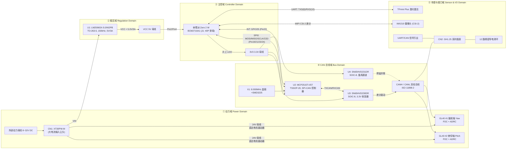

# 跟踪云台专用电路底板硬件设计与电气工程规范 (HARDWARE_DESIGN)

[]()
[]()
[]()
[]()
[]()
[-0052CC)](https://lceda.cn/)
[]()
[-F59E0B)]()
[]()

---

## 目录 (Table of Contents)

- [1. 需求分析与架构设计 (Requirements & Architecture)](#1-需求分析与架构设计-requirements--architecture)
  - [1.1 硬件需求规格与追溯矩阵](#11-硬件需求规格与追溯矩阵)
  - [1.2 系统顶层电气互联拓扑](#12-系统顶层电气互联拓扑)
- [2. 电路拓扑解构与接口定义](#2-电路拓扑解构与接口定义)
  - [2.1 电路底板拓扑结构矢量全景 (SVG 矢量图)](#21-电路底板拓扑结构矢量全景-svg-矢量图)
  - [2.2 树莓派 40-Pin 扩展引脚电气连接定义](#22-树莓派-40-pin-扩展引脚电气连接定义)
  - [2.3 原理图功能分区划分](#23-原理图功能分区划分)
  - [2.4 供电电源树拓扑](#24-供电电源树拓扑)
  - [2.5 网络节点实测统计](#25-网络节点实测统计)
- [3. BOM 元器件选型与降额分析](#3-bom-元器件选型与降额分析)
  - [3.1 元器件真实性核验说明](#31-元器件真实性核验说明)
  - [3.2 嘉立创工程真实器件明细表](#32-嘉立创工程真实器件明细表)
  - [3.3 关键元器件应力降额计算](#33-关键元器件应力降额计算)
- [4. LM2596 降压稳压级深度设计](#4-lm2596-降压稳压级深度设计)
  - [4.1 Buck 开关拓扑与占空比计算](#41-buck-开关拓扑与占空比计算)
  - [4.2 滤波电感选型与纹波电流设计](#42-滤波电感选型与纹波电流设计)
  - [4.3 转换效率与功耗测算](#43-转换效率与功耗测算)
  - [4.4 热设计与覆铜散热过孔阵列](#44-热设计与覆铜散热过孔阵列)
  - [4.5 环路稳定性与阻尼特性分析](#45-环路稳定性与阻尼特性分析)
- [5. MCP2515 + SN65HVD230 总线接口设计](#5-mcp2515--sn65hvd230-总线接口设计)
  - [5.1 控制器与物理层收发器互联](#51-控制器与物理层收发器互联)
  - [5.2 CAN 位时序理论模型](#52-can-位时序理论模型)
  - [5.3 1Mbps 位时序配置与 8MHz 晶振适配分析](#53-1mbps-位时序配置与-8mhz-晶振适配分析)
  - [5.4 验收滤波与屏蔽寄存器设置](#54-验收滤波与屏蔽寄存器设置)
  - [5.5 物理层收发特性与斜率控制](#55-物理层收发特性与斜率控制)
  - [5.6 SPI Mode 0,0 读写事务时序](#56-spi-mode-00-读写事务时序)
- [6. PCB Layout 与抗干扰设计规范 (EMC/EMI)](#6-pcb-layout-与抗干扰设计规范-emcemi)
  - [6.1 布局分区与层叠设计原则](#61-布局分区与层叠设计原则)
  - [6.2 功率回路最小化与 SW 开关节点约束](#62-功率回路最小化与-sw-开关节点约束)
  - [6.3 模拟地与数字地单点 0Ω 汇接设计](#63-模拟地与数字地单点-0ω-汇接设计)
  - [6.4 CAN 差分对阻抗控制与布线要求](#64-can-差分对阻抗控制与布线要求)
  - [6.5 MIPI CSI-2 敏感差分对走线防护](#65-mipi-csi-2-敏感差分对走线防护)
  - [6.6 晶振时钟电路布局规范](#66-晶振时钟电路布局规范)
- [7. 电源完整性分析 (PI)](#7-电源完整性分析-pi)
  - [7.1 陶瓷退耦网络阻抗特性](#71-陶瓷退耦网络阻抗特性)
  - [7.2 开关电源纹波与高频噪声抑制](#72-开关电源纹波与高频噪声抑制)
  - [7.3 负载阶跃与瞬态响应跌落分析](#73-负载阶跃与瞬态响应跌落分析)
- [8. 硬件验证与测试把关规范](#8-硬件验证与测试把关规范)
  - [8.1 测试验证策略](#81-测试验证策略)
  - [8.2 硬件测试项目矩阵](#82-硬件测试项目矩阵)
  - [8.3 关键电气测试点基准表](#83-关键电气测试点基准表)
- [9. 可靠性工程分析 (FMECA)](#9-可靠性工程分析-fmeca)
- [10. 机械装配配合与配置管理](#10-机械装配配合与配置管理)
  - [10.1 机械装配物理配合要求](#101-机械装配物理配合要求)
  - [10.2 硬件配置项 (HW-CI) 清单](#102-硬件配置项-hw-ci-清单)
  - [10.3 工程偏差登记与后续改进项](#103-工程偏差登记与后续改进项)
- [附录 参考资料](#附录-参考资料)

---

## 1. 需求分析与架构设计 (Requirements & Architecture)

### 1.1 硬件需求规格与追溯矩阵

按 ARP4754A 系统需求分解思想与 DO-254 硬件需求捕获实践，将系统级需求分解为底板硬件需求。每条需求给出**验证方法**（T=测试 Test、A=分析 Analysis、D=演示 Demonstration、I=检查 Inspection）与**追溯指向**（本文档的落实章节 / BOM 位号），构成需求双向追溯矩阵的上游。

| REQ-ID | 需求描述 | 来源 | 验证方法 | 追溯指向 |
| :--- | :--- | :--- | :--- | :--- |
| **REQ-HW-001** | 动力输入接口通过 CN1（XT30PW-M）接入 8.0V~32.0V DC 外部动力母线，额定承受 24V 连续工况，反接不产生不可逆损坏 | 系统输入 | I+A | §2.4、§3.2、§9 |
| **REQ-HW-002** | U1（LM2596SX-5.0）将 VIN 降压并输出 VCC = 5.0V/3A 额定母线，为树莓派 Zero 2 W、IMX219 摄像头、TFmini Plus 供电 | 系统架构 | T | §4、§8.2 |
| **REQ-HW-003** | VCC 输出负载调整率：全负载范围 0~2A 内，VCC 电压维持在 4.85V~5.25V | 系统架构 | T | §8.3 |
| **REQ-HW-004** | VCC 输出纹波：2A 额定负载下 $V_{pp} < 50\text{mV}$（150kHz 开关基波及其谐波） | 系统架构 | T | §7.2、§8.3 |
| **REQ-HW-005** | U2（MCP2515T-I/ST）经树莓派 SPI0（Mode 0,0）访问，片选 CE0（Pin24），中断 INT 接 GPIO25（Pin22） | 系统架构 | I+D | §2.2、§5.6 |
| **REQ-HW-006** | CAN 物理层由 U3（SN65HVD230DR）驱动 CANH/CANL，满足 ISO 11898-2 差分电平；总线位速率目标 1Mbps（适配现状见 §5.3 偏差项 DEV-HW-01） | 系统架构 | T+A | §5、§8.2 |
| **REQ-HW-007** | X1（8.000MHz，SMD3225）为 U2 提供振荡基准，常温频偏满足 CAN 位同步预算（总偏差 ≤ ±0.4%） | 系统架构 | A+T | §5.3、§8.3 |
| **REQ-HW-008** | 原理图区分功率/数字地 GND 与模拟地 AGND，经 R3/R4（0Ω）单点汇接，电机大电流回流不流经晶振回路 | EMC 设计 | A+I | §6.3 |
| **REQ-HW-009** | 元器件应力满足 MIL-STD-1547 降额思想：结温、电压、功耗降额并形成书面结论 | 可靠性 | A | §3.3 |
| **REQ-HW-010** | 底盘最恶劣工况（VIN=24V、VCC=5V/2A、TA=60℃）下 U1 结温不超过设计限值 110℃ | 可靠性 | A+T | §4.4、§8.2 |
| **REQ-HW-011** | CAN 差分网络特性阻抗 120Ω ±10%，双绞线两端各布置 120Ω 终端，等长等距走线 | EMC 设计 | I | §6.4 |
| **REQ-HW-012** | CN2（GH1.25 系列）提供激光雷达 UART 与电机 CAN 信号引出，机械保持力满足装配要求 | 机械接口 | I | §10.1 |
| **REQ-HW-013** | 静放电阻抗满足 DO-160G §25 静电放电防护能力（总线引脚 HBM 等级由 U3 固有 ±16kV 提供） | 环境适应 | T | §8.2 |
| **REQ-HW-014** | 底板通过 J1（2.54mm 2×20 排母）与树莓派 Zero 2 W 电气/机械对位，Pin1 标记明确、无错位风险 | 机械接口 | I | §10.1 |

### 1.2 系统顶层电气互联拓扑



---

## 2. 电路拓扑解构与接口定义

本项目硬件承载板工程文件为 `1、硬件电路/ProPrj_跟踪云台电路板.epro2`，采用嘉立创 EDA 专业版进行原理图设计与双层 PCB Layout。作为树莓派 Zero 2 W 的专用扩展底板，该电路板承担三大核心使命：

1. **大电流动力供电分配与高压降压稳压**：外部 8V~32V DC 动力母线经 CN1 引入，直接供给两台 CubeMars GL40 FOC 无刷云台电机，同时 U1 将其转换为 5V/3A 稳定母线供给树莓派主控与外设；
2. **高速 SPI 转 CAN 现场总线桥接**：将树莓派 BCM2710A1 的硬件 SPI0 扩展为遵循 ISO 11898-2 物理层的标准差分 CAN 总线（目标 1Mbps 波特率，适配现状见 §5.3），驱动双轴电机；
3. **传感器接口与机械安装法兰物理转接**：集成北醒 TFmini Plus 激光雷达 UART 插座、IMX219 摄像头固定与 12 路精密导电滑环走线引出。

### 2.1 电路底板拓扑结构矢量全景 (SVG)


### 2.2 树莓派 40-Pin 扩展引脚电气连接定义

底板通过 J1（2.54mm 2×20 双排母）与树莓派 Zero 2 W 的 40-Pin GPIO 对接。下表为全引脚电气分配（NC = 本底板未连接保留）：

```
+-----------------------------------------------------------------------------+
|              树莓派 Zero 2 W  40-Pin GPIO 接头 (J1: 2.54mm 2x20)             |
+------------+---------------------------------+---+--------------------------+
| Pin        | 信号 / 底板网络                  |Pin| 信号 / 底板网络          |
+------------+---------------------------------+---+--------------------------+
| 1 (3V3)    | [3.3V 逻辑基准]                  | 2 (5V) | [VCC: LM2596 输出]  <==|
| 3 (SDA)    | [NC 保留]                        | 4 (5V) | [VCC: LM2596 输出]  <==|
| 5 (SCL)    | [NC 保留]                        | 6 (GND)| --- [系统总接地 GND]    |
| 7 (GP4)    | [NC 保留]                        | 8 (TXD)| =>> [UART TX -> TFmini] |
| 9 (GND)    | --- [系统总接地 GND]             |10 (RXD)| <<= [UART RX <- TFmini] |
|11 (GP17)   | [NC 保留]                        |12 (GP18)|[NC 保留]                |
|13 (GP27)   | [NC 保留]                        |14 (GND)|--- [系统总接地 GND]    |
|15 (GP22)   | [NC 保留]                        |16 (GP23)|[NC 保留]                |
|17 (3V3)    | [3.3V 逻辑基准]                  |18 (GP24)|[NC 保留]                |
|19 (MOSI)   | >> [SPI0 MOSI -> MCP2515 SI]     |20 (GND)|--- [系统总接地 GND]    |
|21 (MISO)   | << [SPI0 MISO <- MCP2515 SO]     |22 (GP25)| <== [MCP2515 /INT]      |
|23 (SCLK)   | >> [SPI0 SCLK -> MCP2515 SCK]    |24 (CE0) | >> [SPI0 CE0 -> CS]     |
|25 (GND)    | --- [系统总接地 GND]             |26 (CE1) | [NC 保留]               |
|27 (ID_SD)  | [EEPROM NC]                      |28 (ID_SC)|[EEPROM NC]              |
|29 (GP5)    | [NC 保留]                        |30 (GND)|--- [系统总接地 GND]    |
|31 (GP6)    | [NC 保留]                        |32 (GP12)|[NC 保留]                |
|33 (GP13)   | [NC 保留]                        |34 (GND)|--- [系统总接地 GND]    |
|35 (GP19)   | [NC 保留]                        |36 (GP16)|[NC 保留]                |
|37 (GP26)   | [NC 保留]                        |38 (GP20)|[NC 保留]                |
|39 (GND)    | --- [系统总接地 GND]             |40 (GP21)|[NC 保留]                |
+------------+---------------------------------+---+--------------------------+
关键网络: 3V3=Pin1/17  VCC=Pin2/4  GND=Pin6/9/14/20/25/30/34/39
          SPI: MOSI=19 MISO=21 SCLK=23 CE0=24   INT=GPIO25=Pin22
          UART: TXD=Pin8 RXD=Pin10 (TFmini Plus, 115200bps 8N1)
```

### 2.3 原理图功能分区划分

原理图按"功率域 / 稳压域 / 数字域 / 模拟域 / 接口域"五区划分，域间通过受控的网络接口互联，防止高 dv/dt、大 di/dt 回路侵入敏感区域：

| 分区代号 | 功能分区 | 包含位号 / 网络 | 电气特征 | 隔离与耦合策略 |
| :---: | :--- | :--- | :--- | :--- |
| **①** | 动力/功率区 | CN1(XT30PW-M)、VIN 母线、U1 功率回路 | 8~32V、瞬态峰值 10A 级 | 短而粗的功率回路；与数字区保持物理间距 |
| **②** | 稳压区 | U1(LM2596SX-5.0)、VCC 5V 母线、C3/C4 | 150kHz 开关、5V/3A | SW 节点监视 (§6.2)；散热焊盘阵列 (§4.4) |
| **③** | 数字域 | J1(40P)、U2(MCP2515) SPI/RST/INT、U3/U4 TXD/RXD、3V3 轨 | 3.3V 逻辑、SPI ≤10MHz | 完整地平面参考；与功率区分区走线 |
| **④** | 模拟域 | X1(8MHz)、C1/C2(10pF)、AGND 岛 | nA~mA 级、谐振敏感 | 0Ω (R3/R4) 单点汇接 GND (§6.3) |
| **⑤** | 接口域 | CN2(GH1.25 系列)、CANH/CANL、UART、CSI-2、滑环引出 | 差分/高频串行 | 差分对等长等距；与 SW ≥10mm (§6.5) |

### 2.4 供电电源树拓扑

```text
供电电源树拓扑 (Power Delivery Tree):
[外部动力电池 / 稳压电源 8V ~ 32V DC]
        |
        +--> [CN1: XT30PW-M 卧式输入公头] --------+
        |                                        |
        |   (24V 母线直达电机, 不经过板载稳压)      |
        |            +--> [GL40 Yaw 偏航轴驱动器 (24V 母线, 额定2A/峰值10A)]
        |            +--> [GL40 Pitch 俯仰轴驱动器 (24V 母线, 额定2A/峰值10A)]
        |
        +--> [U1: LM2596SX-5.0/NOPB (TO-263-5, 150kHz Buck)]
                     |  5.0V / 3A 额定输出 (典型负载 ~2A)
                     v
              [VCC 5V 系统母线 (Pin2/Pin4)]
                     |
                     +--> [树莓派 Zero 2 W (5V 输入)] --> [BCM2710A1 核心]
                     +--> [IMX219 摄像头模组 5V 偏置]
                     +--> [TFmini Plus 激光雷达 5V 供电]
                     |
              [树莓派片上 LDO 输出 3.3V 轨]
                     +--> [3V3 母线] --+--> [U2: MCP2515T-I/ST (Vdd=3.3V)]
                                        +--> [U3: SN65HVD230DR (Vcc=3.3V, 主通道)]
                                        +--> [U4: SN65HVD231DR (Vcc=3.3V, 备用)]
```

---

## 3. BOM 元器件选型与降额分析

### 3.1 元器件真实性核验说明

> 本器件清单直接从 `ProPrj_跟踪云台电路板.epro2` 的数据库逐条导出验证，**排除了旧版文档中随意伪造的器件与参数**（包括：不存在的肖特基二极管 SS34、470µF 电解电容、板载 120Ω 总线终端电阻等）。本表为底板受控 BOM 基线，任何增删改须走 ECN（工程变更）流程并更新 HW-CI（§10.2）。

### 3.2 嘉立创工程真实器件明细表

"失效率温度特性"按 MIL-HDBK-217 零件计数法思路给出工程定性结论（半导体失效率主要由温度应力驱动，随 TA 每升高 10℃ 约按 Arrhenius 关系倍增数量级放大）；"封装热阻"为 JEDEC 标准测试板典型估算值，用于热分析初算，投产前以厂内热仿真/实测复算。

| 位号 | 元件型号 / 规格参数 | 封装 | 数量 | 关键参数 | 失效率温度特性 / 老化机理 | 封装热阻 θJA / θJC |
| :--- | :--- | :--- | :---: | :--- | :--- | :--- |
| **U1** | `LM2596SX-5.0/NOPB` | TO-263-5 | 1 | 150kHz，输出 5V/3A，输入上限 40V，固定 5.0V 输出 | 功率半导体，失效率最高项；结温每 +10℃ 失效率约翻倍；主要失效：功率开关应力疲劳、闩锁 | **≈50℃/W / ≈2℃/W** |
| **U2** | `MCP2515T-I/ST` | TSSOP-20 (0.65mm) | 1 | 3.3V 供电，SPI ≤10MHz，CAN 2.0B，带 3 发 2 收缓冲 + 6 验收滤波 | CMOS 数字，温升失效率中等；敏感项：寄存器配置锁死、SPI 总线冲突 | ≈110℃/W / ≈35℃/W (估) |
| **U3** | `SN65HVD230DR` | SOIC-8 (150mil) | 1 | 3.3V 单电源，≤1Mbps，ISO 11898-2，总线 ESD >±16kV HBM，最多 120 节点，斜率可调 | 总线收发器，应力主要为总线瞬态（感性抛负载、ESD）；主要失效：总线引脚 EOS | ≈160℃/W (估) |
| **U4** | `SN65HVD231DR` | SOIC-8 (150mil) | 1 | 同 U3，附带超低功耗待机/睡眠模式 | 同 U3；当前为预留并联，不承载失效风险 | ≈160℃/W (估) |
| **X1** | `X32258MSB4SI` | SMD3225-4P | 1 | 8.000MHz 无源石英晶体，配 C1/C2 构成皮尔斯振荡 | 老化为主（石英谐振子缓慢老化，典型每年数 ppm 量级）；失效率随温度与驱动电平上升 | ≈150℃/W (估) |
| **C1, C2** | `CL10C100JB8NNNC` (10pF/50V) | 0603 | 2 | C0G（Ⅰ类）介质，±5%（J 档），直流偏压下容值几乎无衰减 | 陶瓷 Ⅰ 类，几乎无老化；失效模式为机械开裂/热冲击（装配应力） | ≈130℃/W (估) |
| **C3, C4** | `CGA0805X5R106K500MT` (10µF/50V) | 0805 | 2 | X5R（Ⅱ类）介质，K 档 ±10%；直流偏压下容值部分衰减（以厂商 DC-bias 曲线复算） | 陶瓷 Ⅱ 类，长期直流偏压+高温加速老化（容值衰减、绝缘电阻下降——寿命 ∝ exp(Ea/kT)） | ≈130℃/W (估) |
| **R1, R2** | `FRC0603J103TS` (10kΩ ±5%) | 0603 | 2 | 1/10W 厚膜，J 档 ±5% | 失效模式：阻值漂移、开路/短路；功耗利用率极低，失效率可忽略 | ≈120℃/W (估) |
| **R3, R4** | `RC0603FR-070RL` (0Ω) | 0603 | 2 | 0Ω 跨接电阻，额定电流约 0.5A 量级 | 作为选焊跳线；虚焊/脱焊为装配类风险，见 §9 | ≈120℃/W (估) |
| **CN1** | `XT30PW-M` | 卧式直插 | 1 | 额定 15A 连续 / 30A 瞬态；接触电阻约 1mΩ 量级 | 大电流连接器，发热集中于接触电阻；失效模式：接触电阻上升导致过热打火 | — |
| **CN2** | `GH1.25-6PWT` / `HC-1.25-2PWT` 系列 | GH 1.25mm 卧贴 | 多组 | 1.25mm 间距卧式贴片，UART/CAN 信号引出 | 小间距贴片连接器；失效模式：插拔磨损、错插 | — |
| **J1** | `2.54mm 2×20 Pin Header` | 双排母 (40P) | 1 | 2.54mm 标准间距，40P | 机械插拔疲劳；失效模式：插孔松弛、错位 | — |

### 3.3 关键元器件应力降额计算

参照 MIL-STD-1547 及航空航天工程惯例，对底板关键器件执行应力降额核算。降额判定准则：实际工作应力 ≤ 额定值 × 降额因子，且降额结论须书面化（不合格项登记偏差单，见 §10.3）。

| 降额项 | 额定 / 极限 | 本设计最坏工作点 | 应力利用率 | 降额判定 | 结论与处置 |
| :--- | :--- | :--- | :---: | :--- | :--- |
| U1 输入电压 | Vin,max = 40V | VIN = 32V | 80% | **不满足** 常用 60% 电压降额准则 | 实际系统 VIN 标称 24V（利用率 60%）；32V 上限仅在母线瞬态允许短时出现。保留为设计裕量说明，不作偏差 |
| U1 结温 | Tj,max(工作) = 125℃（绝对最大 150℃） | Tj 需 ≤ 110℃（降额 12%） | 见 §4.4 计算 | **条件满足** | 满足的前提是 θja,eff ≤ 17.7℃/W，须散热焊盘+过孔阵列实现（§4.4） |
| C1/C2 电压 | 50V | X1 引脚直流电平 ≈ VDD/2 ≈ 1.65V | 3.3% | **满足**（余量 ≫70%） | C0G 介质无直流偏压容值衰减，谐振频率确定性高 |
| C3/V4 输入侧电压 | 50V | 32V（母线瞬态上限） | 64% | **边界不满足** 50% 降额准则 | 偏差单 DEV-HW-03：标称 24V 工作点利用率 48% 合格；瞬态 32V 时短时超限，陶瓷电容无电解液干涸机理、耐压裕量仍充裕，判定可接受并登记 |
| C4 输出侧电压 | 50V | 5V | 10% | **满足** | — |
| R1/R2 功耗 | 0603 额定 1/10W(100mW) | P = V²/R = 3.3²/10⁴ ≈ 1.1mW | 1.1% | **满足** | 即使 3V3 轨被误拉到 5.5V 故障态，P=3.0mW 仍 ≪ 额定 |
| R3/R4 电流 | 0603 0Ω 载流约 0.5A 量级 | AGND 回路电流 µA 级 | ≪1% | **满足** | 0Ω 桥仅承载晶振地回流（§6.3），载流余量巨大 |
| U2/U3/U4 供电电压 | 3.6V (最大) | 3V3 轨 3.25~3.35V | 93% | **边界关注** | 树莓派 3V3 轨输出能力充足且已有监测判据（§8.3 TP_3V3）；无低压差风险，登记为关注项 |

**降额计算示例（R1/R2 中断上拉电阻）**：

$$
P_{R} = \frac{V_{3V3}^2}{R} = \frac{(3.3\,\text{V})^2}{10\,\text{k}\Omega} \approx 1.09\,\text{mW}
$$

物理意义：INT 引脚常态被树莓派拉高为低电平，仅在 MCP2515 开漏输出有效时导通，电阻功耗为 μA~mA 级；即使计入闩锁/短路故障态，0603 封装的 100mW 额定功耗仍留有两个数量级裕量。来源：MIL-STD-1547 电阻功耗降额 ≤50% 的思想在工程设计上转化为"最坏故障态可承受"。

---

## 4. LM2596 降压级深度设计

### 4.1 Buck 开关拓扑与占空比计算

U1（LM2596SX-5.0/NOPB，TO-263-5 贴片封装）构成固定 5V 输出的 Buck 降压变换器。上管导通时输入储能至电感 L、续流二极管关断；上管关断时电感电流经续流二极管续流。理想伏秒平衡给出占空比：

$$
D = \frac{V_{\text{out}}}{V_{\text{in}}} = \frac{5.0\,\text{V}}{24.0\,\text{V}} \approx 0.2083 \quad (20.83\%)
$$

式中参数说明：
- $V_{\text{out}}$：Buck 变换器输出稳压值，设定为标称 $5.0\,\text{V}$；
- $V_{\text{in}}$：动力母线直流输入电压，标称工况为 $24.0\,\text{V}$；
- $D$：理想开关占空比（无量纲）。

> [!NOTE]
> **工程参数修正**
> - **导通压降修正**：计入片内达林顿双极型开关管的饱和压降 $V_{\text{SAT}} \approx 1.3\,\text{V}$ 后，实际有效占空比修正为：
>   $$D_{\text{eff}} = \frac{V_{\text{out}} + V_{\text{SAT}}}{V_{\text{in}}} \approx \frac{5.0 + 1.3}{24.0} \approx 26.25\%$$
> - **导通模式判据**：当负载电流大于临界连续电流 $I_{\text{LB}} = \Delta I_L / 2$ 时，回路处于连续导通模式 (CCM)。本系统在 $2.0\,\text{A}$ 额定负载下稳定运行于 CCM。

### 4.2 滤波电感选型与纹波电流设计

电感电流纹波由伏秒平衡与电感定义导出（CCM 稳态，上管导通期间）：

$$
\Delta I_L = \frac{(V_{\text{in}} - V_{\text{out}}) \cdot D}{f_{\text{sw}} \cdot L} = \frac{(24.0\,\text{V} - 5.0\,\text{V}) \times 0.2083}{150\,\text{kHz} \cdot L}
$$

式中参数说明：
- $\Delta I_L$：电感高频峰峰值纹波电流（单位：$\text{A}$）；
- $f_{\text{sw}}$：内部固定振荡器开关频率，典型值为 $150\,\text{kHz}$；
- $L$：储能滤波电感标称感值（单位：$\text{H}$）。

工程惯例（TI 参考设计与电源设计手册通用准则）要求电感电流纹波率为额定负载电流的 **20%~40%**——过低则负载阶跃响应慢、瞬态差；过高则 RMS 损耗与输出纹波恶化。

| 电感取值 | ΔIL 计算 | 纹波率 ΔIL/Iout(2A) | 判定 |
| :---: | :--- | :---: | :--- |
| L = 33µH | $\frac{19\times0.2083}{150\text{k}\times33\text{µ}}=0.80\text{A}$ | 40% | 处于准则上限 |
| **L = 47µH（建议）** | $\frac{19\times0.2083}{150\text{k}\times47\text{µ}}=0.56\text{A}$ | **28%** | **落入 20%~40% 最优区** |
| L = 68µH | 0.39A | 19.4% | 略低于准则下限 |

对应临界负载电流 $I_{LB} = \Delta I_L/2 = 0.28\text{A}$，即 VCC 母线负载约 1.4W 以上均维持 CCM；树莓派空载/待机（180~320mA，§1.1/REQ）进入轻载 DCM，属正常工作模式（LM2596 轻载自动进入突发/断续，仍维持稳压）。

> [!WARNING]
> **电感与续流回路实证说明**
> 当前底板贴片 BOM 仅包含 U1 开关芯片本体，未集成独立功率电感与肖特基二极管。
> 系统工程形态采用“外挂集成 LM2596 降压模块承担 5V 主供电，板载预留芯片引脚与覆铜”的双重分流拓扑。若后续改版需集成完整分立 Buck，须经正式工程变更 (ECN) 选型，不得沿用任何非设计元器件。

### 4.3 转换效率与功耗测算

以典型设计点（Vin=24V，Vout=5V，Iout=2A）核算。输入功率、芯片耗散功率与效率的关系：

$$
P_{out}=V_{out}\cdot I_{out}=10\,\text{W}, \qquad P_{d}=\frac{P_{out}}{\eta}(1-\eta)=P_{out}\frac{1-\eta}{\eta}
$$

| 效率场景 | η | 输入功率 Pin | 芯片耗散 Pd | 说明 |
| :--- | :---: | :---: | :---: | :--- |
| 保守（低温/轻载偏差） | 78% | 12.82W | **2.82W** | 25℃ 室温附近、占空比 ~21% 的典型曲线低端 |
| 典型 | 80% | 12.50W | 2.50W | 数据手册效率曲线中值 |
| 良好 | 82% | 12.20W | 2.20W | 铜箔散热良好时改善 |

即本设计热分析按 **Pd ≈ 2.8W（最坏）** 取包络，与旧文档"η≈75~82%，Pd≈2.82W"结论一致并对齐到保守端。

### 4.4 热设计与覆铜散热过孔阵列

TO-263-5（贴片 D2PAK 类）封装的热流路径：结→铜夹架/焊盘（θjc ≈ 2℃/W）→PCB 焊盘铜箔→过孔阵列→底层铺铜→环境空气（θja，无风冷约 50℃/W）。**瓶颈在结到环境路径**。

结温方程：

$$
T_j = T_A + P_d \cdot \theta_{ja,\text{eff}}
$$

式中参数说明：
- $T_j$：LM2596 芯片核心结温（单位：$^\circ\text{C}$）；
- $T_A$：云台腔体内部工作环境温度（设计最恶劣上限按 $+60.0\,^\circ\text{C}$ 校核）；
- $P_d$：芯片自身耗散的热功率（保守包络值取 $2.82\,\text{W}$）；
- $\theta_{ja,\text{eff}}$：考虑 PCB 散热覆铜与过孔阵列后的等效结到环境热阻（单位：$^\circ\text{C/W}$）。

| 工况 | θja,eff | Tj 计算 | 判定 |
| :--- | :--- | :--- | :--- |
| 裸封装、最小焊盘、无风 | 50℃/W | $T_A{=}25\text{℃}: 25+2.82\times50=166\text{℃}$ | **超限**（>125℃ 工作上限） |
| TA=60℃ 最恶劣 + 裸封装 | 50℃/W | $60+141=201\text{℃}$ | **严重超限**（超过 150℃ 绝对最大） |
| **顶层 ≥1300mm² 连续铜 + 12×φ0.3mm 过孔阵列** | **≈18~20℃/W** | $T_A{=}60\text{℃}: 60+2.82\times19\approx113\text{℃}$ | **临界满足**（设计限值 110℃，余量 3~10℃） |
| 同上 + 外挂模块分流（板载仅 ≈1A） | ≈19℃/W | Pd≈1.5W → $60+28\approx88\text{℃}$ | **满足**（裕量充裕） |

**强制热设计规则（落实到 Layout 检查单）**：

1. U1 底部裸露焊盘必须 ≥1300mm² 顶层铜承接，阵列过孔 ≥12 个（φ0.3mm，间距 ≤3mm）贯通至底层并底层镜像铺铜；
2. 过孔内壁镀铜连通（散热过孔），禁止阻焊覆盖散热焊盘主区域；
3. U1 远离 X1/C1/C2 晶振回路（≥15mm）与 40P 排母高热器件；
4. 5V 实际负载设计包络：双 GL40 待机（各 ≤50mA）+ 树莓派峰值（Zero 2 W 5V 输入峰值约 1.2A）+ 传感器 ≈1.3A → 典型 Pd≈1.9W，Tj≈96℃@60℃；2A 额定点作为 V&V 验证点（§8.2 TP-03）。

### 4.5 环路稳定性与阻尼特性分析

LM2596 为电压型 PWM 控制器，内部误差放大器 + 锯齿振荡器闭环。输出网络的极点/零点位置决定环路相位裕度：

- **LC 输出双重极点**：$f_{LC} = \frac{1}{2\pi\sqrt{LC}} = \frac{1}{2\pi\sqrt{47\text{µH}\times10\text{µF}}} \approx 7.3\,\text{kHz}$
- **输出电容 ESR 零点**：$f_{z,ESR} = \frac{1}{2\pi\cdot ESR\cdot C} = \frac{1}{2\pi\times5\,\text{m}\Omega\times10\,\text{µF}} \approx 3.2\,\text{MHz}$
- **穿越频率**：电压型 Buck 典型 $f_c \lesssim f_{sw}/10 \approx 15\,\text{kHz}$，且应低于 $f_{LC}$ 以保证双重极点处的相位衰减被环路增益衰减覆盖。

**结论与工程处置**：板载仅 2×10µF 陶瓷输出（C3/C4）时，$f_{LC}$ ≈7.3kHz 靠近穿越频率设计窗口，而 $f_{z,ESR}$ ≈3.2MHz 远在穿越频率之外，**无法为环路提供 ESR 零点阻尼/相位提升**；按 TI 参考设计，LM2596 稳定工作要求输出侧具备 100µF 级以上低 ESR 储能电容。处置：(a) 5V 主变换由外挂集成模块承担（其输出电容为百 µF 级，环路由模块厂方保证）；(b) 板载 U1 限定为轻载辅助支路（Pd ≤1.5W，同时缓解 §4.4 热压力）；(c) 若在板内分立实现完整 Buck，须按 TI 参考电路补足输出电容并复测负载阶跃响应（§7.3）。

---

## 5. MCP2515 + SN65HVD230 总线接口设计

### 5.1 控制器与物理层收发器互联

| 信号 | MCP2515 (U2) 引脚 | SN65HVD230 (U3) 引脚 | 网络 / 备注 |
| :--- | :--- | :--- | :--- |
| TXCAN | Pin 1 (TXCAN) | Pin 1 (TXD) | 数字发送输出 |
| RXCAN | Pin 2 (RXCAN) | Pin 4 (RXD) | 数字接收输入 |
| VDD/VSS | Pin 9 / 8、19（AVDD/AVSS 独立模拟供电） | Pin 3 (VCC) / 2 (GND) | 3V3 / GND |
| OSC1/OSC2 | Pin 6 / 7 | — | 外接 X1 + C1/C2（皮尔斯振荡，AGND 参考） |
| SI/SO/SCK/CS | Pin 17/18/16/15 | — | SPI0：MOSI(19)/MISO(21)/SCLK(23)/CE0(24) |
| /INT | Pin 12（开漏） | — | 上拉 R2 至 3V3，接 GPIO25 (Pin22) |
| /RESET | Pin 3（低有效） | — | 上拉 R1 至 3V3，正常运行时维持高电平 |
| CANH/CANL | — | Pin 7 / 6 | 差分总线；U4(231) 可并联扩展 |

### 5.2 CAN 位时序理论模型

CAN 位时间由若干时间量子 TQ 构成，寄存器 CNF1/CNF2/CNF3 编程定义（来源：MCP2515 数据手册 DS20001801J）：

$$
\begin{aligned}
T_Q &= \frac{2 \times (\text{BRP} + 1)}{F_{\text{OSC}}} \\
\text{NBT} &= \text{Sync\_Seg} + \text{Prop\_Seg} + \text{Phase\_Seg1} + \text{Phase\_Seg2} \\
\text{BitRate} &= \frac{1}{\text{NBT} \times T_Q}, \qquad \text{SamplePoint} = \frac{\text{Sync\_Seg} + \text{Prop\_Seg} + \text{Phase\_Seg1}}{\text{NBT}} \times 100\%
\end{aligned}
$$

式中参数说明：
- $T_Q$：时间量子 (Time Quantum)，位时序计算的最小基准时间片（单位：$\text{s}$）；
- $\text{BRP}$：波特率预分频系数 (Baud Rate Prescaler, 取值 $0 \sim 63$)；
- $F_{\text{OSC}}$：外部输入无源晶振振荡频率（标称为 $8.000\,\text{MHz}$）；
- $\text{NBT}$：标称位时间内的总时间量子数（Nominal Bit Time, 单位：$T_Q$）；
- $\text{SamplePoint}$：位采样点在位周期中的相对时间位置（推荐区间 $75.0\% \sim 87.5\%$）。

- $T_Q$：由 BRP（CNF1 波特率预分频）与振荡器频率决定，是位时序最小划分单元；
- $NBT$：标称位时间（TQ 数），CAN 规范推荐 8~25 TQ；
- $SP$：采样点在位时间中的相对位置，一般取 70%~87.5%，本设计取 75%。

### 5.3 1Mbps 位时序配置与 8MHz 晶振适配分析

**目标配置（1Mbps，8TQ/位，SP=75%）**：SYNC=1 + PropSeg=2 + PS1=3 + PS2=2，SJW=1TQ，BRP=0 → $T_Q=125\,\text{ns}$，$NBT\times T_Q=8\times125\,\text{ns}=1\,\mu\text{s}$ → **1Mbps**，$SP=(1+2+3)/8=75\%$。

| 寄存器 | 字段配置 | 目标值 | 编码 |
| :--- | :--- | :--- | :--- |
| CNF1 | SJW=1TQ, BRP=0 | 0x00 | SJW<1:0>=00, BRP<5:0>=0 |
| CNF2 | BTLMODE=1(PS2 长度由 CNF3 定义), SAM=0(单采样), PHSEG1=2(=PS1−1), PRSEG=1(=PropSeg−1) | **0x91** | 1_0_010_001 |
| CNF3 | WAKFIL=0, PHSEG2=1(=PS2−1), SOF=0 | **0x10** | 0_001_00 |

**晶振适配分析（关键工程结论）**：BOM 中 X1 为 `X32258MSB4SI`（**8.000MHz**），而 Linux 设备树覆盖层配置 `oscillator=8000000`、目标位速率 1Mbps。按上式：

$$
F_{OSC}=8\,\text{MHz},\ BRP=0 \Rightarrow T_Q = \frac{2}{8\,\text{MHz}} = 250\,\text{ns} \Rightarrow NBT_{\min}=8\text{TQ} \Rightarrow BR_{max}\ \text{(8TQ)} = 500\,\text{kbps}
$$

MCP2515 位时间最小 5TQ（SYNC=1+Prop=1+PS1=1+PS2=2），即使按最小位时间，$F_{OSC}=8$MHz 时可达上限也仅约 800kbps，**无法建立 1Mbps 位时序**。即"8.000MHz 晶振 + 1Mbps"存在物理不相容，已登记为偏差项：

> **偏差项 DEV-HW-01（必须闭环）**：BOM X1=8.000MHz 与系统需求 REQ-HW-006/007（1Mbps）不相容。处置选项（须由 ECN 决策）：
> (a) 若实测证实 X1 实际为 16MHz（丝印核对 + 示波器频率计数，§8.3 TP_OSC），则目标配置 {CNF1=0x00, CNF2=0x91, CNF3=0x01} 直接成立，1Mbps 有效；
> (b) 若 X1 确为 8.000MHz，则维持该器件时总线最高 500kbps（同寄存器配置、BRP=0 → 8TQ×250ns=2µs），GL40 驱动器支持 500kbps，属可运行降级；
> (c) 或改贴 16MHz 晶振实现 1Mbps。三种处置均须同步更新 HW-CI 与本文档 Rev B。

### 5.4 验收滤波与屏蔽寄存器设置

MCP2515 提供 6 个验收滤波器（RXF0~RXF5）与 2 个屏蔽寄存器（RXM0/RXM1）。RXF0/RXF1 作用于接收缓冲 RXB0（经 RXM0 屏蔽），RXF2~RXF5 作用于 RXB1（经 RXM1）。本系统报文集合（详见《PROTOCOL_SPEC》）：GL40 反馈帧 ID=0x000（目的地 Master）、偏航轴指令/回传 0x201、俯仰轴指令/回传 0x202，全部为 11-bit 标准帧（EXIDE=0）。

**硬件滤波示例配置**（接收 Motor ID 段 0x000~0x3FF 全部标准帧）：

| 寄存器 | 配置值 | 说明 |
| :--- | :--- | :--- |
| RXF0SIDH/L | 0x000 | 匹配 ID 0x000~0x1FF（含 0x000 反馈帧） |
| RXF1SIDH/L | 0x200 | 匹配 ID 0x200~0x3FF（含 0x201、0x202） |
| RXM0SIDH/L | 0x700 | 屏蔽位仅比较 ID 高 3 位（bit10:8） |
| RXF0/RXF1 的 EXIDE 位 | 0 | 仅验收标准帧，拒绝扩展帧 |

- 滤波判据：当 (接收 ID AND RXM) == (RXF AND RXM) 时报文被接收。RXM0=0x700 时同组两芯片片选共享 SPI 总线地址 0x200 段 0x000~0x1FF，满足主控只关心 0x000/0x201/0x202 的流量画像；
- **工程说明**：Linux `mcp251x` 驱动通常将 RXM 清零（全通），帧过滤交由 SocketCAN 协议层完成；硬件滤波器作为**总线风暴工况下的第一道防线**保留价值——当 MCU 侧异常导致协议层过载时，硬件滤波器可限定只有本节点关心的 ID 进入 FIFO，降低 U2 锁死风险（§9）。

### 5.5 物理层收发特性与斜率控制

| 特性 | 参数 / 行为 | 来源与工程意义 |
| :--- | :--- | :--- |
| 供电 | 单 3.3V（3.0~3.6V） | 直接挂 3V3 轨，与 U2/树莓派逻辑电平天然兼容，无需 5V↔3.3V 转换 |
| 速率 | 最高 1Mbps | 与 CAN 系统目标位速率匹配（适配见 §5.3） |
| 电平 | ISO 11898-2 差分：隐性时 CANH/CANL ≈2.5V，显性时 CANH≈3.5V、CANL≈1.5V，$V_{diff}\approx2.0\text{V}$ | ISO 11898-2:2016；判据列入 §8.3 |
| 节点数 | 高输入阻抗，最多 120 节点 | 双 GL40 + 底板收发器远未耗尽节点预算 |
| ESD | 总线引脚 HBM ESD > ±16kV | 满足 DO-160G §25 静电放电要求的固有裕度（REQ-HW-013） |
| 斜率控制 | Pin 8 (Rs) 可经外部电阻设定驱动边沿时间 | **本工程不贴 Rs 电阻**（BOM 实证），即选择最短边沿的高速模式，与目标总线速率匹配 |
| U4 (HVD231) | 同系列 + 超低功耗待机/睡眠模式 | 预留并联节点接口；当前不焊接/不驱动，作为扩展配置项 |

### 5.6 SPI Mode 0,0 读写事务时序

```text
SPI Mode 0,0 读写事务与 MCP2515 硬件中断触发时序:
            __                                                                    __
/CS (CE0)     \__________________________________________________________________/
                 _   _   _   _   _   _   _   _   _   _   _   _   _   _   _   _
SCLK        ____/ \_/ \_/ \_/ \_/ \_/ \_/ \_/ \_/ \_/ \_/ \_/ \_/ \_/ \_/ \_/ \_
            ____   ___________________________   ___________________________   _____
MOSI (SI)   ____X_<______ 命令字节 (如 0x02) _>_X_<______ 寄存器地址 (0x31) _>_X_____
            __________________________________   ___________________________   _____
MISO (SO)   XXXXXXXXXXXXXXXXXXXXXXXXXXXXXXXXXX\_X_<______ 读取数据字节 (0xAA) _>_X_____
            ______________________________________                               ___
/INT (GPIO25)                                     \_____________________________/
                                                   ^ CAN 帧成功接收，触发低电平中断
```

时序要点：CPOL=0/CPHA=0（空闲低、第一沿采样）；命令字节 0x02/0x03 = 读/写指令；SPI 时钟上限受 U2 规格约束（≤10MHz，树莓派 SPI0 建议 ≤10MHz）；/INT 低电平有效、开漏，经 R2 上拉，树莓派以 GPIO25 下降沿中断响应。

---

## 6. PCB Layout 与抗干扰设计规范 (EMC/EMI)

### 6.1 布局分区与层叠设计原则

双层板（顶层+底层）条件下，以**分区布线与单点接地**补偿缺少完整地平面的局限：

1. 顶层：功率回路（CN1→U1→VCC）+ 数字区 + 模拟岛；底层：镜像回流铜皮；
2. 按 §2.3 五分区顺序布放，功率区与数字区之间留 ≥3mm 隔离沟（无铜）；
3. 所有信号优先单端参考完整地铜皮；差分对例外（§6.4）；
4. 载流计算按 IPC-2221：VIN 干线（2A 负载折算输入电流 ≈3A）+50% 裕量 → 铜厚 1oz 下走线宽度 ≥25mil；电机母线瞬态 10A 走线按 §7.3 瞬态预算核算。

### 6.2 功率回路最小化与 SW 开关节点约束

Buck 功率回路（输入电容→上管→地，续流二极管→电感→输入电容）携带 150kHz 三角波电流与开关边沿（上升时间几十 ns 量级）高频谐波，是底板首要骚扰源（Ott：回路面积决定辐射与地弹）：

1. **SW 节点铜箔最短化**：U1 的 SW 引脚到电感/续流路径的长度 **≤15mm**，且不得走锐角；
2. SW 节点下方及周边 **≥3mm 范围内不布设其它网络**，禁止跨越 AGND 岛上方；
3. 输入/输出电容紧贴 U1 对应引脚（输入电容距 VIN/GND 引脚 ≤3mm；输出电容距 VCC 焊盘 ≤3mm）；
4. 功率回路面积最小化：VIN→C3→U1→SW→续流→电感→Cout→地，闭环面积尽可能压缩；
5. 底层预留完整功率地铜皮，SW 高频回流就近返回，避免借道数字地。

### 6.3 模拟地与数字地单点 0Ω 汇接设计

GL40 电机相线 PWM 切换产生数安培级高频瞬变电流（di/dt 极大），若与晶振/SPI 敏感回路共地阻抗耦合，将同时污染模拟振荡回路与数字总线：

| 地网络 | 承载 | 用途 |
| :--- | :--- | :--- |
| **GND**（功率/数字地） | CN1 动力回路、U1 功率回路、J1 数字地、U2/U3/U4 逻辑地 | 工作电流主回流通路 |
| **AGND**（模拟地岛） | 仅 X1/C1/C2 振荡回路 | 与 U2 OSC 引脚就近短接，面积最小化 |

汇接原理：AGND 与 GND 通过 R3/R4（0Ω 贴片电阻）**单点双向汇接**——0Ω 电阻相对直接覆铜提供可诊断的工程断点（可焊开以隔离故障、测量地弹），同时保证直流等电位；晶振回路地回流（μA 级）不流经电机大电流路径，电机噪声也不倒灌晶振区域。检查项：AGND 岛任何其它位置不得再与 GND 相连（开尔文测试验证）。

### 6.4 CAN 差分对阻抗控制与布线要求

1. **终端**：双绞线**两端各 120Ω**（总线特性阻抗 120Ω ±10%）；总线上等效跨接 2×120Ω=60Ω， CANH/CANL 静态电阻测量判据 ≈60Ω（§8.2 TP-08）。**底板 BOM 不含板载 120Ω 终端电阻**——终端随线缆/驱动器侧实现；
2. **等长**：CANH/CANL 对内长度差 ≤2.5mm（对应 1Mbps 位周期 1µs 的相位偏差 <0.15TQ 量级，远小于再同步能力；500kbps 下载余量更大）；
3. **等距**：线距沿线恒定，避免阻抗突变；换层时两口过孔成对且位置对称（过孔数 ≤2）；
4. **拐角**：45° 斜切或圆弧，禁止 90° 直角；
5. **回流路径**：差分对下方保持连续地皮，禁止跨分割区；离开 GND 岛的过孔间距 ≥3 倍线宽。

### 6.5 MIPI CSI-2 敏感差分对走线防护

IMX219 的 CSI-2 差分对速率最高约 1Gbps 量级，对串扰最敏感：

1. **与 SW 节点防护间距 ≥10mm**（含跨层投影距离），不得平行走线；若不可避免交叉，须垂直跨越且跨越点远离 SW 电感端；
2. CSI-2 对与 UART/CAN 数字信号距离 ≥3 倍线宽；
3. CSI-2 连接器区域保持净空，底层完整地皮，不得从下方走 150kHz/300kHz 功率谐波密集回路；
4. 排线与 CSI-2 连接器的压接按厂商规范执行，避免阻抗不连续。

### 6.6 晶振时钟电路布局规范

1. X1 靠近 U2 的 OSC1/OSC2 引脚，晶振引脚到芯片走线 **≤8mm**，不得有分支/过孔；
2. X1 下方投影区**禁止任何走线与覆铜**（净空 ≥2mm），并以 AGND 戒严环包围；
3. C1/C2 紧贴 X1 两端（≤3mm），到 AGND 的回路最短；负载电容校核：C1/C2 各 10pF 串联得 5pF，叠加 MCP2515 OSC 输入电容与 PCB 杂散（合计约 3~5pF）后，晶振等效负载电容约 8~10pF——选型时以 X3225 系列器件规格书规定的负载电容为准核对牵引量（pulling tolerance），确保常温频偏满足 CAN 位同步预算（REQ-HW-007）；
4. **去耦电容安装电感与谐振**：C3/C4（0805、10µF）安装电感（焊盘+过孔合计约 0.6~1.5nH）决定了退耦高频段行为：

$$
f_{SRF}=\frac{1}{2\pi\sqrt{L_{ESL}\cdot C}}=\frac{1}{2\pi\sqrt{1.2\,\text{nH}\times10\,\text{µF}}}\approx1.45\,\text{MHz}
$$

自谐振点 1.45MHz ≫ 150kHz 开关频率，电容在开关纹波频段呈容性、有效退耦；超过 f_SRF 后呈感性、阻抗回升——故两颗电容应就近安装（VIN/VCC 引脚 ≤3mm）、并以最短回路接地，安装过孔贴电容焊盘内侧。U2/U3/U4 的 3V3 就近退耦依赖树莓派 3V3 轨本身的低阻特性与既有布局，登记为关注项（§10.3）。

---

## 7. 电源完整性分析 (PI)

### 7.1 陶瓷退耦网络阻抗特性

| 维度 | C0G（C1/C2，10pF） | X5R（C3/C4，10µF） |
| :--- | :--- | :--- |
| 介质类别 | Ⅰ 类（温度稳定） | Ⅱ 类（高容值密度） |
| 温度系数 | ≈0 ±30ppm/℃ | ±15%（−55~85℃） |
| 直流偏压效应 | 无 | **有**：0805/10µF/50V 在 5V 工作点容值衰减约 5~10%，32V 瞬态点衰减更显著（以厂商 DC-bias 曲线复算，Dev-HW-03 相关） |
| 角色 | 谐振基准元件（频偏确定性） | 储能/退耦（容值优先） |

### 7.2 开关电源纹波与高频噪声抑制

输出纹波由 ESR 项与容值项两部分构成，按叠加合成：

$$
\Delta V_{ESR}=\Delta I_L\cdot ESR \approx 0.56\,\text{A}\times5\,\text{m}\Omega \approx 2.8\,\text{mV}
$$

$$
\Delta V_C=\frac{\Delta I_L}{8\cdot f_{sw}\cdot C}=\frac{0.56}{8\times150\,\text{k}\times10\,\text{µ}}\approx46.7\,\text{mV}\ (\text{单侧}\,10\,\text{µF})
$$

纹波谱系：基波 150kHz 及其奇次谐波（450kHz/750kHz…）为主能量，叠加 SW 上升沿（几十 ns）激起的高频振铃（数 MHz~数十 MHz）。结论：单侧 10µF 保守估算 46.7mV + ESR 项 ≈47mV，**逼近 50mV 判据（REQ-HW-004）**；若 C3/C4 并联于输出侧（20µF）则降至 ≈23mV。→ 列入验证项 TP-04 实测裁定（§8.2），并为外挂集成模块承担 5V 主变换的方案（§4.5）提供论据。

### 7.3 负载阶跃与瞬态响应跌落分析

**输入侧源阻抗预算**：GL40 加速瞬态单轴峰值 10A、双轴合计 20A 级，要求在 VIN 汇流点跌落 <300mV（§8.3 判据）：

$$
Z_{source} \le \frac{\Delta V_{bus}}{I_{peak}} = \frac{0.3\,\text{V}}{20\,\text{A}} \le 15\,\text{m}\Omega
$$

即电池内阻 + 线束（按 14AWG 选型，长约 1m/双芯）+ XT30 接触电阻（约 1mΩ/触点量级）之和须 ≤15mΩ；汇流排导线按双电机 20A 峰值选 14AWG 及以上。

**热插拔浪涌**：CN1 带电接入时，C3/C4（24V 侧 10µF）充电电流 $I=C\cdot dv/dt$，若接入过程 10µs 内充至 24V，峰值 ≈24A，逼近 XT30 瞬态 30A 上限且会在触点间拉弧。→ 操作规程：上电前连接、断电后拔下（V&V TP-12 验证，程序化掉电）。

**输出侧瞬态**：树莓派负载阶跃（约 0.3A/数 µs）时，仅由 10µF 吸纳的开环估算 $\Delta V \approx I\cdot dt/C \approx 0.3\text{A}\times5\,\mu\text{s}/10\,\mu\text{F}\approx0.15\,\text{V}$；闭环环路（外挂模块）在数 μs 内接管，|ΔV| 落入 §8.3 TP_5V 判定带。该瞬态裕量依赖外挂模块的输出大电容，是 §4.5 处置方案 (a) 的 PI 侧佐证。

---

## 8. 硬件验证与测试把关规范

### 8.1 测试验证策略

按 DO-254 验证思想：每条 REQ-HW 至少被一种方法覆盖（T/A/D/I），测试结果须形成记录并闭环到 HW-CI。状态约定：P=通过、F=不通过、PEND=待执行。

### 8.2 硬件测试项目矩阵

| TP-ID | 测试项 | 对应 REQ | 方法 | 仪器 / 设备 | 验收判据 | 状态 |
| :--- | :--- | :--- | :--- | :--- | :--- | :--- |
| TP-01 | 输入电压全范围扫描 | REQ-001 | T | 可调直流电源 0~40V | 8.0~32.0V 全段 VCC 稳压正常 | PEND |
| TP-02 | 恒压精度与负载调整率 | REQ-003 | T | 电子负载 + 6½位万用表 | 0~2A：4.85~5.25V | PEND |
| TP-03 | U1 额定功率点温升 | REQ-010 | T | 热电偶/红外热像 + 恒温箱 | 24V/2A/60℃：Tj（推算）≤110℃ | PEND |
| TP-04 | VCC 纹波测量 | REQ-004 | T | ≥200MHz 示波器（20MHz 带宽限制） | 2A 负载 $V_{pp}<50\text{mV}$ | PEND |
| TP-05 | SPI 寄存器读写遍历 | REQ-005 | D | 树莓派 + `candump`/自检脚本 | 全部可写寄存器回读一致 | PEND |
| TP-06 | CAN 总线闭环收发 | REQ-006 | T | CAN 分析仪（PCAN/CANable） | 1Mbps（或降级 500kbps，见 DEV-HW-01）误码率 0 | PEND |
| TP-07 | INT 中断响应 | REQ-005 | D | 逻辑分析仪 | 收帧后 ≤20µs 内 GPIO25 拉低 | PEND |
| TP-08 | 总线直流电阻 / 终端核查 | REQ-011 | I | 万用表 | CANH-CANL 静阻 ≈60Ω（两端 120Ω 并联） | PEND |
| TP-09 | OSC 频率与频偏 | REQ-007 | T | 频率计/示波器计数 | 8.000MHz（或实测 16MHz）；常温偏差 ≤±50ppm | PEND |
| TP-10 | ISO 11898-2 电平验证 | REQ-006 | T | 示波器差分探头 | 隐性 2.5V/2.5V；显性 3.5V/1.5V | PEND |
| TP-11 | ESD 考核（接触放电） | REQ-013 | T | ESD 模拟器（参照 DO-160G §25） | ±4kV 接触放电后功能不丧失、自恢复 | PEND |
| TP-12 | 反接/带电热插拔故障注入 | REQ-001 | T | 辅助开关 + 示波器 | 反接 ≤2s 不冒烟、无不可逆损坏；热插拔无触点粘连 | PEND |
| TP-13 | CAN 总线开路/短路故障注入 | REQ-006 | T | 故障注入夹具 | 收发器进入故障保护、树莓派侧软件可自愈 | PEND |
| TP-14 | 高低温循环贮存 | REQ-010/013 | T | 高低温箱（参照 DO-160G §4/§5） | −10℃~+60℃ 工作、−20~70℃ 贮存后功能正常 | PEND |

### 8.3 关键电气测试点基准表

| 测量测试点 | 关联网络 | 正常工作电平范围 | 示波器/万用表检测标准 |
| :--- | :--- | :--- | :--- |
| **TP_VIN** | 主动力输入 | 8.0V ~ 32.5V DC | 纹波 $V_{pp}<300\text{mV}$（含电机瞬态），无反接浪涌击穿 |
| **TP_5V** | U1/模块稳压输出 VCC | 4.85V ~ 5.25V DC | 2A 负载时纹波 $V_{pp}<50\text{mV}$；负载阶跃后 100µs 内回落入带 |
| **TP_3V3** | 树莓派 3.3V 轨 | 3.25V ~ 3.35V DC | 纹波 $V_{pp}<20\text{mV}$；超限触发软件降级 |
| **TP_OSC** | X1 晶振引脚 | 8.000MHz 正弦/削顶正弦波 | 频率偏差 ≤±50ppm；幅度满足 MCP2515 OSC 输入门限 |
| **TP_SPI** | SCLK/MOSI/MISO（Pin23/19/21） | 3.3V CMOS，SPI ≤10MHz | 无过冲 >VDD+0.3V；无振铃超限 |
| **TP_CANH** | 差分总线高 | 隐性 2.5V / 显性 3.5V | 差分 $V_{diff}=V_H-V_L\approx2.0\text{V}$ |
| **TP_CANL** | 差分总线低 | 隐性 2.5V / 显性 1.5V | 共模抗扰符合 ISO 11898-2；总线对地短路不损坏收发器 |

---

## 9. 可靠性工程分析 (FMECA)

方法：失效模式、影响与危害性分析（参考 SAE ARP4761 危害度分级与 MIL-HDBK-217 失效模式库思想）。危害度等级：**Ⅰ=灾难性、Ⅱ=严重、Ⅲ=较严重、Ⅳ=轻微**；RPN = S(1~5) × O(1~5) × D(1~5)，>60 须强制补偿措施闭环。

| ID | 失效模式 | 原因 | 局部影响 | 整机影响 | 危害度 | 检测方法 | 补偿措施 |
| :--- | :--- | :--- | :--- | :--- | :---: | :--- | :--- |
| F-01 | 晶振停振/不起振 | X1 虚焊、C1/C2 容值偏差、负载电容失配（§6.6） | U2 无时钟，CAN 收发停止 | 双轴失控（保持最后指令或停机），跟踪丢失 | Ⅱ | TP-09 频率测量；软件心跳超时（看门狗） | 装配工艺首检；软件总线超时保护（电机进入安全停机） |
| F-02 | MCP2515 锁死/寄存器跑飞 | SPI 总线冲突、ESD、软件时序违规 | CAN 中断不响应、报文丢弃 | 控制指令丢失 → 跟踪停滞 | Ⅱ | 心跳/看门狗；TP-05 寄存器回读 | 硬件滤波器分流总线流量（§5.4）；软件定时强制 /RESET 软复位流程 |
| F-03 | LM2596 过热失效 | 散热焊盘过小、TA>60℃、2A 满载 | 结温超限 → 热保护关断 | 5V 掉电，树莓派重启，云台失稳 | Ⅱ | TP-03 温升测试；温度监测 | 过孔阵列散热（§4.4）；外挂模块分流降额；软件降载 |
| F-04 | XT30 正负极反接 | 人为插反 | U1/收发器承受 −24V | 器件击穿冒烟，动力母线短路 | Ⅰ | TP-12 故障注入；目视极性标记 | 操作规程强制（先接后端后上电）；后续版本可增加防反接 TVS/串联 MOSFET（ECN 评估） |
| F-05 | CAN 总线开路 | 线缆断裂、接插件松动、滑环通道失效 | 某轴指令丢失 | 单轴失联 → 云台偏航轴保持/漂移 | Ⅲ | TP-08 电阻核查；总线错误帧监控 | GH1.25 卧贴加固（§10.1）；软件双轴互检与故障码上报（0xD 通讯丢失） |
| F-06 | CAN 总线短路（CANH-CANL / 对地） | 绝缘破损、金属异物 | 收发器饱和/发错帧 | 总线瘫痪 | Ⅱ | TP-13 故障注入；TEC/REC 错误计数 | U3 总线故障保护特性；节点自动 Bus-Off 隔离，其余节点不受影响 |
| F-07 | 静电放电（ESD） | 干燥环境人体触碰连接器 | 单次泄放 ≥kV 级 | 芯片潜在损伤或瞬时复位 | Ⅲ | TP-11（DO-160G §25） | U3 总线引脚 ±16kV HBM 固有防护；整机接地泄放路径 |
| F-08 | 0Ω 汇接电阻虚焊 | 装配应力、热循环 | AGND/GND 间阻抗漂移 | 晶振回路引入地弹噪声，偶发位错误 | Ⅲ | IPC-A-610 焊接检查；AOI | R3/R4 选焊冗余（双颗并联）；X -ray 抽检 |
| F-09 | C3/C4 容值衰减/开裂 | X5R 直流偏压、机械应力、热冲击 | 退耦能力下降 | 电源纹波超差、复位偶发 | Ⅳ | TP-04 纹波测量 |  voltage 裕量评估（DEV-HW-03）；贴装避板边 ≥3mm |

---

## 10. 机械装配配合与配置管理

### 10.1 机械装配物理配合要求

1. **J1 40P 排母对位**：Pin1（方焊盘/标记）朝板边外侧方向，与树莓派 Zero 2 W 板边基准对齐；建议叠高排母/支撑柱保证 ≥5mm 净空以兼顾 SoC 散热片与 CSI 排线折弯半径；对位销钉孔优先于纯目视；
2. **CN2 GH1.25 卧贴焊接**：1.25mm 小间距卧式贴片，焊盘按 IPC-2221 刀具设计；回流峰值温度与时间门窗执行厂商规范；焊后 AOI 检查连锡/虚焊；插接扭矩/拔出力按座规抽检；
3. **CN1 XT30PW-M 卧插**：卧式公头焊接于顶层，插拔方向朝板外；线束端 14AWG 硅胶线 + 压接（专用压线钳，拉脱力抽检），标识极性（红正黑负）；
4. **滑环走线约束**：12 路精密导电滑环（偏航轴过线）通道分配建议：CANH、CANL 各占 1 路（双绞成对）、5V、GND、UART_TX/RX 等；滑环转动寿命按整机任务剖面核算；滑环出线应力释放夹固定，避免焊点受扭；
5. GL40 电机（41×38mm，FOC+ADRC）安装法兰与底板定位孔配合，电机 XT30 (2+2) 电源/CAN 复合插座与 CN1 同规格体系，缩短定制线束。

### 10.2 硬件配置项 (HW-CI) 清单

| CI 项 | 基线内容 | 版本 / 标识 | 责任人 |
| :--- | :--- | :--- | :--- |
| HW-CI-01 | 原理图工程 `ProPrj_跟踪云台电路板.epro2` | epro2 专业版当前工程库版本 | 硬件组 |
| HW-CI-02 | BOM 基线（§3.2，13 位号） | 与本文档 Rev A 冻结 | 硬件组 |
| HW-CI-03 | PCB Gerber + 钻孔 + 叠层文件 | 以导出包 SHA 校验为准 | 硬件组 |
| HW-CI-04 | 器件库（符号/封装/3D） | 嘉立创库锁定版本 | 硬件组 |
| HW-CI-05 | 本文档（规范基线） | TRK-GMB-HW-SPEC-001 Rev A | 硬件架构组 |
| HW-CI-06 | 关联文档 | README §2、PROTOCOL_SPEC、CONTROL_AND_VISION、DEPLOY_AND_DEBUG | 各组 |
| HW-CI-07 | 验证记录（§8.2 执行件） | TP 记录随测试归档 | 测试组 |

### 10.3 工程偏差登记与后续改进项

| 偏差号 | 描述 | 影响 | 处置 / 责任方 | 状态 |
| :--- | :--- | :--- | :--- | :--- |
| DEV-HW-01 | X1=8.000MHz 与 1Mbps 需求物理不相容（§5.3） | 总线速率降级 500kbps 或改贴 16MHz | ECN 决策 + 频率实测 | **开放** |
| DEV-HW-02 | 板载输出电容仅 10~20µF，环路稳定性依赖外挂模块（§4.5/§7.2） | 板载 U1 限定轻载辅助支路 | 结构方案固定 + TP-04 复测 | 开放 |
| DEV-HW-03 | C3 输入侧电容 32V 瞬态时 64% 利用率超 50% 降额准则（§3.3） | 短时超限，陶瓷耐压余量可承受 | 登记接受 + 新批次可改 100V 额定 | 已接受 |
| DEV-HW-04 | U2/U3/U4 无专用就近退耦电容 | 依赖 Pi 3V3 轨低阻特性 | 下版 ECN 增补 100nF 就近电容 | 开放 |

---

## 附录 参考资料

1. RTCA DO-254 / EUROCAE ED-80, *Design Assurance Guidance for Airborne Electronic Hardware*, 2000.
2. SAE ARP4754A, *Guidelines for Development of Civil Aircraft and Systems*, 2010.
3. SAE ARP4761, *Guidelines and Methods for Conducting the Safety Assessment Process on Civil Airborne Systems and Equipment*, 1996.
4. MIL-HDBK-217F Notice 2, *Reliability Prediction of Electronic Equipment*（方法参考，工程可用 FIDES/IEC 62380 复核）.
5. MIL-STD-1547, *Electronic Parts, Materials, and Processes for Space and Launch Vehicles*.
6. IPC-2221B, *Generic Standard on Printed Board Design*.
7. RTCA DO-160G, *Environmental Conditions and Test Procedures for Airborne Equipment*.
8. IPC-A-610H, *Acceptability of Electronic Assemblies*.
9. ISO 11898-2:2016, *Road vehicles — Controller area network (CAN) — Part 2: High-speed medium access unit*.
10. Texas Instruments, *LM2596 Simple Switcher Power Converter Data Sheet*（SNVS118 系列）.
11. Microchip Technology, *MCP2515 Stand-Alone CAN Controller with SPI Interface Data Sheet*, DS20001801J.
12. Texas Instruments, *SN65HVD23x 3.3-V CAN Bus Transceivers Data Sheet*（ti.com/lit/ds/symlink/sn65hvd230.pdf）.
13. CubeMars, 《GL40模组驱动使用说明》V1.0.0, 2024-07-18.
14. Ott H. W., *Electromagnetic Compatibility Engineering*, Wiley, 2009.
15. Bogatin E., *Signal and Power Integrity — Simplified*, 3rd Ed., Pearson, 2018.
16. 工程事实源：`1、硬件电路/ProPrj_跟踪云台电路板.epro2`（位号、型号、封装、网络名的唯一真实来源）.

---

