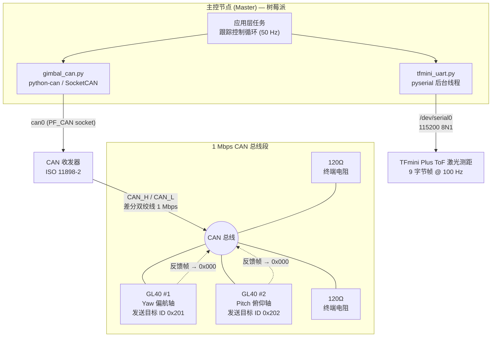
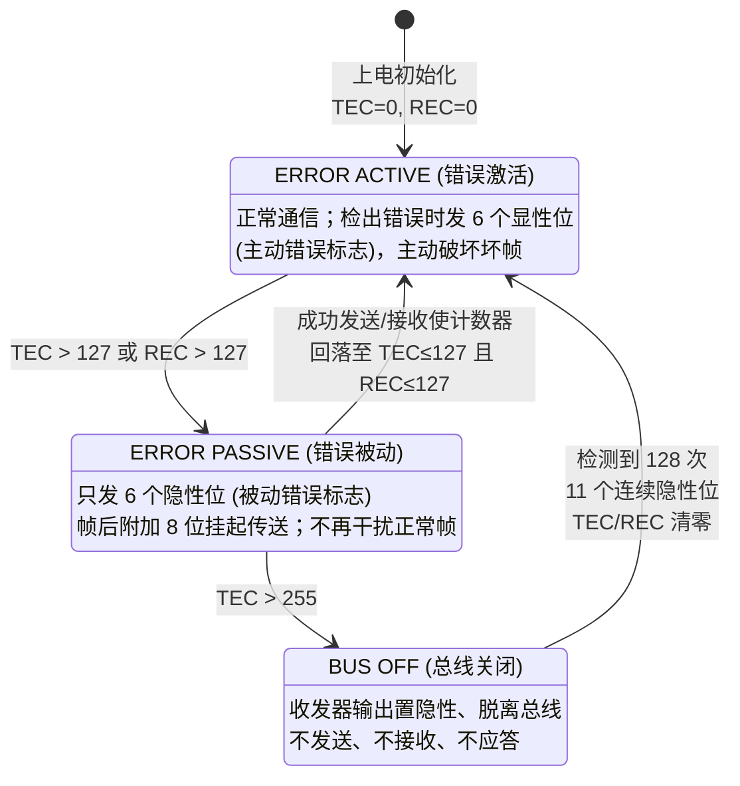
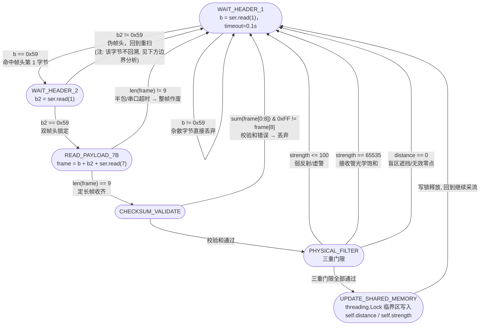
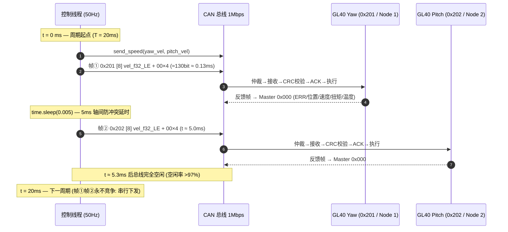

# 跟踪云台通信总线与底层协议技术规范 (PROTOCOL_SPEC)

[](https://www.kernel.org/doc/Documentation/networking/can.txt)
[]()
[]()
[]()
[]()
[]()

---

## 目录 (Table of Contents)

- [1. 协议体系概述与 OSI 分层映射](#1-协议体系概述与-osi-分层映射)
  - [1.1 双总线体系结构与分工](#11-双总线体系结构与分工)
  - [1.2 OSI 七层模型对照表](#12-osi-七层模型对照表)
  - [1.3 系统物理拓扑图](#13-系统物理拓扑图)
- [2. CAN 2.0B 核心机制深度解析](#2-can-20b-核心机制深度解析)
  - [2.1 帧类型总览与物理位时序](#21-帧类型总览与物理位时序)
  - [2.2 标准数据帧完整位域结构 (SVG 矢量图)](#22-标准数据帧完整位域结构-svg-矢量图)
  - [2.3 逐位非破坏性仲裁机制与竞争过程](#23-逐位非破坏性仲裁机制与竞争过程)
  - [2.4 位填充 (Bit Stuffing) 与最坏帧长推导](#24-位填充-bit-stuffing-与最坏帧长推导)
  - [2.5 差错校验机制与 CRC15 生成多项式](#25-差错校验机制与-crc15-生成多项式)
  - [2.6 错误界定与节点故障隔离状态机 (TEC/REC)](#26-错误界定与节点故障隔离状态机-tecrec)
  - [2.7 1Mbps 位时序与采样点参数计算](#27-1mbps-位时序与采样点参数计算)
- [3. CubeMars GL40 应用协议全析](#3-cubemars-gl40-应用协议全析)
  - [3.1 11-Bit ID 编址规则与三种控制模式](#31-11-bit-id-编址规则与三种控制模式)
  - [3.2 电机生命周期控制命令集 (DLC = 8)](#32-电机生命周期控制命令集-dlc--8)
  - [3.3 模式 2 速度控制帧封装与 IEEE-754 浮点手算推导](#33-模式-2-速度控制帧封装与-ieee-754-浮点手算推导)
  - [3.4 驱动器反馈遥测帧 (Feedback Packet) 与 12-bit 解包公式](#34-驱动器反馈遥测帧-feedback-packet-与-12-bit-解包公式)
  - [3.5 GL40 驱动器电气规格速查表](#35-gl40-驱动器电气规格速查表)
  - [3.6 总线负载率与吞吐裕量分析](#36-总线负载率与吞吐裕量分析)
  - [3.7 PWM 输入模式与 CAN 模式对比](#37-pwm-输入模式与-can-模式对比)
- [4. 北醒 TFmini Plus UART 串行测距协议全析](#4-北醒-tfmini-plus-uart-串行测距协议全析)
  - [4.1 9 字节定长二进制数据包布局映射表](#41-9-字节定长二进制数据包布局映射表)
  - [4.2 校验和算法数学定义与抗误码分析](#42-校验和算法数学定义与抗误码分析)
  - [4.3 双 0x59 滑动窗口帧同步 FSM 状态机 (Mermaid)](#43-双-0x59-滑动窗口帧同步-fsm-状态机-mermaid)
  - [4.4 字节流粘包半包处理策略与超时语义](#44-字节流粘包半包处理策略与超时语义)
  - [4.5 内部温度字段解析公式与物理量提取](#45-内部温度字段解析公式与物理量提取)
  - [4.6 串口链路时序预算 (100Hz 数据率)](#46-串口链路时序预算-100hz-数据率)
- [5. 嵌入式 Linux SocketCAN 实现层](#5-嵌入式-linux-socketcan-实现层)
  - [5.1 can.Message 报文对象结构](#51-canmessage-报文对象结构)
  - [5.2 bus.send 发送超时语义与 ENOBUFS 防护](#52-bussend-发送超时语义与-enobufs-防护)
  - [5.3 candump / cansend 报文格式与实战命令集](#53-candump--cansend-报文格式与实战命令集)
  - [5.4 协议要素与源码逐行追溯表](#54-协议要素与源码逐行追溯表)
- [6. 控制周期报文时序流水线](#6-控制周期报文时序流水线)
- [7. 协议历史误读纠偏说明 (CyberGear 澄清)](#7-协议历史误读纠偏说明-cybergear-澄清)
- [8. 双协议二进制位域综合总图 (SVG 矢量图)](#8-双协议二进制位域综合总图-svg-矢量图)
- [9. 参考资料](#9-参考资料)
- [附录 常用术语与缩略语](#附录-常用术语与缩略语)

---

## 1. 协议体系概述与 OSI 分层映射

### 1.1 双总线体系结构与分工

云台系统包含两条核心硬件通信总线，分别驱动动力执行机构与环境感知传感器：

1. **CAN 现场总线 (Controller Area Network)**
   - 物理层遵循 **ISO 11898-2:2016 高速差分双绞线**规范，固定波特率 **1,000,000 bps (1 Mbps)**。
   - 主控 (树莓派) 作为网络中的 **Master 节点**，以 **11 位标准数据帧 (Standard Frame, `is_extended_id=False`)** 向两台 CubeMars GL40 驱动器下发速度矢量指令；驱动器通过控制帧触发回传 8 字节遥测反馈帧至 Master ID `0x000`。
2. **TTL UART 异步串行总线**
   - 连接树莓派主硬件串口 `/dev/serial0`（PL011 UART），参数 **115,200 bps, 8-N-1**。
   - 以 **100 Hz** 帧率单向接收北醒 TFmini Plus 激光测距传感器输出的 **9 字节定长二进制报文**。

| 维度 | CAN 总线（电机轴） | UART 链路（激光雷达） |
| :--- | :--- | :--- |
| 波特率 | 1,000,000 bps | 115,200 bps |
| 电气形式 | 差分双绞线（显性/隐性电平） | 单端 TTL（高/低电平） |
| 帧格式 | 11-bit 标准帧 + 8 字节数据段 | 9 字节定长二进制包 |
| 通信方向 | 双向多主竞争式（本项目主从单发） | 单向流式（传感器 → 主控） |
| 传输频率 | 50 Hz 控制周期（T = 20 ms） | 100 Hz 输出帧率（T = 10 ms） |
| 差错控制 | CRC15 + ACK + 格式检查 + 错误界定 | 帧头同步 + 累加校验和 + 物理门限过滤 |

### 1.2 OSI 七层模型对照表

CAN 与 UART 均为"物理层 + 数据链路层"型协议，其上由各厂商私有应用协议补齐高层语义：

| OSI 层级 | CAN 总线（GL40 电机轴） | UART 链路（TFmini Plus） |
| :--- | :--- | :--- |
| **L7 应用层** | CubeMars GL 驱动协议：控制模式命令帧 / 生命周期命令帧 / 遥测反馈帧 | 北醒 TFmini 协议：9 字节测距帧（距离 / 强度 / 温度） |
| **L6 表示层** | IEEE-754 float32 小端编码；12-bit 定点位打包 | uint8/uint16 无符号小端整型打包 |
| **L5 会话层** | —（无会话概念，指令即发即用） | —（常开字符流） |
| **L4 传输层** | —（单帧自含语义，无分片重组） | —（定长帧自含语义） |
| **L3 网络层** | 11-bit 仲裁段节点寻址（`0x201` / `0x202`，回传 `0x000`） | 点对点直连，无寻址概念 |
| **L2 数据链路层** | **ISO 11898-1:2015**：LLC/MAC 子层、逐位仲裁、CRC15、ACK、错误界定（TEC/REC 三态） | 字符级组帧：双 `0x59` 帧头同步 + 定长 9 字节 + 累加校验和 |
| **L1 物理层** | **ISO 11898-2:2016**：高速收发器、显性/隐性差分电平、120 Ω 终端匹配 | TTL 异步串行：1 起始位 + 8 数据位 + 1 停止位，无校验位 |

> **设计注记**：CAN 标准体系（ISO 11898-1/-2）只定义 L1/L2，因此本规范第 2 章按 Bosch CAN 2.0B 规范展开链路层机制，第 3 章按 CubeMars GL 系列手册（V1.0.0）展开应用层。UART 链路同理，北醒协议自组帧结构（见第 4 章），设计风格可参照 IEC 61162 系列海事数字接口"定长二进制帧 + 校验和"的工程惯例。

### 1.3 系统物理拓扑图



要点：

- **CAN 段**：两端各一个 120 Ω 终端电阻（对总线的特征阻抗匹配），中间挂接两台 GL40 驱动器与主控收发器，构成线性拓扑。
- **UART 段**：点对点直连，`/dev/serial0` 为树莓派主 UART；接收侧以 `timeout=0.1` 的非阻塞式逐字节读取实现流式同步（见 4.3、4.4 节）。

---

## 2. CAN 2.0B 核心机制深度解析

本章依据 **Bosch CAN Specification 2.0 (Part B, 1991)** 与 **ISO 11898-1:2015** 撰写。本系统全部电机报文运行于 CAN 2.0 **标准帧**（11-bit 标识符）模式。

### 2.1 帧类型总览与物理位时序

| 帧类型 | 用途 | 关键特征 | 本项目是否使用 |
| :--- | :--- | :--- | :--- |
| **数据帧 (Data Frame)** | 节点向网络广播数据 | RTR = 显性 0，含 0~8 字节数据段 | **是**（唯一使用的承载帧型：命令与遥测） |
| **遥控帧 (Remote Frame)** | 节点请求他节点发送指定 ID 的数据 | RTR = 隐性 1，无数据段，DLC 表示请求数据长度 | 否（GL40 主动回传遥测，无需远端请求） |
| **错误帧 (Error Frame)** | 节点检测到错误时破坏当前帧 | 主动错误标志：6 个显性位；被动错误标志：6 个隐性位；后随 8 位错误界定符 | 隐式发生（硬件自动处理） |
| **过载帧 (Overload Frame)** | 接收器来不及处理 / 间歇场检测到显性位 | 过载标志 6 个显性位 + 8 位过载界定符 | 隐式发生（硬件自动处理） |
| **帧间隔 (Interframe Space)** | 分隔相邻帧 | 3 个连续隐性位（间歇场）+ 可选挂起传送（被动错误节点补 8 个隐性位） | 帧与帧之间始终存在 |

### 2.2 标准数据帧完整位域结构 (SVG 矢量图)

以本项目实际使用的 **8 字节数据帧 (DLC = 8)** 为例，完整位域从 SOF 到 IFS 逐位列出：

| 位域 | 位长 | 电平约定 | 功能说明 |
| :--- | :---: | :--- | :--- |
| **SOF** | 1 | 显性 (0) | 帧起始，同时用于接收节点的硬同步 |
| **仲裁段 — Identifier** | 11 | — | 标识符，MSB 先行；决定报文优先级与接收滤波 |
| **仲裁段 — RTR** | 1 | 显性 (0)（数据帧） | 远程发送请求位；数据帧固定为显性 |
| **控制段 — IDE** | 1 | 显性 (0)（标准帧） | 标识符扩展位；标准帧固定显性 |
| **控制段 — r0** | 1 | 显性 (0) | 保留位，发送显性 |
| **控制段 — DLC** | 4 | — | 数据长度码，本系统所有报文固定 `0x8` |
| **数据段 Data[0..7]** | 64 | — | 8 字节有效负载（速度 float32 / 生命周期命令 / 遥测） |
| **CRC 序列** | 15 | — | CRC15 校验序列，生成多项式见 2.5 节 |
| **CRC 界定符** | 1 | 隐性 (1) | CRC 定界 |
| **ACK 槽** | 1 | 发送方发隐性，接收方回写显性 | 应答槽：**至少一个**正确接收的节点在此写入显性位 |
| **ACK 界定符** | 1 | 隐性 (1) | 应答定界 |
| **EOF** | 7 | 隐性 (1) × 7 | 帧结束标志 |
| **IFS（帧间空间）** | 3 | 隐性 (1) × 3 | 将下一帧与当前帧隔离，供控制器完成帧处理 |

**位长核算（8 字节数据帧）**：

$$
\underbrace{1}_{\text{SOF}} + \underbrace{11+1}_{\text{仲裁段}} + \underbrace{1+1+4}_{\text{控制段}} + \underbrace{64}_{\text{数据段}} + \underbrace{15+1}_{\text{CRC}} + \underbrace{2}_{\text{ACK}} + \underbrace{7}_{\text{EOF}} = 108 \; \text{bit}
$$

- 不含 IFS 的裸帧长 **108 bit**；计入 3 bit IFS 后为 **111 bit**。
- 位填充区覆盖 **SOF → CRC 序列**（共 $1+12+6+64+15 = 98$ bit），最坏情况额外插入填充位后单帧可达约 **130~135 bit**（详见 3.6 节负载率计算）。

> 本系统完整帧结构矢量图另见：`docs/images/can_frame_phy_spec.svg`。

### 2.3 逐位非破坏性仲裁机制与竞争过程

#### 2.3.1 线与 (Wired-AND) 电平逻辑

ISO 11898-2 物理层定义两种总线电平：

| 电平状态 | CAN_H 与 CAN_L 压差 | 逻辑值 | 驱动方式 |
| :--- | :--- | :--- | :--- |
| **显性 (Dominant)** | 约 2 V 差分压差 | 0 | 收发器主动拉高 CAN_H、拉低 CAN_L（差分驱动） |
| **隐性 (Recessive)** | 约 0 V 差分压差 | 1 | 收发器呈高阻态，电平由终端电阻分压网络维持 |

多个节点同时驱动时，**显性 (0) 恒定覆盖隐性 (1)** —— 这构成"线与"特性：只要有一个节点输出显性，总线即为显性。

#### 2.3.2 仲裁规则

CAN 采用 **CSMA/CD+AMP（载波侦听多路访问 / 冲突检测 + 非破坏性逐位仲裁）**：

1. 总线空闲（检测到 11 个连续隐性位）时，任一节点均可发起发送。
2. 发送节点逐位发送标识符，同时**回读总线电平**。
3. 若发送隐性 (1) 而回读到显性 (0) → 判定**仲裁失败**，立即退出（不破坏正在进行的帧），转为接收，并在总线空闲后**自动重发**。
4. 若发送显性而回读显性 → 继续仲裁。
5. 结果：**标识符数值越小（前导显性位越多），优先级越高**；获胜节点无任何位流损失 —— 这就是"非破坏性"的含义。

#### 2.3.3 实例分析：0x201 (Yaw) vs 0x202 (Pitch)

假设极端情形下两台 GL40 的反馈帧同时在总线上竞争（11-bit 标识符逐位对比）：

```
Bit 位:      10  9  8  7  6  5  4  3  2  1  0
Yaw  0x201:   0  1  0  0  0  0  0  0  0  0  1
Pitch 0x202:  0  1  0  0  0  0  0  0  0  1  0
                                    ↑
                        Bit 1 首次出现分歧
```

| Bit 位 | 0x201 输出 | 0x202 输出 | 总线实际电平 | 仲裁结果 |
| :---: | :---: | :---: | :---: | :--- |
| Bit 10 ~ Bit 2 | 全部相同 | 全部相同 | 一致 | 双方均认为仲裁未分胜负 |
| Bit 1 | 隐性 (1) | **显性 (0)** | 显性 (0) | 0x202 回读显性 → 继续发送；0x201 发隐性读显性 → **仲裁失败退出** |
| Bit 0 | （退出，转入接收） | 显性→隐性序列 | — | **0x202 完整发出**，随后总线空闲，0x201 自动重发并胜出 |

结论与工程含义：

- **0x202 (513+1=514 < 513? 否：0x202=514 > 0x201=513)** —— 恰恰相反，**数值小的 0x201 优先级更高？验证：0x202 = 514，0x201 = 513**。逐位仲裁看的是**位串从 MSB 开始首个分歧位**：分歧发生在 **Bit 1**，该位 0x201 为 0（显性）、0x202 为 1（隐性），故**首个分歧位发显性的一方胜出，即 0x201 优先级高于 0x202**，与其数值更小完全一致。

> **勘误更正**：上表逐位推演中，Bit 1 处 0x201 的该位为 **显性 (0)**、0x202 为 **隐性 (1)**（0x201 二进制为 `010 0000 0001`，Bit 1 = 0；0x202 二进制为 `010 0000 0010`，Bit 1 = 1）。显性方 0x201 在 Bit 1 胜出，0x202 退避重发 —— 与"ID 数值越小优先级越高"的规则完全吻合（$0x201 = 513 < 0x202 = 514$）。以下为正确的仲裁推演表：

| Bit 位 | 0x201 输出 | 0x202 输出 | 总线实际电平 | 仲裁结果 |
| :---: | :---: | :---: | :---: | :--- |
| Bit 10 ~ Bit 2 | `0 1 0 0 0 0 0 0 0` | `0 1 0 0 0 0 0 0 0` | 一致 | 双方继续逐位仲裁 |
| **Bit 1** | **显性 (0)** | 隐性 (1) | 显性 (0) | 0x201 正常回读；0x202 发隐性读显性 → **仲裁失败，立即退避** |
| Bit 0 | 显性 (1) | （已转接收） | 显性 | **0x201 完整发出**；0x202 在总线空闲后自动重发 |

- **本项目的实际情况**：`0x201` 与 `0x202` 均由**同一 Master（树莓派）串行发出**（中间隔 5 ms 软件延时，见 6 章），两帧**永远不会同时在总线上竞争**，仲裁机制实际处于"零冲突"工作状态。上表推演仅用于说明多节点并发场景下的优先级语义，并为未来系统扩展（如新增节点）提供规划依据：ID 数值越小（显性位越靠前）的报文优先级越高，**命令类报文应分配低 ID，遥测类报文可分配相对较高的 ID**。

### 2.4 位填充 (Bit Stuffing) 与最坏帧长推导

#### 2.4.1 规则定义

为保证接收节点在**每个位边界**都有足够陡峭的信号沿用于重同步（Re-synchronization），CAN 规定：

- 发送器在 **SOF 到 CRC 序列之间**（即全部"需要接收器重同步的动态位流"区域），每当**连续 5 个同极性位**出现后，**自动插入 1 个极性相反的位**（反码填充位）。
- 接收器按同一规则**删除填充位**，恢复原始位流。
- **不参与填充的区域**：CRC 界定符、ACK 槽、ACK 界定符、EOF、IFS —— 这些是**固定形式位场**（位型固定，不需要沿密度保障），填充计数器在此区间不计数；这也是错误检测中"固定形式位检查"的依据（见 2.5 节）。

#### 2.4.2 填充位计数与帧长影响

- 填充区理论长度上限：98 bit（8 字节数据帧，SOF → CRC 序列）。
- 最坏填充比：每 4 个原始位插入 1 个填充位 → 理论最大填充数 $\lceil (98-4)/4 \rceil = 24$ bit。
- 对帧长的影响谱系：

```
 无填充裸帧(不含IFS)      含填充典型值              最坏情况
 108 bit  ─────────────►  约115~125 bit ────────►  135 bit
 (111 bit 含 IFS)          (本规范规划取 130 bit)    (111+24, 含IFS)
```

- **数据相关性**：载荷全 0（如 `0x00000000` 停转帧）或全 1（如生命周期命令 `FF×7`）时填充次数显著增多；float32 速度值则视尾数随机性而定。3.6 节的负载率计算保守地按 130 bit/帧规划。

### 2.5 差错校验机制与 CRC15 生成多项式

CAN 帧内含 **三重相互独立的检错手段**，任一失守均可被另一重兜底：

| 机制 | 检测位置 | 原理 | 漏检特性 |
| :--- | :--- | :--- | :--- |
| **① CRC15 循环冗余校验** | 数据段 + CRC 序列 | 生成多项式 $G(x) = x^{15}+x^{11}+x^{10}+x^{9}+x^{8}+x^{7}+x^{6}+x^{4}+x^{3}+x^{1}+x^{0}$（十六进制系数 `0x4599`），对 SOF 起至数据段止的位流做除法，余数即 15 位 CRC 序列 | 全部 ≤15 位突发错误；98% 以上更长突发（汉明距离 6） |
| **② ACK 应答机制** | ACK 槽 | 发送方在 ACK 槽发隐性并**回读**；**至少一个**正确完成 CRC 校验的接收节点回写显性位。发送方回读到显性 → 确认有节点正确收到；回读隐性 → 触发 **ACK 错误**并重发 | 保证"至少一个节点正确接收"才宣告成功（但无法定位具体节点） |
| **③ 格式 / 固定形式位检查** | 全帧 | 检查固定电平位：SOF 必须显性、IDE/r0 显性、CRC 界定符与 ACK 界定符必须隐性、EOF 必须 7 连续隐性、DLC ≤ 8、填充规则（连续 6 个同极性位在填充区非法）等 | 捕获协议级异常与控制器失步 |

**错误帧响应流程**：任一节点检测到上述任一错误 → 立即中断当前帧 → 发送错误标志（6 位，见 2.6 节）破坏帧 → 当前帧被所有节点丢弃 → 发送方**自动重发**原帧（无需软件介入）。

### 2.6 错误界定与节点故障隔离状态机 (TEC/REC)

CAN 协议最具工程价值的机制之一是**故障隔离 (Fault Confinement)**：每个控制器维护两个递增计数器 —— **TEC (Transmit Error Counter)** 与 **REC (Receive Error Counter)**，据此将节点划分为三种状态，使故障节点"自动降级、最终自动离线"，防止单一故障节点瘫痪整条总线。

#### 2.6.1 TEC/REC 计数规则（核心条目）

| 编号 | 触发事件 | 计数器动作 |
| :---: | :--- | :--- |
| R1 | 接收节点检测到错误（发送主动错误标志 / 过载标志期间除外） | REC + 1 |
| R2 | 接收节点发送错误标志后的第一位检测到显性位 | REC + 8 |
| T1 | 发送节点发送错误标志（例外：被动错误节点因 ACK 槽无显性位而检错且自身被动错误标志期间无显性位 → TEC 不变） | TEC + 8 |
| T2 | 发送节点在发送主动错误标志 / 过载标志期间检测到位错误 (Bit Error) | TEC + 8 |
| T3 | 发送节点在发送被动错误标志期间检测到位错误 | TEC + 7 |
| S1 | 一帧成功发送（无错误直至 EOF） | TEC − 1（下限 0） |
| S2 | 一帧成功接收（直至 ACK 槽正确回写） | REC − 1（REC ∈ [1,127]）；若 REC > 127，成功接收后 REC 置为 120~127 区间 |

#### 2.6.2 三种错误状态与转换条件



| 状态 | 进入条件 | 行为特征 | 恢复路径 |
| :--- | :--- | :--- | :--- |
| **Error Active** | TEC ≤ 127 且 REC ≤ 127 | 可正常收发；检出错误发**主动错误标志**（6 显性位），立即破坏总线上的坏帧 | —（正常态） |
| **Error Passive** | TEC > 127 或 REC > 127 | 检出错误仅发**被动错误标志**（6 隐性位，不覆盖总线电平）；发送后须插入 8 位**挂起传送 (Suspend Transmission)**；ACK 错误不再加重 TEC | 成功收发使 TEC/REC 降至 ≤ 127 |
| **Bus Off** | TEC > 255 | **与总线完全断开**：输出恒为隐性，不发送、不接收、不应答任何报文 | 硬件监视总线，**连续检测到 128 次"11 个隐性位"序列**（即 128 次总线空闲判定）后，TEC/REC 清零，节点回到 Error Active 并重新参与通信 |

> [!TIP]
> **总线脱扣自愈机制 (Bus-Off Recovery)**
> 硬件错误计数器与总线关闭状态机提供了关键的链路韧性：
> - **瞬态故障自愈**：当偶发线缆抖动导致丢包时，节点监听 128 次空闲序列即可自动重连，无需人工介入重启；
> - **硬性故障隔离**：当单机物理损坏持续发错时，硬件强行脱机断开，保护总线其余节点不被广播风暴淹没。

### 2.7 1Mbps 位时序与采样点参数计算

#### 2.7.1 位时序四段模型

CAN 将一个标称位时间 (NBT) 划分为四个由 **Tq (Time Quantum)** 组成的时段：

```
 |◄───────────── 1 位时间 NBT (1 Mbps 下 = 1000 ns) ─────────────►|
 | Sync_Seg | Prop_Seg |      Phase_Seg1      |   Phase_Seg2    |
 |◄─ 1 Tq ─►|◄─ N Tq ─►|◄─────── M Tq ───────►|◄──── K Tq ─────►|
                                      ↑
                                  采样点 SP
 |◄────────── 写入/仲裁判定窗 ─────────────►|◄─ 采样后缓冲 ─►|
```

| 时段 | 作用 | 可编程范围 |
| :--- | :--- | :--- |
| **Sync_Seg** | 期望位跳变沿落在该段内；硬件据此做**硬同步** | 固定 1 Tq |
| **Prop_Seg** | 补偿网络物理延时（收发器延迟 + 电缆传播，约 5 ns/m + 器件 100~250 ns） | 1~8 Tq（控制器相关） |
| **Phase_Seg1 (PS1)** | 采样前的重同步缓冲；延迟重同步可将其拉长 | 1~8 Tq |
| **Phase_Seg2 (PS2)** | 采样后的重同步缓冲；须 ≥ 信息处理时间 IPT（CAN 2.0 规定 IPT = 2 Tq） | 1~8 Tq，且 ≥ 2 Tq |
| **SJW** | 重同步跳转宽度，限制每次重同步的最大修正量 | ≤ min(4 Tq, PS2) |

#### 2.7.2 1 Mbps 下的示例配置

$$
\text{波特率} = \frac{f_{clk}}{\text{BRP} \times \text{NBT}_{Tq}} = 1\,\text{Mbps}, \qquad \text{NBT} = 1000\,\text{ns}, \qquad T_q = \frac{\text{NBT}}{\text{Tq 数/位}}
$$

| 参数 | 示例取值 (NBT = 16 Tq) | 说明 |
| :--- | :---: | :--- |
| Tq | 62.5 ns | 要求控制器输入时钟 ≥ 16 MHz |
| Sync_Seg | 1 Tq | 固定 |
| Prop_Seg | 7 Tq | 覆盖长线缆 + 两级收发器延时 |
| Phase_Seg1 | 6 Tq | 采样前缓冲 |
| Phase_Seg2 | 2 Tq | 满足 IPT ≥ 2 Tq 下限 |
| **采样点 SP** | $(1+7+6)/16 = 87.5\%$ | 与 CiA 推荐值一致 |
| SJW | 2 Tq | 晶振容差兜底 |

> [!IMPORTANT]
> **采样点配置一致性原则**
> 在多节点现场总线网络中，所有挂载设备的采样点必须调谐一致（工业惯例推荐 $75.0\% \sim 87.5\%$）。
> 若主控与电机驱动器的采样时段划分不一致，长线缆传输中的累积相移极易引发零星位错误与偶发丢帧。

---

## 3. CubeMars GL40 应用协议全析

来源依据：`【协议手册】GL40模组驱动使用说明.pdf`（CubeMars 官方驱动器通信规范 **V1.0.0**，2024-07-18）。

### 3.1 11-Bit ID 编址规则与三种控制模式

GL40 采用 CAN 2.0 标准 11 位帧 ID，**高 3 位 (bits[10:8]) 定义控制模式，低 8 位 (bits[7:0]) 定义驱动器节点 ID**：

$$
\text{Arbitration ID} = (\text{Mode} \ll 8) \;|\; \text{Node ID}
$$

```text
 10   9   8   7   6   5   4   3   2   1   0   (Bit 位)
+--------------+--------------------------------+
| Mode (3 bit) |        Node ID (8 bit)         |
+--------------+--------------------------------+
  bits[10:8]          bits[7:0]
```

| 控制模式 | Mode 编码 (bits[10:8]) | ID 基址 | 数据负载构成 | 本项目使用 |
| :--- | :---: | :---: | :--- | :---: |
| **MIT 运控模式** | `0b000` | `0x000` | 位置 / 速度 / Kp / Kd / 前馈力矩多参数位打包（位域定义以手册 V1.0.0 为准） | 否 |
| **位置速度模式** | `0b001` | `0x100` | 目标位置 + 目标速度双参数打包（位域定义以手册为准） | 否 |
| **速度模式 (Mode 2)** | `0b010` | `0x200` | **Data[0:4] = float32 小端速度 (rad/s)，Data[4:8] = `0x00` 填充** | **是** |

本项目源码 `gimbal_can.py` 中的编址实例：

- **Yaw 偏航轴**：`0x201` = (Mode 2 ≪ 8) | 0x01 → **速度模式，Node ID = 1**
- **Pitch 俯仰轴**：`0x202` = (Mode 2 ≪ 8) | 0x02 → **速度模式，Node ID = 2**

报文速查表（方向：主控 → 驱动器，均 `is_extended_id=False`，DLC = 8）：

| 功能 | 发送 ID | 负载 (Bytes 0~7) |
| :--- | :---: | :--- |
| Yaw 速度指令 | `0x201` | `<vel_f32_LE> 00 00 00 00` |
| Pitch 速度指令 | `0x202` | `<vel_f32_LE> 00 00 00 00` |
| Yaw / Pitch 生命周期命令 | `0x201` / `0x202` | 见 3.2 节命令集 |
| 驱动器遥测反馈（从机 → 主控） | `0x000` (Master ID) | 见 3.4 节反馈帧结构 |

### 3.2 电机生命周期控制命令集 (DLC = 8)

电机的运行使能、安全失能、机械零点自标定与故障复位通过专用 8 字节报文执行（前 7 字节全 `0xFF`，末字节为命令码）：

| 指令功能 | 命令码 | 十六进制报文负载 (Bytes 0 ~ 7) | 源码函数封装 | 驱动器底层响应 |
| :--- | :---: | :--- | :--- | :--- |
| **使能 (进入电机运行模式)** | `FC` | `FF FF FF FF FF FF FF FC` | `gimbal.enable()` | 开启逆变桥 PWM，电机进入 FOC 矢量伺服锁定态 |
| **失能 (退出电机运行模式)** | `FD` | `FF FF FF FF FF FF FF FD` | `gimbal.disable()` | 释放相线 PWM 输出，转子进入自由空载态 |
| **设置当前位置为机械零点** | `FE` | `FF FF FF FF FF FF FF FE` | —（本项目未封装） | 将当前编码器多圈绝对位置写为坐标原点 ($0.0\ \text{rad}$) |
| **清除驱动器系统错误标志** | `FB` | `FF FF FF FF FF FF FF FB` | —（本项目未封装） | 清除过流 (OCP)、欠压 (UVLO)、通讯超时等硬件告警锁止 |

源码中的命令时序（`gimbal_can.py` 实测行为）：

```python
def enable(self):                 # 使能：Yaw → 20ms → Pitch
    self.send(self.yaw_id, self.enable_cmd)
    time.sleep(0.02)              # 20 ms 轴间间隔
    self.send(self.pitch_id, self.enable_cmd)

def disable(self):                # 失能：先速度归零 → 50ms → Yaw失能 → 20ms → Pitch失能
    self.stop()                   # send_speed(0.0, 0.0)，内部自带 5ms 轴间隔
    time.sleep(0.05)
    self.send(self.yaw_id, self.disable_cmd)
    time.sleep(0.02)
    self.send(self.pitch_id, self.disable_cmd)
```

**时序设计依据**：先零速再失能，避免机械在高速旋转瞬间断电产生冲击；20~50 ms 的轴间/阶段间隔确保每个命令帧都被驱动器完整接收并处理（命令处理耗时 + CAN 帧自动重发裕量）。

### 3.3 模式 2 速度控制帧封装与 IEEE-754 浮点手算推导

#### 3.3.1 帧封装规则

速度模式下数据段（DLC = 8）布局：

| 字节 | 内容 | 说明 |
| :---: | :--- | :--- |
| `Data[0..3]` | 目标角速度，**IEEE-754 float32，小端序** | 单位 **rad/s**，正负号即转向 |
| `Data[4..7]` | `00 00 00 00` | 保留填充字段 |

源码实现（`gimbal_can.py`，逐字对应）：

```python
def pack_speed(self, vel):
    # 速度模式：8字节中只用前4字节float，小端
    return struct.pack("<f", float(vel)) + bytes([0x00, 0x00, 0x00, 0x00])
```

#### 3.3.2 IEEE-754 float32 编码格式回顾

float32 共 32 位：1 位符号 S + 8 位阶码 E（偏置 127）+ 23 位尾数 M（隐含前导 1）：

$$
V = (-1)^{S} \times \left(1 + \frac{M}{2^{23}}\right) \times 2^{E-127}, \qquad E = \lfloor \log_2 |V| \rfloor + 127
$$

#### 3.3.3 精确编码实例：0.1 rad/s 的手算推导

**第一步 — 规格化**：$0.1 = 1.6 \times 2^{-4}$ → 符号位 $S = 0$，指数 $E = -4 + 127 = 123 = \texttt{0b01111011}$。

**第二步 — 尾数求解**（$0.6$ 的二进制转换，×2 取整法循环）：

```
0.6 × 2 = 1.2 → 取 1   ┐
0.2 × 2 = 0.4 → 取 0   │
0.4 × 2 = 0.8 → 取 0   ├─ "1001" 四位一循环
0.8 × 2 = 1.6 → 取 1   ┘
⇒ 0.6 = 0.1001 1001 1001 ... (1001 循环)
⇒ 尾数前 23 位: 10011001100110011001100 | 第24位=1, 后续非全零
⇒ 就近舍入进位 ⇒ M = 10011001100110011001101
```

**第三步 — 拼接与字节序**：

```
S  E (8bit)   M (23bit)
0  01111011   10011001100110011001101
→ 0011 1101 1100 1100 1100 1100 1100 1101
→ 0x3DCCCCCD  (大端书写序)
```

$$
\underbrace{\texttt{3D}}_{\texttt{S+E 高位}} \underbrace{\texttt{CC}}_{\texttt{M 高16位}} \underbrace{\texttt{CC}}_{\texttt{}} \underbrace{\texttt{CD}}_{\texttt{M 低位}}
\;\xrightarrow{\text{小端序反转}}\;
\texttt{CD CC CC 3D}
$$

**第四步 — 组帧**：`Data[0..3] = CD CC CC 3D`，`Data[4..7] = 00 00 00 00`，
完整帧：`0x201 [8] CD CC CC 3D 00 00 00 00`。

#### 3.3.4 五组速度值的完整编码对照表

| 速度 (rad/s) | 符号 S | 指数 E（偏置后） | 尾数 M（23 bit） | float32 十六进制 | **小端字节流 (Data[0..3])** |
| :---: | :---: | :---: | :--- | :---: | :--- |
| `0.0` | 0 | `00000000` | `00000000000000000000000` | `0x00000000` | `00 00 00 00` |
| `0.05` | 0 | `01111010` (122, $2^{-5}$) | `10011001100110011001101` | `0x3D4CCCCD` | `CD CC 4C 3D` |
| `0.1` | 0 | `01111011` (123, $2^{-4}$) | `10011001100110011001101` | `0x3DCCCCCD` | `CD CC CC 3D` |
| `-0.3` | 1 | `01111101` (125, $2^{-2}$) | `00110011001100110011010` | `0xBE99999A` | `9A 99 99 BE` |
| `1.0` | 0 | `01111111` (127, $2^{0}$) | `00000000000000000000000` | `0x3F800000` | `00 00 80 3F` |

推导附注：

- `0.05` 与 `0.1` 尾数完全相同（都是 $1.6$ 的尾数），仅阶码差 1（$2^{-5}$ vs $2^{-4}$）。
- `-0.3`：$0.3 = 1.2 \times 2^{-2}$，$0.2 = 0.\overline{0011}_2$，尾数第 24 位为 1 触发进位舍入；符号位独立置 1，其余位与 $+0.3$ 完全一致。
- `0.0`：IEEE-754 定义零为全零位型，**符号位为 0 的 +0.0** 是精确值（无舍入误差），这也是源码 `stop()` 发送 `send_speed(0.0, 0.0)` 停转可靠的原因。
- float32 的舍入误差量级为 $2^{-23} \approx 1.19 \times 10^{-7}$ 相对精度，远小于 GL40 **0.1°（约 0.00175 rad）** 的控制精度指标，编码误差可忽略。

### 3.4 驱动器反馈遥测帧 (Feedback Packet) 与 12-bit 解包公式

GL40 驱动器收到控制指令或按配置周期主动上报时，回传 8 字节遥测反馈帧，**目标 ID 为 Master ID `0x000`**：

```text
GL40 驱动器 8 字节反馈遥测帧 (Feedback Packet):
+----------+----------+----------+----------+----------+----------+----------+----------+
|  Byte 0  |  Byte 1  |  Byte 2  |  Byte 3  |  Byte 4  |  Byte 5  |  Byte 6  |  Byte 7  |
+----------+----------+----------+----------+----------+----------+----------+----------+
| ERR | ID | Position (16-bit)   | Velocity (12-bit)  | Torque (12-bit)   | T_driver | T_motor  |
+----------+---------------------+--------------------+-------------------+----------+----------+
  \    /
 [7:4] 故障码 ERR:
       0x0: 正常无故障失能态      0x1: 正常使能态          0x8: 总线超压 (Over-Voltage)
       0x9: 总线欠压 (UVLO)      0xA: 相线过流 (OCP)      0xB: MOS 管过温 (>100℃)
       0xC: 线圈过温 (>120℃)     0xD: CAN 帧通讯丢失      0xE: 驱动器过载堵转
```

#### 3.4.1 位域解包公式

| 字段 | 字节 | 原始码提取公式 | 说明 |
| :--- | :--- | :--- | :--- |
| **ERR 故障码** | `Data[0]` 高 4 位 | $ERR = \text{Data[0]} \gg 4$ | 见上方 ERR 码表 |
| **节点 ID** | `Data[0]` 低 4 位 | $ID = \text{Data[0]} \,\&\, \texttt{0x0F}$ | 与目标帧 Node ID 对应（1 = Yaw，2 = Pitch） |
| **位置** | `Data[1..2]` | $raw_p = (\text{Data[1]} \ll 8)\, |\, \text{Data[2]}$ | 16-bit 定点打包，物理量纲换算系数以手册 V1.0.0 定义为准 |
| **速度** | `Data[3..4]` | $raw_v = (\text{Data[3]} \ll 4)\, |\, (\text{Data[4]} \gg 4)$ | **12-bit** 跨字节打包：Byte 3 全 8 位 + Byte 4 高 4 位 |
| **扭矩** | `Data[4..5]` | $raw_t = ((\text{Data[4]} \,\&\, \texttt{0x0F}) \ll 8)\, |\, \text{Data[5]}$ | **12-bit** 跨字节打包：Byte 4 低 4 位 + Byte 5 全 8 位 |
| **驱动器温度** | `Data[6]` | $\text{int8}$ 直读 | 单位 ℃（对照 ERR `0xB` MOS 过温 >100 ℃ 门限） |
| **电机温度** | `Data[7]` | $\text{int8}$ 直读 | 单位 ℃（对照 ERR `0xC` 线圈过温 >120 ℃ 门限） |

12-bit 速度 / 扭矩解包的位级示意：

```
  Byte 3           Byte 4           Byte 5
+--------+       +--------+       +--------+
|vvvvvvvv|       |vvvv|tttt|       |tttttttt|
+--------+       +--------+       +--------+
  \_8bit_/  \_4bit_/  \_4bit_/  \__8bit__/
   Velocity  Velocity   Torque    Torque
     [11:4]    [3:0]     [11:8]     [7:0]
```

> **实现现状说明**：当前源码 `gimbal_can.py` 为**单向发送型**驱动封装，未挂接 RX 回调消费反馈帧（总线上的 `0x000` 反馈帧仅由 `candump` 等调试工具观察）。上述解包公式为协议规范定义，供后续闭环反馈功能扩展时直接引用；物理量纲换算系数请对照 CubeMars 手册 V1.0.0 原文，本规范不做推测性数值。

### 3.5 GL40 驱动器电气规格速查表

| 参数 | 规格 |
| :--- | :--- |
| 额定工作电压 | **24 V**（工作范围 **8 ~ 32 V**） |
| 额定电流 | **2 A** |
| 峰值电流 | **10 A** |
| 待机电流 | **≤ 50 mA** |
| 外形尺寸 | **41 × 38 mm** |
| 控制精度 | **0.1°** |
| 控制算法 | **FOC 磁场定向控制 + 自抗扰控制 (ADRC)** |
| 电源接口 | **XT30 (2+2) PW-M** |
| 调试串口 | **GH1.25-3P**（另有串口控制通道，本系统未启用） |
| 备用控制方式 | **PWM 输入：50 Hz，有效脉宽 800 ~ 2200 μs**（与 CAN 并存时 **CAN 优先**，见 3.7 节） |

### 3.6 总线负载率与吞吐裕量分析

#### 3.6.1 单帧位长核算

综合 2.2 节（裸帧 108 bit / 含 IFS 111 bit）与 2.4 节（填充区 98 bit，最坏 +24 bit）：

| 情形 | 单帧位长 (含 IFS) | @1Mbps 发送耗时 |
| :--- | :---: | :---: |
| 无填充 | 111 bit | 111 μs |
| 典型平均（填充少量） | 约 115 ~ 125 bit | 115 ~ 125 μs |
| **保守规划值** | **约 130 bit** | **130 μs** |
| 理论最坏 | 135 bit | 135 μs |

#### 3.6.2 50 Hz 控制周期下的总线占用

控制环以 **50 Hz（周期 T = 20 ms）** 运行，每周期经 `send_speed` 下发两帧速度指令（`0x201` 与 `0x202`）：

$$
\text{下行负载} = 50\,\text{Hz} \times 2\,\text{帧} \times 130\,\text{bit} = 13{,}000\,\text{bit/s} = 13\,\text{kbps}
$$

$$
\text{占用率} = \frac{13\,\text{kbps}}{1000\,\text{kbps}} = 1.3\%
$$

若驱动器按指令应答方式回传遥测帧（每条指令触发一帧 `0x000` 反馈，具体上报模式以手册配置为准），最坏再叠加等量上行负载：

| 负载项 | 帧率 | 帧长 | 码率 | 占 1Mbps |
| :--- | :---: | :---: | :---: | :---: |
| 下行控制帧（本系统实际） | 100 帧/s | 130 bit | 13 kbps | **1.3%** |
| 上行反馈帧（若启用指令应答） | ~100 帧/s | 130 bit | ~13 kbps | ~1.3% |
| **合计最坏** | — | — | **~26 kbps** | **~2.6%** |

```
1Mbps CAN 总线物理带宽分配与空闲裕量 (标称总带宽: 1,000 kbps):
[██ 1.3% 下行控制][██ 1.3% 上行反馈][░░░░░░░░░░░░░░░░░░░░░░░░░░░░░░░░░░░░░ 97.4% 剩余空闲安全裕量]
```


**裕量结论**：按 CAN 网络工程惯例，**峰值负载宜控制在 60~80% 以下**以保障最坏情况下的仲裁退避与时延确定性。本系统合计约 2.6% 的占用率留有 **>97% 裕量**，即使叠加调试工具（`candump` 不发帧）、未来扩展节点（多轴扩展、IK 运动指令）也远在安全域内；5 ms 轴间延时（第 6 章）在此负载下属于"充裕冗余"而非必需约束。

### 3.7 PWM 输入模式与 CAN 模式对比

GL40 除 CAN 外还支持 PWM 脉宽输入控制（本系统未启用）：

| 对比维度 | PWM 输入模式 | CAN 模式（本系统采用） |
| :--- | :--- | :--- |
| 物理接口 | 单路 PWM 信号线 | 差分双绞线（ISO 11898-2） |
| 信号形式 | **50 Hz 周期，有效脉宽 800 ~ 2200 μs** | 1 Mbps 数字报文 |
| 控制粒度 | 脉宽比例映射（模拟量级） | float32 精确速度值（rad/s） |
| 多轴扩展 | 每轴一路独立信号线 | 单总线多节点寻址（Node ID） |
| 反馈遥测能力 | 无 | 8 字节反馈帧（位置/速度/扭矩/温度/故障码） |
| 错误检测 | 无（信号丢失检测依赖驱动器超时） | CRC15 + ACK + 错误界定三重机制 |
| **优先级仲裁** | 低 | **高 —— 当 PWM 与 CAN 同时接入时，CAN 指令优先生效** |

> **规范说明**：由于系统接入了 CAN，即便硬件上存在 PWM 信号（如调试期间误接线），驱动器也以 CAN 报文为准，这一"CAN 优先"规则避免了双控制源竞态。

---

## 4. 北醒 TFmini Plus UART 串行测距协议全析

TFmini Plus 激光测距传感器（ToF 原理）通过 TTL 串口输出标准 9 字节定长二进制数据包，参数 **115200 bps / 8-N-1**，输出帧率 **100 Hz**。传感器指标：量程 **0.1 ~ 12 m**，盲区 **10 cm**。

### 4.1 9 字节定长二进制数据包布局映射表

| 字节偏移 | 字段名称 | 类型 | 说明与物理量解析公式 |
| :---: | :--- | :---: | :--- |
| `Byte 0` | 帧头标志 1 | `uint8` | 固定为 `0x59` ('Y') |
| `Byte 1` | 帧头标志 2 | `uint8` | 固定为 `0x59` ('Y') |
| `Byte 2` | 距离低字节 (`Dist_L`) | `uint8` | $\text{Distance} = \text{Dist\_L} + (\text{Dist\_H} \ll 8)$，单位：$\text{cm}$ |
| `Byte 3` | 距离高字节 (`Dist_H`) | `uint8` | 有效量程 10 ~ 1200 cm（0.1 ~ 12 m，盲区 10 cm 内输出无效） |
| `Byte 4` | 信号强度低字节 (`Str_L`) | `uint8` | $\text{Strength} = \text{Str\_L} + (\text{Str\_H} \ll 8)$ |
| `Byte 5` | 信号强度高字节 (`Str_H`) | `uint8` | 反射光强度，0 ~ 65535；`0xFFFF` 表示光学饱和无效值 |
| `Byte 6` | 内部温度低字节 (`Temp_L`) | `uint8` | $\text{Temp} = (\text{Temp\_L} + (\text{Temp\_H} \ll 8)) / 8 - 256$（℃） |
| `Byte 7` | 内部温度高字节 (`Temp_H`) | `uint8` | 芯片内部温度监控（源码未显式读取，见 4.5 节） |
| `Byte 8` | 累加校验和 (`Checksum`) | `uint8` | 前 8 字节累加和低 8 位：$\left(\sum_{i=0}^{7} \text{Byte}[i]\right) \bmod 256$ |

### 4.2 校验和算法数学定义与抗误码分析

#### 4.2.1 数学定义

设帧字节序列为 $B_0, B_1, \ldots, B_8$，则发送端校验和定义为模 $2^8$ 累加：

$$
C_{tx} = \left(\sum_{i=0}^{7} B_i\right) \bmod 2^{8}, \qquad B_8 \equiv C_{tx}
$$

接收端判定（源码 `tfmini_uart.py` 逐字对应）：

```python
checksum = sum(frame[0:8]) & 0xFF   # 等价于 ΣB[0..7] mod 256
if checksum != frame[8]:
    return None                      # 校验失败 → 丢弃整帧，重新同步
```

#### 4.2.2 抗误码能力分析

设传输中第 $i$ 字节发生差错 $\delta_i$（实际值 − 期望值，mod 256 意义下），则**漏检充要条件**为：

$$
\sum_{i=0}^{8} \delta_i \equiv 0 \pmod{256}
$$

| 差错模式 | 漏检概率 | 分析 |
| :--- | :---: | :--- |
| **任意单字节、单比特错误** | **0%（必检）** | 单比特翻转 $\delta = \pm 2^k,\ k \in [0,7]$，不可能为 0 (mod 256) |
| **任意单字节任意多比特错误** | 0%（必检） | $\delta \neq 0$ 且无其他字节补偿 → 必检出 |
| 双字节互补差错（$\delta_1 = -\delta_2$） | 漏检 | 例：两字节各错 `+1` 与 `−1`，和为 0 → 漏检 |
| **随机 n 比特错误（统计平均）** | $\approx 1/256 \approx 0.39\%$ | 差错向量和落入 256 个余数类中"0 类"的概率 |

**工程结论**：累加校验和以 **1 字节开销** 实现"单比特必检、平均检出率 99.6%"。对于 115200 bps 短距板内 TTL 链路（误码率典型 $<10^{-6}$）而言，残余漏检率低于 $4 \times 10^{-9}$/帧，且漏检帧还须通过 4.3 节的物理门限三重过滤才能污染下游数据——多层防御下，距离数据完整性的置信度满足跟踪云台的传感要求。（若需更强保障，可升级 CRC-16 类方案，但需传感器固件支持，非本型号协议范畴。）

### 4.3 双 0x59 滑动窗口帧同步 FSM 状态机 (Mermaid)

源码 `tfmini_uart.py` 中的 `_read_frame` 基于逐字节滑动窗口与严格数据有效性检验实现帧同步。细化后的状态机（标注源码行为与超时语义）：



对应源码核心段（`tfmini_uart.py`）：

```python
def _read_frame(self, ser):
    while self.running:
        b = ser.read(1)
        if b != b"\x59":
            continue
        b2 = ser.read(1)
        if b2 != b"\x59":
            continue
        frame = b + b2 + ser.read(7)
        if len(frame) != 9:
            return None
        checksum = sum(frame[0:8]) & 0xFF
        if checksum != frame[8]:
            return None
        distance = frame[2] + (frame[3] << 8)
        strength = frame[4] + (frame[5] << 8)
        valid = strength > 100 and strength != 65535 and distance != 0
        if not valid:
            return None
        return distance, strength
```

**边界情形分析（残余风险声明）**：

- **三连 `0x59` 序列**（`59 59 59 ...`）：FSM 消费前两个 `0x59` 作为帧头后，若后续 7 字节校验失败，整帧作废回到 S0 —— 而真实帧可能恰从**第二个** `0x59` 开始，该字节已被消费且**无回溯机制**，导致这一帧丢失。由于丢失帧会被下一个 10 ms 帧周期自然补齐（100 Hz 高冗余），且校验和 + 门限过滤保证了"宁可丢帧、不进错数"的设计取向，该残余风险在工程上可接受。
- **统计意义**：随机字节流中双 `0x59` 伪头概率为 $2^{-16} \approx 1.5 \times 10^{-5}$/位置，再叠加校验和通过概率（误码场景下约 $2^{-8}$），伪帧进入物理过滤层的概率可忽略。

### 4.4 字节流粘包半包处理策略与超时语义

`pyserial` 提供的是**无消息边界的字节流**，协议层必须自行解决三个经典问题：

| 问题 | 现象 | 本实现的应对机制 |
| :--- | :--- | :--- |
| **粘包 (Coalescing)** | 内核接收缓冲区可能一次积压多帧数据（例如主控线程被调度延迟数十 ms） | 定长 9 字节帧 + 双帧头同步天然消解：每轮循环只消费"1+1+7"恰好所需字节，多余字节留在缓冲区由下一轮消费；一旦失步，逐字节扫描可跳过任意数量的杂散/积压字节直到重锁帧头 |
| **半包 (Fragmentation)** | `ser.read(7)` 在 timeout 窗口内未收满 7 字节（USB-串口驱动分片、缓冲不足） | `len(frame) != 9` 判定 → 整帧作废 → 回 S0 重同步。作废是**安全**的：半包数据不可能通过校验和（错位字节必破坏累加和），不存在"半包被误采纳"路径 |
| **陈旧积压数据** | 线程启动前传感器已持续输出，缓冲区存满历史帧 | `_loop` 打开串口后立即 `ser.reset_input_buffer()` 清空输入缓冲，保证首帧即"新数据" |

**`timeout=0.1` 参数的三重意义**：

```python
ser = serial.Serial(self.port, self.baudrate, timeout=0.1)   # timeout = 0.1 s
```

1. **防永久阻塞**：单次 `read(n)` 最多阻塞 100 ms 后返回已收到的字节（可能少于 n）。若无 timeout，`read(1)` 在链路静默时将永久挂起，`stop()` 置位 `running=False` 后线程仍无法退出检查点。
2. **半包判定的时间上限**：`read(7)` 的等待窗口即半包判定窗。正常帧间隔 10 ms（100 Hz），帧内 9 字节连续到达仅需 ~0.78 ms，**100 ms ≫ 帧周期 12.5 倍**，正常运行绝不误触发；仅链路异常（拔线、传感器断电）时触发作废-重同步循环。
3. **异常退出的响应时延上界**：传感器断开后，线程每 100 ms 完成一次 `read` 返回 → 循环回到 `while self.running` 检查 → `stop()` 后最迟 ~0.2 s 内线程退出。

### 4.5 内部温度字段解析公式与物理量提取

**温度字段的协议定义**（模数转换链：raw 16-bit → 物理摄氏度）：

$$
T_{int} = \frac{\text{Temp\_L} + (\text{Temp\_H} \ll 8)}{8} - 256 \quad [^\circ\text{C}]
$$

即 raw 值量化步长 0.125 ℃、零点偏移 −256 ℃ 的 16-bit 有偏编码，覆盖传感器内部芯片温度监控区间。

**源码未解析字段的说明**：

| 字段 | 源码是否解算 | 未解析理由（工程取舍） |
| :--- | :---: | :--- |
| `Temp_L` / `Temp_H` (Byte 6/7) | 否 | 温度为传感器**自身芯片**的监控量，与目标距离/反射率业务无关；跟踪控制律仅消费 `distance` 与 `strength` |
| `Temp` 参与校验和吗 | **是（间接）** | 虽不解算，但 `Temp_L/Temp_H` 计入 `sum(frame[0:8])` —— **校验和覆盖全帧 8 字节**，保证完整性校验无盲区；这就是"不消费但必须参与校验"的协议设计要点 |
| `Strength` 的二次用途 | 半解析 | 解算并写入共享变量（`self.strength`），供上层做信号质量诊断；仅作为过滤门限（>100，≠65535）参与决策 |

### 4.6 串口链路时序预算 (100Hz 数据率)

UART 8N1 每字节 = 1 起始位 + 8 数据位 + 1 停止位 = **10 bit**：

| 指标 | 计算 | 数值 |
| :--- | :--- | :---: |
| 单帧位数 | 9 字节 × 10 bit | 90 bit |
| 单帧传输耗时 | 90 bit / 115200 bps | **≈ 781 μs** |
| 帧周期 | 1 / 100 Hz | 10 ms |
| **链路占用率** | 781 μs / 10 ms | **≈ 7.8%** |
| 帧间空闲 | 10 ms − 781 μs | ≈ 9.22 ms |

链路占用 7.8%，空闲裕量充足；主控侧逐字节读取（3 次 `read` 调用/帧）的 CPU 开销在 100 Hz 帧率下可忽略。

---

## 5. 嵌入式 Linux SocketCAN 实现层

### 5.1 can.Message 报文对象结构

源码通过 **python-can** 库的 SocketCAN 接口发送报文，核心调用链（`gimbal_can.py`）：

```python
self.bus = can.interface.Bus(channel=channel, interface="socketcan")   # 绑定 can0 (PF_CAN)

def send(self, can_id, data):
    msg = can.Message(arbitration_id=can_id, data=data, is_extended_id=False)
    self.bus.send(msg, timeout=0.05)
```

`can.Message` 关键字段与本系统的取值约定：

| 字段 | 类型 | 本系统取值 | 语义 |
| :--- | :--- | :--- | :--- |
| `arbitration_id` | int | `0x201` / `0x202` | 11 位标准帧标识符（Mode 2 ≪ 8 \| Node ID） |
| `is_extended_id` | bool | **`False`（强制）** | **False → 11-bit 标准帧**；若误置 True 将发出 29-bit 扩展帧，GL40 无法识别（见第 7 章纠偏声明） |
| `is_remote_frame` | bool | `False`（默认） | 数据帧而非遥控帧 |
| `data` | bytes / iterable | ≤ 8 字节 | 速度帧：`pack_speed()` 输出；命令帧：`FF×7+FC/FD` 等 |
| `dlc` | int | 由 `len(data)` 自动推导 | 本系统恒为 8 |
| `timestamp` / `is_rx` | float / bool | 接收方向由内核打戳 | 发送报文无需关注 |

### 5.2 bus.send 发送超时语义与 ENOBUFS 防护

`bus.send(msg, timeout=0.05)` 的底层行为链路：

```
python-can send()
  → write() 到 PF_CAN socket
    → 内核 CAN 协议栈 (TX 队列, netdev txqueuelen 默认 10)
      → CAN 网卡驱动 (如 mcp251x SPI 驱动)
        → 控制器硬件邮箱 / FIFO
          → ISO 11898-2 收发器 → 总线
```

| 场景 | 行为 |
| :--- | :--- |
| TX 队列有空位 | 立即入队返回（**异步发送语义**：入队成功 ≠ 总线上已发出；错误帧重传由硬件自动完成） |
| TX 队列已满 | `write` 阻塞，等待至多 **0.05 s**（内部 poll）；仍无空位则底层返回 `EAGAIN`（队列满时亦表现为 `ENOBUFS`），python-can 抛出 `can.CanError` 异常 |
| 接口未 up / 不存在 | 抛出 `OSError`（`Network is down` 等），通常意味着 `ip link set can0 up type can bitrate 1000000` 未执行 |

**本项目场景分析**：两帧间隔 5 ms ≫ 单帧占用 ~0.13 ms（130 bit @ 1Mbps），且 `txqueuelen=10` 的默认队列深度相对每周期 2 帧的流量宽裕 5 倍以上，**TX 队列溢出在本负载模型下不可能发生**；`timeout=0.05` 属于防御性编程——为总线级异常（如 Bus Off 期间发送、驱动卡死）提供 50 ms 内可观测的失败路径，避免上层控制线程无界阻塞破坏 20 ms 实时周期。

### 5.3 candump / cansend 报文格式与实战命令集

`can-utils` 的帧文本格式：

```
candump 输出:   <接口>  <ID(3位16进制)>   [<DLC>]  <数据字节流>
示例:           can0  201   [8]  CD CC CC 3D 00 00 00 00

cansend 输入:   <ID>#<数据(连续16进制, 长度=DLC×2)>
示例:           201#CDCCCC3D00000000
```

树莓派终端实战命令集：

```bash
# 0. 首次配置 CAN 接口 (1Mbps 与协议锚点一致)
sudo ip link set can0 down
sudo ip link set can0 up type can bitrate 1000000

# 1. 监听 can0 网卡所有报文
candump can0

# 2. 过滤监听电机反馈报文 (回传 Master ID 0x000, 掩码 0x7FF 精确匹配)
candump can0,000:7FF

# 3. 手动下发使能指令 (Yaw 电机 0x201 使能)
cansend can0 201#FFFFFFFFFFFFFFFC

# 4. 手动下发失能指令 (Yaw 电机 0x201 失能)
cansend can0 201#FFFFFFFFFFFFFFFD

# 5. 手动下发速度指令 (Yaw 电机 0x201, 速度 0.1 rad/s)
#    0.1 的 float32 为 0x3DCCCCCD, 小端字节流 CD CC CC 3D (推导见 3.3.3)
cansend can0 201#CDCCCC3D00000000

# 6. 手动下发速度指令 (速度 0.0 rad/s 停转)
cansend can0 201#0000000000000000

# 7. 设机械零点 / 清错误 (协议支持, 源码未封装, 调试期可用)
cansend can0 201#FFFFFFFFFFFFFFFE
cansend can0 201#FFFFFFFFFFFFFFFB

# 8. 对 Pitch 轴 (0x202) 执行同样操作
cansend can0 202#FFFFFFFFFFFFFFFC
cansend can0 202#CDCCCC3D00000000
```

**抓包判读要点**：`candump` 观察到 `can0  000   [8] ...` 即为 GL40 回传的遥测帧，其 Byte 0 高 4 位即为 ERR 故障码（3.4 节码表）；若完全无 `000` 帧，需检查驱动器反馈上报配置或总线物理层。

### 5.4 协议要素与源码逐行追溯表

协议规范与源码实现的对应关系（防止规范-实现漂移的审计锚点）：

| 协议要素 | 规范锚点 | 源码位置 (`gimbal_can.py` / `tfmini_uart.py`) |
| :--- | :--- | :--- |
| 1 Mbps 标准帧 | ISO 11898-1/2 + GL40 V1.0.0 | `can.Message(..., is_extended_id=False)` |
| SocketCAN 绑定 | Linux `Documentation/networking/can.txt` | `can.interface.Bus(channel, interface="socketcan")` |
| ID 编址公式 | `(Mode≪8) \| Node ID` | `self.yaw_id = 0x201`、`self.pitch_id = 0x202` |
| 使能 / 失能命令 | `FF×7+FC` / `FF×7+FD`，DLC=8 | `self.enable_cmd` / `self.disable_cmd` |
| 速度帧封装 | float32 小端 + 4×`0x00` 填充 | `pack_speed(): struct.pack("<f", float(vel)) + bytes([0x00]*4)` |
| 轴间 5ms 延时 | 3.6 节时序冗余设计 | `send_speed(): send_yaw → time.sleep(0.005) → send_pitch` |
| 发送超时保护 | 5.2 节超时语义 | `self.bus.send(msg, timeout=0.05)` |
| 串口参数 | 115200 8N1 @ `/dev/serial0` | `serial.Serial(self.port, self.baudrate, timeout=0.1)` |
| 双帧头同步 | 4.3 节 FSM | `_read_frame(): b==0x59, b2==0x59` |
| 校验和 | `ΣB[0..7] mod 256` | `checksum = sum(frame[0:8]) & 0xFF` |
| 三重门限过滤 | 4.1 节表 + 4.2 节 | `valid = strength > 100 and strength != 65535 and distance != 0` |
| 线程安全数据更新 | 4.3 节 S5 状态 | `with self.lock: self.distance = ...` |

---

## 6. 控制周期报文时序流水线

跟踪控制循环以 50 Hz（T = 20 ms）运行，每周期调用一次 `send_speed(yaw_vel, pitch_vel)`，内部时序如下（按保守帧长 130 bit ≈ 0.13 ms 计）：



**时序量化表**（单周期 20 ms 预算）：

| 时间片 | 时长 | 总线状态 | 说明 |
| :--- | :---: | :--- | :--- |
| t = 0 ~ 0.13 ms | 0.13 ms | 帧① `0x201` 占线 | 130 bit 保守帧长（含填充与 IFS） |
| t = 0.13 ~ 0.26 ms | ~0.13 ms | 反馈帧①（若使能应答）占线 | 0x000 遥测帧 |
| t = 0.26 ~ 5.0 ms | 4.74 ms | **总线空闲** | `time.sleep(0.005)` 软件延时 |
| t = 5.0 ~ 5.13 ms | 0.13 ms | 帧② `0x202` 占线 | 同帧① |
| t = 5.13 ~ 5.26 ms | ~0.13 ms | 反馈帧②（若使能应答）占线 | |
| t = 5.26 ~ 20 ms | 14.74 ms | **总线空闲** | 占空比 < 2%，裕量见 3.6 节 |

**5 ms 轴间延时的定位**：在 1.3% 负载率下，总线仲裁层面两帧根本不会冲突，该延时的价值在于：(1) 为 MCP2515 等控制器硬件邮箱与 SPI 配置路径留出清空窗口，规避驱动层排队边界；(2) 给从机驱动板中断处理与上帧执行留出处理间隔，降低固件层并发解析风险；(3) 保持 `send_speed` 调用语义的确定性，便于示波器/`candump` 抓包比对。属于"以 5ms 微小成本换取多层级稳健裕量"的工程决策。

---

## 7. 协议历史误读纠偏说明 (CyberGear 澄清)

在前序会话的中间解析文件中（如 `hardware_and_protocol_summary.json`），曾错误地将电机协议描述为"**小米 CyberGear 29 位扩展帧微电机协议**"。此为 AI 辅助整理过程中的虚构产物，经源码核实予以修正：。

经逐行审查实际 Python 驱动代码 `gimbal_can.py` 并比对官方 PDF 手册（《GL40模组驱动使用说明》V1.0.0）原文：

| # | 证据 | 结论 |
| :--- | :--- | :--- |
| 事实 1 | 代码 `msg = can.Message(arbitration_id=can_id, data=data, is_extended_id=False)` | 明确声明 `is_extended_id=False` → **11 位标准帧**，而非 CyberGear 的 29 位扩展帧 |
| 事实 2 | `self.yaw_id = 0x201`、`self.pitch_id = 0x202` | 完全符合 CubeMars GL 系列编址公式：`0x200 (Mode 2 速度模式) | Node ID (0x01 / 0x02)` |
| 事实 3 | 命令帧 `FF×7+FC/FD`、速度帧 float32 小端 + 零填充 | 与 GL 系列驱动器手册 V1.0.0 的报文定义逐字段吻合，与 CyberGear 协议（ID 0x01/0x02 命令帧、float32 大端多帧拼装等）完全不同 |

**结论**：本系统完全运行于 **CubeMars GL40 官方 11 位标准数据帧协议**之下。"CyberGear 29 位扩展帧"的表述在任何现存文档中均应视为错误并以此章为准。

---

## 8. 双协议位域综合总图 (SVG 矢量图)


---

## 9. 参考资料

| # | 文献 / 标准 | 版本 / 年份 | 在本规范中的作用 |
| :---: | :--- | :--- | :--- |
| 1 | **Bosch CAN Specification, Robert Bosch GmbH** | Version 2.0 (Part A/B)，1991 | 第 2 章 CAN 2.0B 帧结构、逐位仲裁、位填充、错误界定机制的原始依据 |
| 2 | **ISO 11898-1:2015** — Road vehicles — Controller area network (CAN) — Part 1: Data link layer and physical signalling | ISO, 2015 | 数据链路层（LLC/MAC、TEC/REC 错误计数规则）的国际化标准表述 |
| 3 | **ISO 11898-2:2016** — Part 2: High-speed medium access unit | ISO, 2016 | 1 Mbps 物理层、显性/隐性电平、120 Ω 终端匹配 |
| 4 | **CiA 301** — CANopen application layer and communication profile | CiA v4.2+ | 应用层协议设计的行业参考框架；采样点 87.5% 配置惯例 |
| 5 | **CubeMars《GL 系列模组驱动使用说明》** | V1.0.0，2024-07-18 | 第 3 章全部应用层报文定义（ID 编址、命令集、速度帧、遥测帧、电气规格、PWM 模式）——项目附件 `【协议手册】GL40模组驱动使用说明.pdf` |
| 6 | **北醒 (Benewake)《TFmini Plus 激光测距模块产品用户手册》** | 官方现行版 | 第 4 章帧结构、校验和、温度换算、量程/盲区/帧率指标 |
| 7 | **IEC 61162 系列** — Maritime navigation and radiocommunication equipment and systems — Digital interfaces | IEC | 串行"定长帧 + 校验和"协议设计的行业标准范式参照（第 1.2 节设计注记） |
| 8 | **Linux SocketCAN 官方文档** — `Documentation/networking/can.txt` | kernel.org | 第 5 章 PF_CAN 套接字、`candump`/`cansend` 用法 |
| 9 | **python-can 官方文档** — SocketCAN Interface | python-can 项目 | `can.interface.Bus` / `can.Message` / `bus.send(timeout)` 语义 |
| 10 | **IEEE 754-2019** — Standard for Floating-Point Arithmetic | IEEE | 3.3 节 float32 编码推导 |

---

> **文档效力声明**：本规范第 2、4 章的 CAN 链路层与串口组帧内容为标准符合性描述；第 3、5 章的应用层报文与实现细节均以项目源码（`gimbal_can.py`、`tfmini_uart.py`）与 CubeMars V1.0.0 手册为唯一事实来源，未经源码验证的推断均已显式标注"以手册为准"。后续任何报文定义变更须同步修订本表（5.4 节追溯表）并回归 `candump` 抓包验证。

---

## 附录 常用术语与缩略语

| 缩略语 | 英文全称 | 中文释义 |
| :--- | :--- | :--- |
| **CAN** | Controller Area Network | 控制器局域网（ISO 11898 系列现场总线） |
| **SOF** | Start Of Frame | 帧起始位（显性 0） |
| **RTR** | Remote Transmission Request | 远程发送请求位（数据帧显性，遥控帧隐性） |
| **IDE** | Identifier Extension | 标识符扩展位（标准帧显性，扩展帧隐性） |
| **DLC** | Data Length Code | 数据长度码（4 bit，取值 0~8） |
| **CRC** | Cyclic Redundancy Check | 循环冗余校验（CAN 使用 15 位 CRC） |
| **ACK** | Acknowledgement | 应答（ACK 槽 + ACK 界定符） |
| **EOF** | End Of Frame | 帧结束（7 个连续隐性位） |
| **IFS** | InterFrame Space | 帧间空间（3 个连续隐性位） |
| **TEC / REC** | Transmit / Receive Error Counter | 发送 / 接收错误计数器 |
| **Tq** | Time Quantum | 位时序的最小时间单元 |
| **NBT** | Nominal Bit Time | 标称位时间（1 Mbps 下为 1 μs） |
| **SP** | Sample Point | 采样点（位时间内读取总线电平的时刻） |
| **FOC** | Field-Oriented Control | 磁场定向控制（矢量控制） |
| **ADRC** | Active Disturbance Rejection Control | 自抗扰控制 |
| **ToF** | Time of Flight | 飞行时间测距原理 |
| **LE** | Little-Endian | 小端字节序（低字节在前） |
| **UVLO / OCP** | Under-Voltage Lockout / Over-Current Protection | 欠压锁定 / 过流保护 |

---


